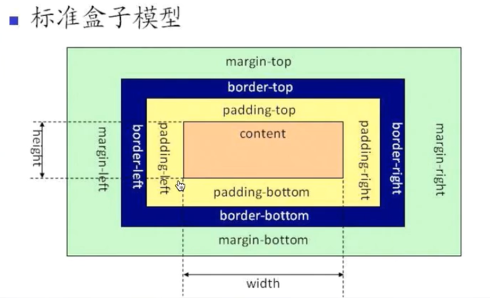
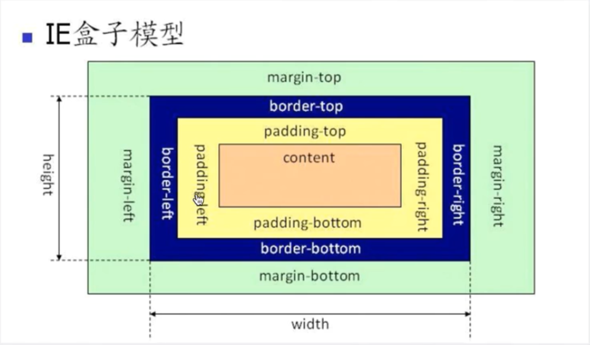
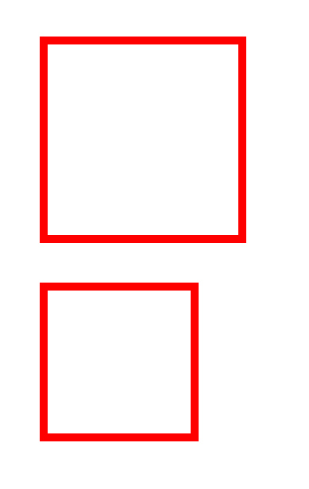

# box-sizing

在 CSS 盒子模型的默认定义里，你对一个元素所设置的 width 与 height 只会应用到这个元素的内容区。如果这个元素有任何的 border 或 padding ，绘制到屏幕上时的盒子宽度和高度会加上设置的边框和内边距值。



box-sizing: border-box 告诉浏览器：你想要设置的边框和内边距的值是包含在 width 内的。也就是说，如果你将一个元素的 width 设为 100px，那么这 100px 会包含它的 border 和 padding，内容区的实际宽度是 width 减去(border + padding)的值。

注: border-box 不包含 margin



```html
<div class="box1"></div>
<div class="box2"></div>
```

```css
* {
  margin: 0;
  padding: 0;
}
.box1 {
  width: 200px;
  height: 200px;
  border: 10px solid red;
  padding: 20px;
  margin: 50px;
}
.box2 {
  width: 200px;
  height: 200px;
  border: 10px solid red;
  padding: 20px;
  margin: 50px;
  box-sizing: border-box;
}
```


