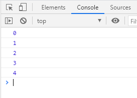
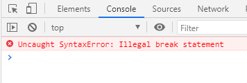
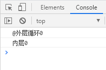

# break 和 continue 语句

## break

<font size=4>

break 和 continue 语句用于在循环中精确地控制代码的执行。其中，break 语句会立即退出循环，强制执行循环后面的语句。而 continue 语句虽然也是立即退出循环，但退出循环后会从循环的顶部继续执行。

```javascript
for (var i = 0; i < 5; i++) {
  console.log(i);
}
```

(1)

```javascript
for (var i = 0; i < 5; i++) {
  console.log(i);
  break;
}
```

(2)

不能在 if 语句中使用 break 和 continue

```javascript
if (true) {
  break;
  console.log("Hello");
}
```

(3)

```javascript
for (var i = 0; i < 5; i++) {
  console.log(i);
  if (i == 2) {
    break;
  }
}
```

注：此处的 break 是对 for 循环起作用，因此可以使用。

break 关键字，会立即终止离他最近的那个循环语句。

```javascript
for (var i = 0; i < 5; i++) {
  console.log("@外层循环" + i);
  for (var j = 0; j < 3; j++) {
    console.log("内层" + j);
  }
}
```

(4)

```javascript
for (var i = 0; i < 5; i++) {
  console.log("@外层循环" + i);
  for (var j = 0; j < 3; j++) {
    console.log("内层" + j);
    break;
  }
}
```

(5)

## label 语句

使用 label 语句可以在代码中添加标签，以便将来使用。
语法：
label:statement
示例：
start: for(var i=0; i<5; i++;){
console.log(i);
}

使用 break 语句时，可以在 break 后跟着一个 label ,这样 break 将会结束指定的循环，而不是最近的。

```javascript
outer: for (var i = 0; i < 5; i++) {
  console.log("@外层循环" + i);
  for (var j = 0; j < 3; j++) {
    console.log("内层" + j);
    break outer;
  }
}
```

(6)

## continue

```javascript
for (var i = 0; i < 3; i++) {
  if (i == 1) {
    continue;
  }
  console.log("@外层循环" + i);
}
```

(7)

同样 continue 也是默认只会对离它最近的循环起作用

```javascript
for (var i = 0; i < 5; i++) {
  console.log("@外层循环" + i);
  for (var j = 0; j < 3; j++) {
    if (j == 1) {
      continue;
    }
    console.log("内层" + j);
  }
}
```

同样也可以使用 label 来指定跳出特定的循环

</font>
