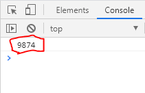
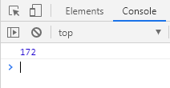
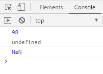

# 函数的参数

## 定义一个用来求两个数和的函数

- 可以在函数的（）中来指定一个或多个形参（形式参数）。
- 多个形参之间使用 , 隔开，声明形参就相当于在函数内部声明了对应的变量。
- 但是并不赋值。

```javascript
function sum(a, b) {
  console.log(a + b);
}
```

- 在调用函数时，可以在（）中指定实参（实际参数）。
- 实参将会赋值给函数中对应的形参。

```javascript
sum(98, 89);
```

- 调用函数时解析器不会检查实参的类型，所以要注意，是否有可能会接收到非法的参数，如果有可能，则需要对参数进行类型的检查。
- 函数的实参可以是任意的数据类型。

```javascript
function sum(a, b) {
  console.log(a + b);
}
sum(98, "74");
```

(1)

- 调用函数时，解析器也不会检查实参的数量。
- 多余实参不会被赋值。
- 如果实参的数量少于形参的数量，则没有对应实参的形参将是 undefined 。

```javascript
function sum(a, b) {
  console.log(a + b);
}
sum(98, 74, "Tony", undefined);
```

(2)

```javascript
function sum(a, b) {
  console.log(a);
  console.log(b);
  console.log(a + b);
}
sum(98);
```

(3)
