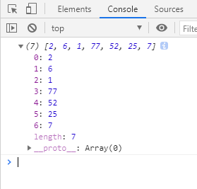
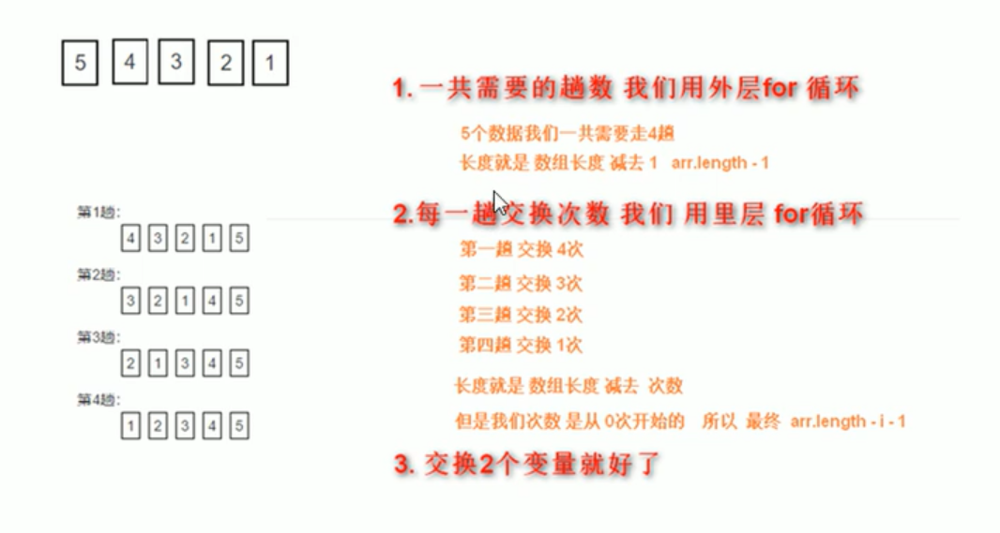
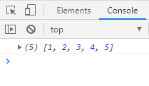

# 数组案例

## 案例一：筛选指定数组元素

- 要求：将数组[2,0,6,1,77,0,52,0,25,7]中的 0 去掉后，形成一个不包含 0 的新数组。

```javascript
var arr = [2, 0, 6, 1, 77, 0, 52, 0, 25, 7];
var newArr = [];
for (var i = 0; i < arr.length; i++) {
  if (arr[i] != 0) {
    newArr[newArr.length] = arr[i];
  }
}
console.log(newArr);
```

(1)

## 案例二：翻转数组

- 要求：将数组['梅长苏','林殊','霓凰','萧景琰','蔺晨']的内容反过来存放，输出['蔺晨','萧景琰','霓凰','林殊','梅长苏']

```javascript
var arr = ["梅长苏", "林殊", "霓凰", "萧景琰", "蔺晨"];
var newArr = [];
for (var i = 0; i < arr.length; i++) {
  newArr[newArr.length] = arr[arr.length - 1 - i];
}
console.log(newArr);
```

(2)

## 案例三：数组排序（冒泡排序）

- 冒泡排序是一种简单的排序算法，它重复地走访要排序的数列，**一次比较两个元素，如果它们的顺序错误就把他们交换过来**。走访数列的工作时重复地进行直到不再需要交换，也就是说该数列已经排序完成。

- 将数组[5,4,3,2,1]中的元素按照从小到大的顺序排序并输出

(3)

```javascript
var arr = [5, 4, 3, 2, 1];
for (var i = 0; i < arr.length - 1; i++) {
  for (var j = 0; j < arr.length - 1 - i; j++) {
    if (arr[j] > arr[j + 1]) {
      var temp = arr[j];
      arr[j] = arr[j + 1];
      arr[j + 1] = temp;
    }
  }
}
console.log(arr);
```

(3)
