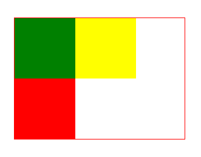

# 浮动 VS 负 margin

对于相邻的两个浮动元素，如果因为空间不够导致第二个浮动元素下移，可以通过给第二个浮动元素设置 **margin-left: 负值** 来让第二个元素上移，其中 **负值** 大于等于元素上移后和第一个元素重合的临界值。

```html
<div class="wrapper">
  <div class="sm1"></div>
  <div class="sm2"></div>
  <div class="sm3"></div>
</div>
```

.

```css
.wrapper {
  border: 1px solid red;
  width: 280px;
  height: 200px;
  margin: 100px;
}
.wrapper .sm1 {
  width: 100px;
  height: 100px;
  background-color: green;
  float: left;
}
.wrapper .sm2 {
  width: 100px;
  height: 100px;
  background-color: yellow;
  float: left;
}
.wrapper .sm3 {
  width: 100px;
  height: 100px;
  background-color: red;
  float: left;
}
```

(1)

```css
.wrapper .sm3 {
  width: 100px;
  height: 100px;
  background-color: red;
  float: left;
  margin-left: -20px;
}
```

(2)

## 水平等距排列

```html
<div class="all clearfix">
  <ul>
    <li class="item1"></li>
    <li class="item2"></li>
    <li class="item3"></li>
    <li class="item4"></li>
    <li class="item5"></li>
    <li class="item6"></li>
    <li class="item7"></li>
    <li class="item8"></li>
  </ul>
</div>
```

.

```css
.clearfix::after {
  content: "";
  display: block;
  clear: both;
}
.all {
  width: 640px;
  margin: 100px;
  border: 1px solid blue;
}
.all ul {
  margin-right: -20px;
}
.all ul li {
  height: 200px;
  width: 200px;
  background-color: red;
  margin: 0 20px 20px 0;
  list-style: none;
  float: left;
}
```

(3)
