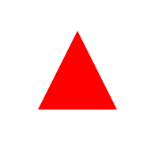

<font size=3>

1. **底边 100，高 100，尖朝上**

```css
.triangle1 {
  width: 0;
  border-left: 50px solid transparent;
  border-right: 50px solid transparent;
  border-bottom: 100px solid red;
  margin: 50px;
}
```



2. **底边 100，高 100，尖朝下**

```css
.triangle2 {
  width: 0;
  border-left: 50px solid transparent;
  border-right: 50px solid transparent;
  border-top: 100px solid red;
  margin: 50px;
}
```


3. **底边 100，高 100，尖朝左**

```css
.triangle3 {
  width: 0;
  border-top: 50px solid transparent;
  border-bottom: 50px solid transparent;
  border-right: 100px solid red;
  margin: 50px;
}
```


4. **底边 100，高 100，尖朝右**

```css
.triangle4 {
  width: 0;
  border-top: 50px solid transparent;
  border-bottom: 50px solid transparent;
  border-left: 100px solid red;
  margin: 50px;
}
```


5. **两条直角边均为 100，直角在左上**

```css
.triangle5 {
  width: 0;
  border-bottom: 100px solid transparent;
  border-left: 100px solid red;
  border-right: 100px solid transparent;
  margin: 50px;
}
```


6. **两条直角边均为 100，直角在右上**

```css
.triangle6 {
  width: 0;
  border-bottom: 100px solid transparent;
  border-left: 100px solid transparent;
  border-right: 100px solid red;
  margin: 50px;
}
```


7. **两条直角边均为 100，直角在左下**

```css
.triangle7 {
  width: 0;
  border-top: 100px solid transparent;
  border-left: 100px solid red;
  border-right: 100px solid transparent;
  margin: 50px;
}
```


8. **两条直角边均为 100，直角在右下**

```css
.triangle {
  width: 0;
  border-top: 100px solid transparent;
  border-left: 100px solid transparent;
  border-right: 100px solid red;
  margin: 50px;
}
```


</font>
