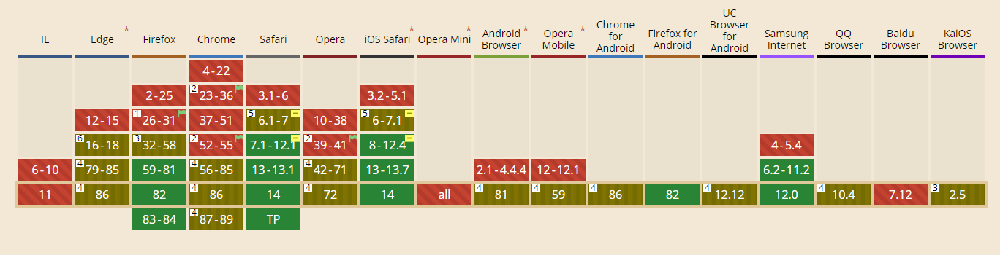
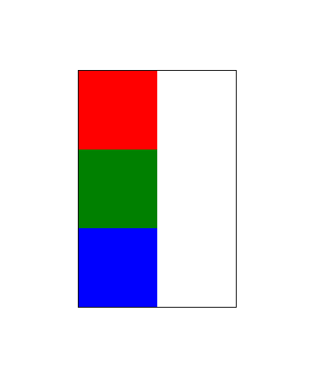
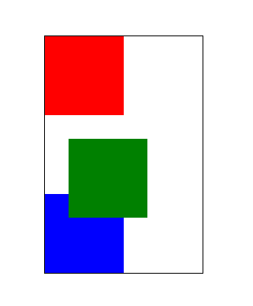
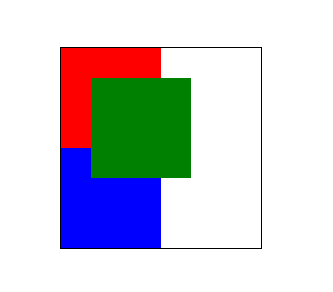
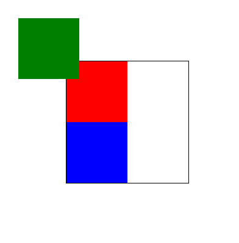

# CSS 各种定位方式（一）

## 基本属性

### inherit

规定应该从父元素继承**position**属性的值

### static

默认值，没有定位，元素出现在正常的流中（忽略**top,bottom,left,right**或者**z-index**声明）

### relative

生成相对定位的元素，相对于元素本身正常位置进行定位，因此，**left:20px** 会向元素的**left**位置添加**20px**

### absolute

生成绝对定位的元素，相对于**static**定位以外的第一个祖先元素（**offset parent**)进行定位，元素的位置通过**top,right,bottom**以及**left**属性进行规定。

### fixed

生成绝对定位的元素，相对于浏览器窗口进行定位。元素的位置通过**top,right,bottom**以及**left**属性进行规定。

### sticky

CSS3 新属性，表现类似**position:relative**和**position:fixed**的合体，在目标区域在屏幕中可见

注：兼容性较差，一般不用


## 普通流与相对定位

css 中有三种基本的定位机制：普通流，相对定位和绝对定位

**普通流**是默认定位方式，在普通流中元素框的位置由元素在**html**中的位置决定，元素**position**属性为**static**或继承来的**static**时就会按照普通流定位，这也是我们最常见的方式。

**相对定位**比较简单，对应**position**属性的**relative**值，如果对一个元素进行相对定位，它将出现在他所在的位置上，然后可以通过设置垂直或水平位置，让这个元素相对于它自己移动，在使用相对定位时，无论元素是否移动，元素在文档流中占据原来空间，只是表现出来的位置会改变。

```html
<div class="all">
  <div class="ex1"></div>
  <div class="ex2"></div>
  <div class="ex3"></div>
</div>
```

```css
.all {
  border: 1px solid black;
  width: 200px;
  margin: 100px;
}
.ex1 {
  height: 100px;
  width: 100px;
  background-color: red;
}
.ex2 {
  height: 100px;
  width: 100px;
  background-color: green;
}
.ex3 {
  height: 100px;
  width: 100px;
  background-color: blue;
}
```



```css
.ex2 {
  height: 100px;
  width: 100px;
  background-color: green;
  position: relative;
  top: 30px;
  left: 30px;
}
```



## 绝对定位与固定定位

**相对定位**可以看做特殊的普通流定位，元素位置时相对于它在普通流中位置发生变化，而绝对定位时元素的位置与文档流无关，也不占据文档流空间，普通流中的元素布局就像绝对定位元素不存在一样。

**绝对定位**的元素的位置是相对于距离最近的**非 static 祖先元素**的**内边框**位置决定的。如果元素没有已定位的祖先元素，那么他的位置就相对于浏览器窗口来定位，而不是 html 的内边框。

因为绝对定位与文档流无关，所以绝对定位元素可以覆盖页面上的其他元素，可以通过**z-index**属性控制叠放顺序，**z-index**越高，元素位置越靠上。

```css
.all {
  border: 1px solid black;
  width: 200px;
  margin: 100px;
  position: relative;
}
.ex1 {
  height: 100px;
  width: 100px;
  background-color: red;
}
.ex2 {
  height: 100px;
  width: 100px;
  background-color: green;
  position: absolute;
  top: 30px;
  left: 30px;
}
.ex3 {
  height: 100px;
  width: 100px;
  background-color: blue;
}
```



**fixed**固定定位，固定定位是绝对定位的一种，固定定位的元素也不包含在普通文档流中，差异是固定元素的包含块儿是视口（viewport）

```css
.all {
  border: 1px solid black;
  width: 200px;
  margin: 100px;
  position: relative;
}
.ex1 {
  height: 100px;
  width: 100px;
  background-color: red;
}
.ex2 {
  height: 100px;
  width: 100px;
  background-color: green;
  position: fixed;
  top: 30px;
  left: 30px;
}
.ex3 {
  height: 100px;
  width: 100px;
  background-color: blue;
}
```



注：1. 绝对定位时只写**position: absolute; **不写**relative、top、left**等定位元素，**div**只脱离文档流，位置不变，位置和不写没有区别。
