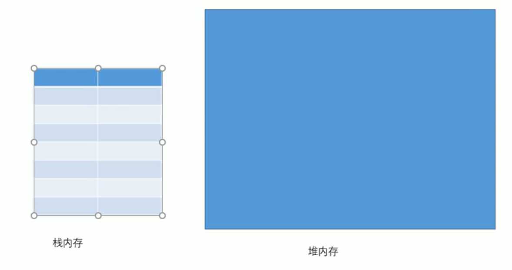
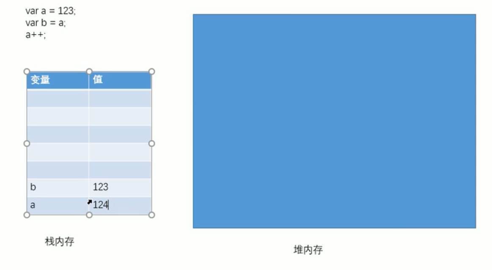
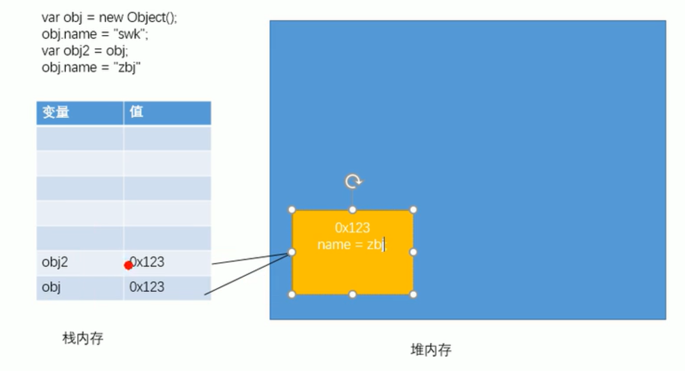
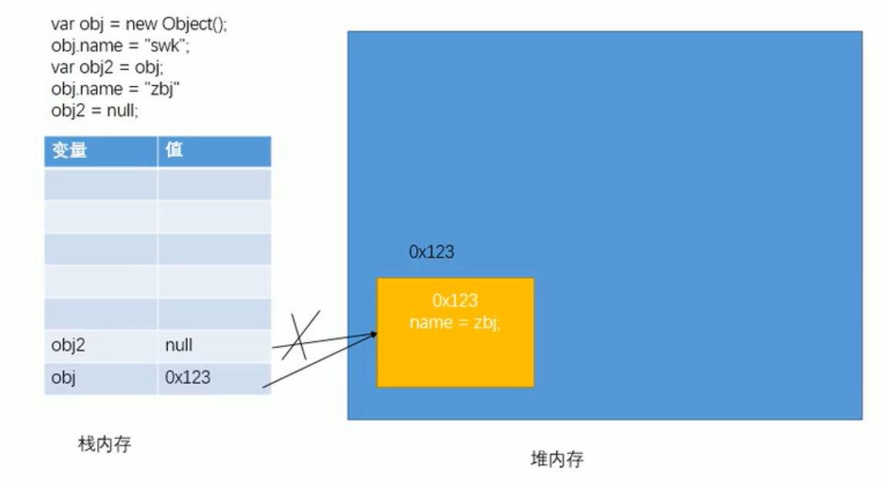
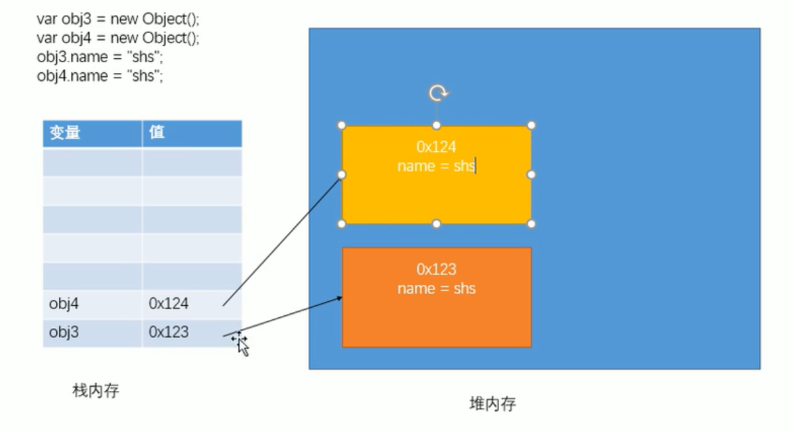
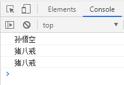

# 基本数据类型和引用数据类型

## 基本数据类型

String Number Boolean Null Undefined

## 引用数据类型

Object

- JS 中的变量都是保存到栈内存中的，基本数据类型的值直接在栈内存中存储，值与值之间是独立存在的，修改一个变量不会影响其他的变量。

(1)
(2)

- 对象是保存到堆内存中的，每创建一个新的对象，就会在堆内存中开辟出一个新的空间，而变量保存的是对象的内存地址（对象的引用），如果两个变量保存的是同一个对象引用，当一个通过变量修改属性时，另一个也会受到影响。

(3)
(4)
(5)

```javascript
var obj = new Object();
obj.name = "孙悟空";
console.log(obj.name);
var obj2 = new Object();
obj2 = obj;
obj2.name = "猪八戒";
console.log(obj.name);
console.log(obj2.name);
```

(6)
