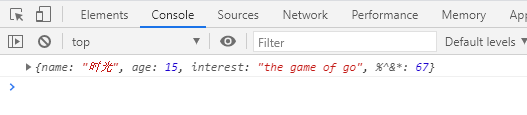

# 对象自变量

- 使用对象字面量，可以在创建对象时，直接指定对象中的属性。  
  语法：{属性名:属性值,属性名:属性值......}
- 对象字面量的属性名可以加引号，也可以不加，建议不加。
- 如果要使用一些特殊的名字，则必须加引号。
- 属性名和属性值是一组一组的名值对结构，名和值之间使用 : 连接，多个名值对之间使用 , 隔开，如果一个属性之后没有其他属性了，就不要写 ,

```javascript
var obj = {
  name: "时光",
  age: 15,
  interest: "the game of go",
  "%^&*": 67,
};
console.log(obj);
```


