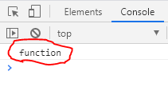
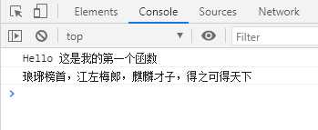
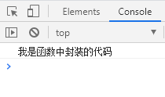

# 函数

## 函数 function

- 函数也是一个对象。
- 函数中可以封装一些功能（代码），在需要时可以执行这些功能（代码）。
- 函数中可以保存一些代码在需要的时候调用。
- 使用 typeof 检查一个函数对象时，会返回 function 。

```javascript
//创建一个函数对象
var fun = new Function();
console.log(typeof fun);
```

(1)

- 创建一个函数对象。
- 可以将要封装的代码以字符串的形式传递给构造函数。
- 封装到函数中的代码不会立即执行。
- 调用函数 **语法：函数对象（）**
- 当调用函数时，函数中封装的代码会按照顺序执行。

```javascript
var fun = new Function(
  "console.log('Hello 这是我的第一个函数');console.log('琅琊榜首，江左梅郎，麒麟才子，得之可得天下');"
);
fun();
```

(2)

- 函数对象仍具有普通对象的所有功能。

```javascript
var fun = new Function();
fun.hello = "你好";
console.log(fun.hello);
```

(3)

- 使用 函数声明 来创建一个函数  
  function 函数名（[形参 1，形参 2...形参 N]）{  
  &emsp;&emsp;语句...  
  }

```javascript
function fun() {
  console.log("你知道我这双手，以前也是挽过大弓，降过烈马的。");
  console.log("可如今却只能在这阴诡地狱里，搅弄风云了。");
}
fun();
```

- 使用 函数表达式 来创建一个函数。
  var 函数名 = function([形参 1，形参 2...形参 N]){  
  &emsp;&emsp;语句...  
  }

```javascript
var fun = function () {
  console.log("我是函数中封装的代码");
};
fun();
```

(4)
