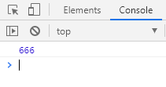
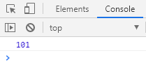
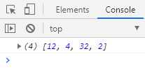

# 函数的返回值

## 函数的返回值格式

```javascript
function 函数名() {
  return 需要返回的结果;
}
函数名();
```

注意：  
(1)函数只是实现某种功能，最终的结果需要返回给函数的调用者**函数名()**，通过 return 实现。  
(2)只要函数遇到 return ，就把后面的结果返回给函数的调用者。函数名() = return 后面的结果。

```javascript
function getResult() {
  return 666;
}
getResult(); //getResult() = 666;
console.log(getResult());
```

(11)

## 示例一

- 利用函数，求两个数的最大值。

```javascript
function getMax(num1, num2) {
  if (num1 > num2) {
    return num1;
  } else {
    return num2;
  }
}
console.log(getMax(23, 89));
```

方法二：

```javascript
function getMax(num1, num2) {
  return num1 > num2 ? num1 : num2;
}
console.log(getMax(23, 89));
```

## 示例二

- 利用函数求任意一个数组中的最大值。
- 求数组[5,2,99,101,67,77]中的最大值。

```javascript
function getMaxArr(arr) {
  var max = arr[0];
  for (var i = 0; i < arr.length; i++) {
    if (max < arr[i]) {
      max = arr[i];
    }
  }
  return max;
}
var result = getMaxArr([5, 2, 99, 101, 67, 77]);
console.log(result);
```

(12)

- 在实际开发里面，我们经常用一个变量来接收函数的返回结果，使用更简单。

## 注意事项

### return 只能返回一个值。如果用逗号隔开多个值，以最后一个为准。

```javascript
function fun(a, b) {
  return a, b;
}
console.log(fun(3, 7));
```


### 如果需要返回多个值，可以利用数组来变相实现。

求任意两个数的加减乘除结果。

```javascript
function getResult(num1, num2) {
  return [num1 + num2, num1 - num2, num1 * num2, num1 / num2];
}
var result = getResult(8, 4);
console.log(result);
```



### 函数没有 return 返回 undefined

函数都是有返回值的，如果有 return 则返回 return 后面的值，如果没有 return 则返回 undefined 。

```javascript
function fun1() {
  return 666;
}
console.log(fun1());
function fun2() {}
console.log(fun2());
```


