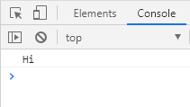
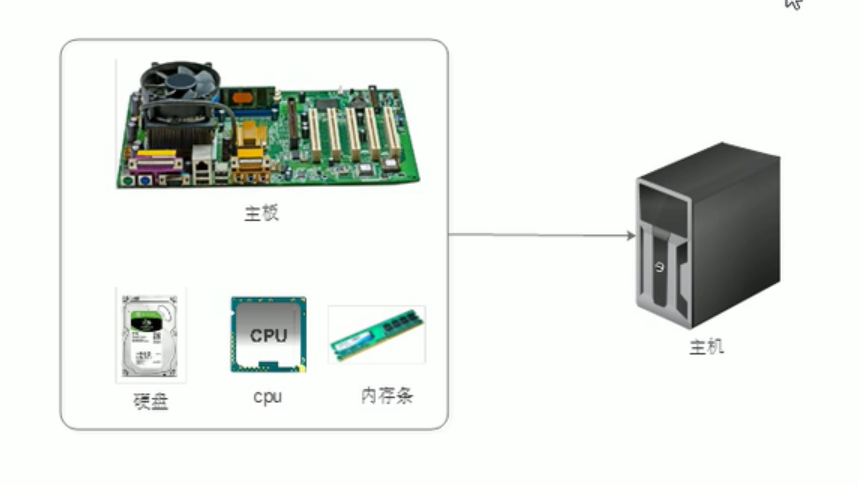

# 函数的使用

- 函数在使用时分为两步：**声明函数**和**调用函数**。

## 声明函数

```javascript
function 函数名() {
  函数体代码;
}
```

- function 是声明函数的关键字，**必须小写**。
- 由于函数一般是为了实现某个功能才定义的，所以通常我们将**函数名**命名为**动词**，比如 getSum 。

## 调用函数

```javascript
函数名();
```

- 通过调用函数名来执行函数体代码。
- 调用的时候千万不要忘记添加小括号。
- 声明函数本身并不会执行代码，只有调用函数时才会执行函数体代码。
- 口诀：函数不调用，自己不执行。

```javascript
function sayHi() {
  console.log("Hi");
}
sayHi();
```



## 函数的封装

- 函数的封装是把一个或者多个功能通过**函数的方式封装起来**，对外只提供一个简单的函数接口。
- 简单理解：封装类似于将电脑配件整合组装到机箱中（类似快递打包）。
  

## 示例

- 利用函数计算 1~100 之间的累加和

```javascript
function getSum() {
  var sum = 0;
  for (var i = 1; i <= 100; i++) {
    sum = sum + i;
  }
  console.log(sum);
}
getSum();
```
