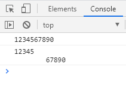
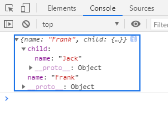

# JS 中的数据类型

## 七种数据类型

- number
- string
- boolean
- symbol
- undefined
- null
- object

**注意**没有 array 类型也没有 function 类型。

## number

- 整数和小数：1 1.1 .1
- 科学记数法：1.23e2
- 二进制：0b11
- 八进制：011（后来 ES5 添加了 0o11 语法）
- 十六进制：0x11

## string

- 空字符串：''
- 多行字符串：

```javascript
var a = "12345" + "67890"; // 无回车符号
console.log(a);

var b = `12345
        67890`; // 含回车符号
console.log(b);
```

(1)

## boolean

- boolean 只有两个值：true 和 false

a && b 在 a 和 b 都为 true 时，取值为 true；否则为 false

a || b 在 a 和 b 都为 false 时，取值为 false；否则为 true

## symbol

[JS 中的 Symbol 是什么？](https://zhuanlan.zhihu.com/p/22652486)

## undefined 和 null

- 都表示没有值

- （规范）如果一个变量没有被赋值，那么这个变量的值就是 undefiend

- （习俗）如果你想表示一个还没赋值的对象，就用 null。如果你想表示一个还没赋值的字符串/数字/布尔/symbol，就用 undefined（但是实际上你直接 var xxx 一下就行了，不用写 var xxx = undefined）

## object

- object 就是上面几种基本类型（无序地）组合在一起
- object 里面可以有 object

```javascript
var person = {
  name: "Frank",
  child: {
    name: "Jack",
  }, // 最后这个逗号可有可无
};
console.log(person);
```

(2)

- object 的 key 一律是字符串，不存在其他类型的 key

- object[''] 是合法的
