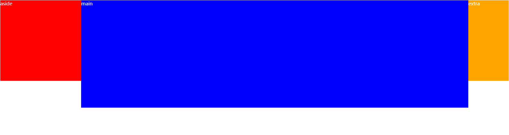
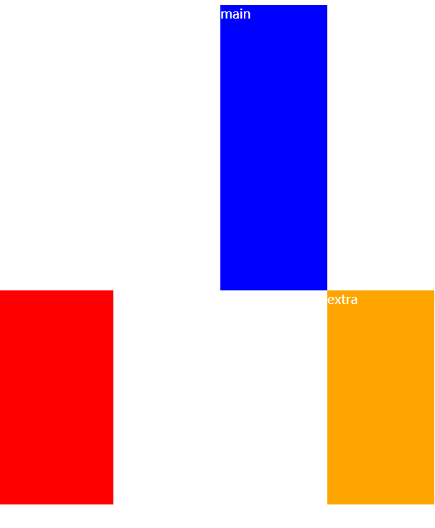

# 圣杯布局

## 什么是圣杯布局？

- 是三列布局，两边固定宽度，中间自适应
- 中间内容元素在 dom 元素次序中优先位置

html

```html
<div id="content">
  <div class="main">main</div>
  <div class="aside">aside</div>
  <div class="extra">extra</div>
</div>
```

css

```css
* {
  margin: 0;
  padding: 0;
}
#content::after {
  content: "";
  display: block;
  clear: both;
}
#content {
  padding-left: 300px;
  padding-right: 150px;
  font-size: large;
  color: white;
  margin: 10px;
}
#content .aside {
  float: left;
  width: 300px;
  height: 300px;
  background-color: red;
  margin-left: -100%;
  position: relative;
  left: -300px;
}
#content .extra {
  float: left;
  width: 150px;
  height: 300px;
  background-color: orange;
  margin-left: -150px;
  position: relative;
  right: -150px;
}
#content .main {
  float: left;
  width: 100%;
  height: 400px;
  background-color: blue;
}
```

(1)

**注意：**.main 的最小宽度不能小于 .aside 的宽度，否则
(2)
