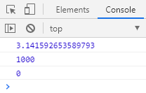

# 封装自己的数学对象

```javascript
var myMath = {
  PI: 3.141592653589793,
  max: function () {
    var max = arguments[0];
    for (var i = 1; i < arguments.length; i++) {
      if (max < arguments[i]) {
        max = arguments[i];
      }
    }
    console.log(max);
  },
  min: function () {
    var min = arguments[0];
    for (var i = 1; i < arguments.length; i++) {
      if (min > arguments[i]) {
        min = arguments[i];
      }
    }
    console.log(min);
  },
};
console.log(myMath.PI);
myMath.max(12, 34, 8, 1000);
myMath.min(0, 3489, 34, 98, 4);
```


