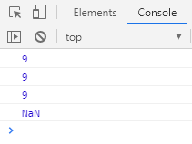
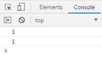
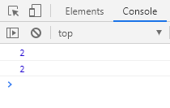
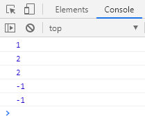

# Math 绝对值和三个取整方法

## Math.abs 绝对值

```javascript
console.log(Math.abs(9)); // 9
console.log(Math.abs(-9)); // 9
console.log(Math.abs("-9")); // 9 隐式转换，会把字符型 -9 转换为数字型
console.log(Math.abs("你大爷")); // NaN
```

(1)

## 三个取整方法

- Math.floor() 向下取整，往小了取值

```javascript
console.log(Math.floor(1.1));
console.log(Math.floor(1.9));
```

(2)

- Math.ceil() 向上取整，往大了取值

```javascript
console.log(Math.ceil(1.1));
console.log(Math.ceil(1.9));
```

(3)

- Math.round() 四舍五入

```javascript
console.log(Math.round(1.1));
console.log(Math.round(1.5));
console.log(Math.round(1.9));
console.log(Math.round(-1.1));
console.log(Math.round(-1.5));
```

(4)

注意：其他数字都是四舍五入，但 .5 特殊，它往大了取。
