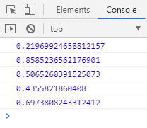
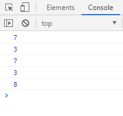

# Math 对象随机数方法

- Math.random() 返回一个 0 到 1 之间的随机的小数，包括 0 但不包括 1

```javascript
for (var i = 0; i < 5; i++) {
  console.log(Math.random());
}
```

(1)

- 得到一个两个整数之间的随机整数，包括两个整数在内

```javascript
for (var i = 0; i < 5; i++) {
  function getRandom(min, max) {
    return Math.floor(Math.random() * (max - min + 1)) + min;
  }
  console.log(getRandom(1, 10));
}
```

(2)

### 案例：猜数字游戏

程序随机生成一个 1~10 之间的数字，并让用户输入一个数字，

- 如果大于该数字，就提示，数字大了，继续猜；
- 如果小于该数字，就提示，数字小了，继续猜；
- 如果等于该数字，就提示，猜对了，结束程序；
- 如果三次都没有猜对，就提示，机会用尽，失败，结束程序。

```javascript
function getRandom(min, max) {
  return Math.floor(Math.random() * (max - min + 1)) + min;
}
var num = getRandom(1, 10);
var i = 3;
alert("你有3次机会");
while (true) {
  var unum = prompt("你来猜？输入一个1到10之间的数字：");
  if (unum > num) {
    alert("大了");
  } else if (unum < num) {
    alert("小了");
  } else {
    alert("猜对了");
    break;
  }
  i--;
  if (i == 0) {
    alert("机会用尽，失败");
    break;
  }
}
```
