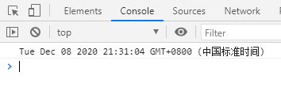
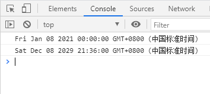
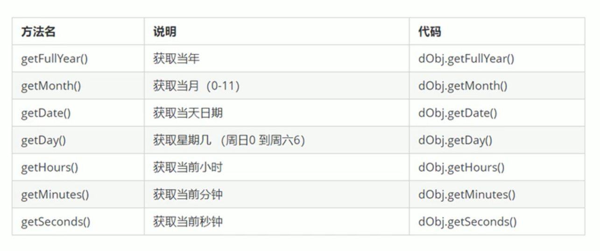
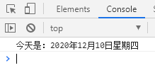

# Date 对象

## Date 概述

- Date 对象和 Math 对象不一样，它是一个构造函数，所以我们需要实例化后才能使用，也就是**必须使用 new 来调用创建我们的日期对象**

- 使用 Date 如果没有参数，返回当前系统的当前时间

```javascript
var date = new Date();
console.log(date);
```

(1)

- 参数常用的写法  
  数字型 2020,12,8  
  字符串型 '2029-12-8 21:36:00'

```javascript
var date1 = new Date(2020, 12, 8);
console.log(date1);
var date2 = new Date("2029-12-8 21:36:00");
console.log(date2);
```



注意：使用数字型时，月份会加一

## 日期格式化



```javascript
var date = new Date();
var year = date.getFullYear();
var month = date.getMonth() + 1; //月份 返回的月份小1个月，所以要+1
var day = date.getDate();
var week = date.getDay(); //周日0 周一1 周六6
var arr = [
  "星期日",
  "星期一",
  "星期二",
  "星期三",
  "星期四",
  "星期五",
  "星期六",
];
console.log("今天是：" + year + "年" + month + "月" + day + "日" + arr[week]);
```


