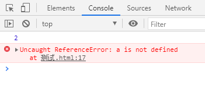
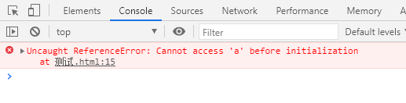
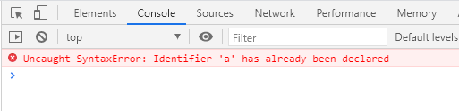
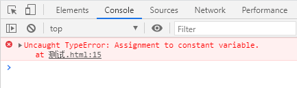

# let & const 命令

## let

- ES6 新增了 let 命令，用来声明变量。它的用法类似于 var，但是所声明的变量，只在 let 命令所在的代码块内有效，**也就是 let 的作用域在最近的 {} 之间**。

```javascript
{
  let a = 2;
  console.log(a);
}
console.log(a);
```

(1)

- 不存在变量提升，如果你在 let a 之前使用 a, 那么报错。

```javascript
console.log(a);
{
  let a = 2;
  console.log(a);
}
```

(2)

- 暂时性死区  
  只要块级作用域内存在 let 命令，它所声明的变量就“绑定”这个区域，不再受外部的影响。

```javascript
var a = 5;
{
  console.log(a);
  let a = 2;
}
```

(3)

- 不允许重复声明  
  let 不允许在相同作用域内，重复声明同一个变量。如果你重复 let a, 那么报错

```javascript
{
  let a = 2;
  let a = 5;
  console.log(a);
}
```

(4)

## const

- 其他特性和 let 一样，只是 const 只有一次赋值机会，而且必须在声明的时候立马赋值。对于 const 来说，只声明不赋值，就会报错。

```javascript
{
  const a;
  console.log(a);
}
```

(5)

- const 声明一个只读的常量。一旦声明，常量的值就不能改变。

```javascript
{
  const a = 3;
  a = 5;
  console.log(a);
}
```

(6)
