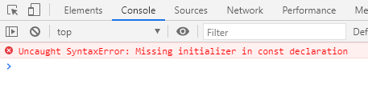

# let & const 命令

## let

* ES6 新增了let命令，用来声明变量。它的用法类似于var，但是所声明的变量，只在let命令所在的代码块内有效，**也就是 let 的作用域在最近的 {} 之间**。

```javascript
        {
            let a = 2;
            console.log(a);
        }
        console.log(a);
```
(1)

* 不存在变量提升，如果你在 let a 之前使用 a, 那么报错。 

```javascript
        console.log(a);
        {
            let a = 2;
            console.log(a);
        }
```
(2)

* 暂时性死区  
只要块级作用域内存在let命令，它所声明的变量就“绑定”这个区域，不再受外部的影响。

```javascript
        var a = 5;
        {
            console.log(a);
            let a = 2;
        }
```
(3)

* 不允许重复声明  
let不允许在相同作用域内，重复声明同一个变量。如果你重复 let a, 那么报错

```javascript
        {
            let a = 2;
            let a = 5;
            console.log(a);
        }
```
(4)

## const

* 其他特性和 let 一样，只是 const 只有一次赋值机会，而且必须在声明的时候立马赋值。对于const来说，只声明不赋值，就会报错。

```javascript
        {
            const a;
            console.log(a);
        }
```
(5)

* const声明一个只读的常量。一旦声明，常量的值就不能改变。

```javascript
        {
            const a = 3;
            a = 5;
            console.log(a);
        }
```
(6)


