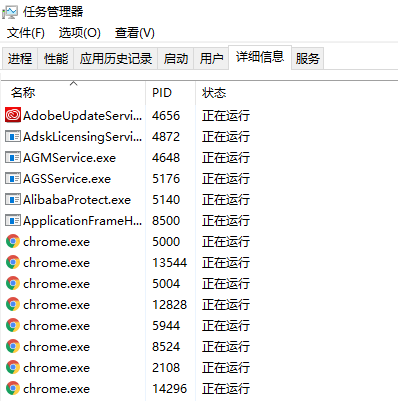
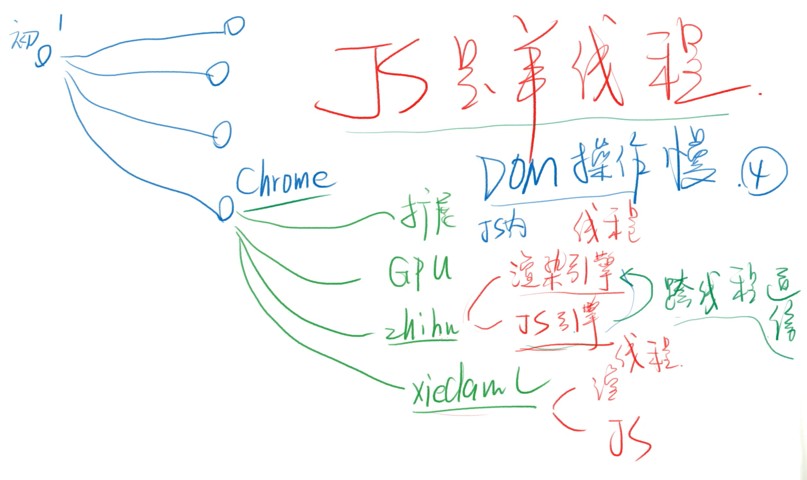

# 进程和线程

## 操作系统常识

## 一切运行都在内存里

## 开机

- 操作系统在 C 盘里
- 当你按下开机键，主板通电，开始读取固件
- 固件就是固定在主板上的存储设备，里面有开机程序
- 开机程序会将文件里的操作系统加载到内存中运行

## 操作系统（以 Linux 为例）

- 首先加载操作系统内核
- 然后启动初始化进程，编号为 1，每个进程都有编号
  (1)
- 启动系统服务：文件、安全、联网
- 等待用户登录：输入密码登录、ssh 登录
- 登录后，运行 shell, 用户就可以和操作系统对话了
- bash 是一种 shell, 图形化界面可认为是一种 shell

## 打开浏览器

## chrome.exe

- 你双击 Chrome 图标，就会 运行 Chrome.exe 文件
- 开启 Chrome 进程，作为主进程
- 主进程会开启一些辅助进程，如网络服务、GPU 加速
- 你每新建一个网页，就有可能会开启一个子进程

## 浏览器的功能

- 发起请求，下载 HTML，解析 HTML，下载 CSS，解析 CSS，渲染界面，下载 JS，解析 JS，执行 JS 等
- 功能模块：用户界面、渲染引擎、JS 引擎、存储等
- 上面功能模块一般各处于不同的线程（比进程更小）
- 如果进程是车间，那么线程就是车间里的流水线

(n8)
