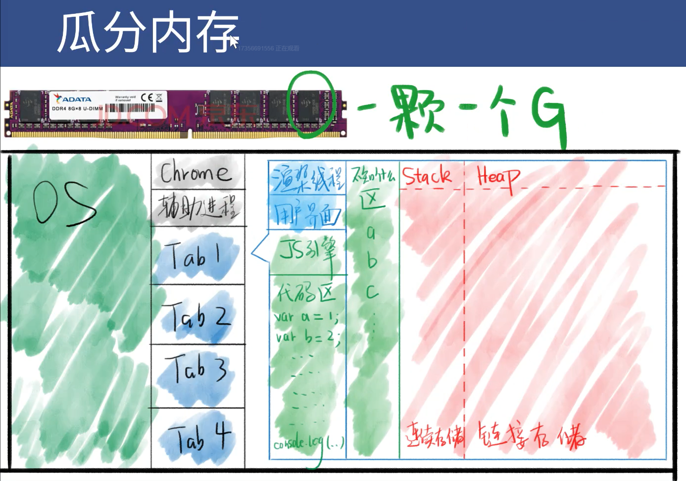
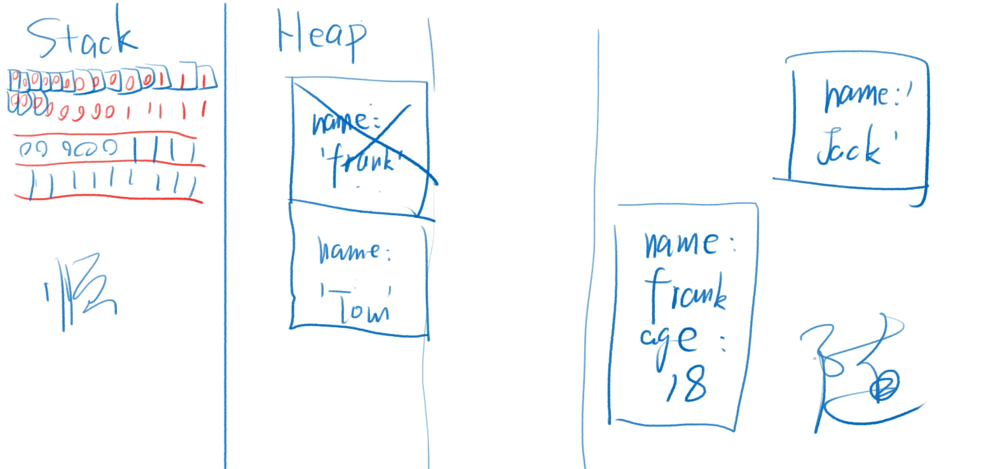
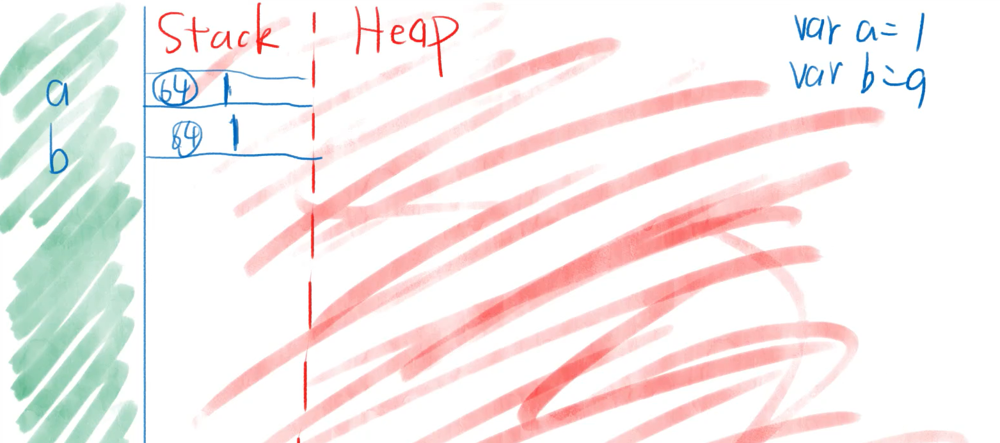
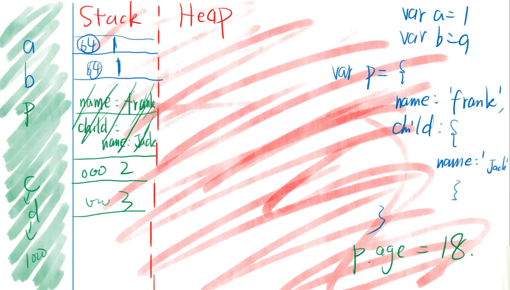
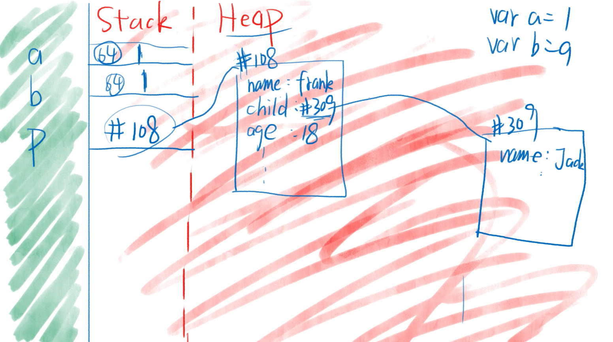
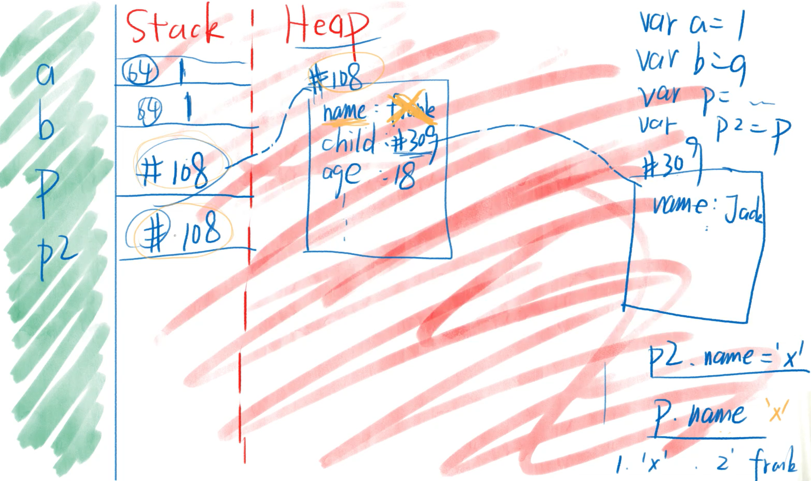

# JS 引擎和代码执行

## JS 引擎

- Chrome 用的是 V8 引擎，C++ 编写
- 网景用的是 SpiderMonkey，后被 Firefox 使用，也是用 C++ 编写的
- Safari 用的是 JavaScriptCore
- IE 用的是 Chakra(JScript9)
- Edge 用的是 Chakra(JavaScript)
- Node.js 用的是 V8 引擎

### 主要功能

- **编译**：把 JS 代码翻译为机器能执行的字节码或机器码。
- **优化**：改写代码，使其更高效。
- **执行**：执行上面的字节码或者机器码。
- **垃圾回收**：把 JS 用完的内存回首，方便之后再次使用。

## 执行 JS 代码

**准备工作**

- 提供 API：window/document/setTimeout
- 上面这些东西都不是 JS 自身具备的功能，我们把这些功能称为运行环境 runtime env .
- 一旦我们把 JS 放进页面，就开始执行 JS

## 内存图

- JS 代码在内存中运行。



**红色区域**

**作用**

- 红色区域专门用来存放数据。
- 红色区域并不存变量名，变量名在**不知什么区**（不同浏览器中的名称不同）。
- 每种浏览器的分配规则并不一样。
- 上图的区域并不完整，没有画「调用栈」、「任务队列」等区域。

**Stack 和 Heap**

- 红色区域分为 Stack 栈和 Heap 堆。
- Stack 区特点：每个数据顺序存放。
- Heap 区特点：每个数据随机存放。



## 示例

**代码**

```javascript
var a = 1;
var b = a;
var person = {
  name: "frank",
  child: {
    name: "jack",
  },
};
var person2 = person;
```













### **规律**

- 数据分两种：非对象和对象。
- 非对象都存在 Stack 。
- 对象都存在 Heap 。
- 数组和函数皆为对象。
- = 号总是会把右边的东西复制到左边。
