## 原型链

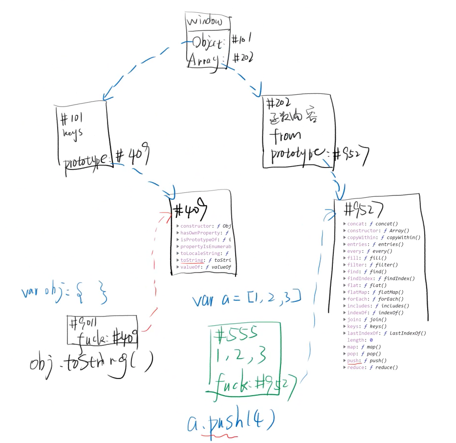

 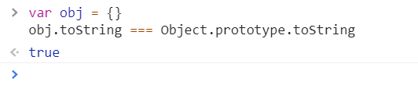

-

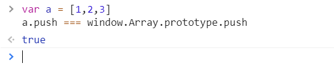

#### 读的时候是这个逻辑，写的时候并不是

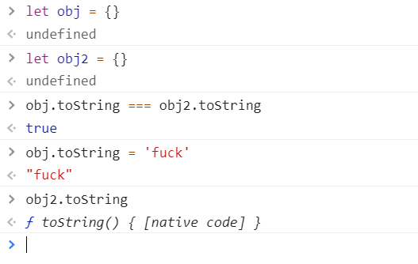


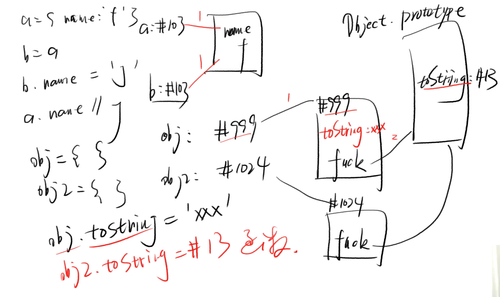

* 改的时候只改了一层

## 问题一

```javascript
var obj = {};
obj.toString();
```

- 为什么不报错？为什么可以运行？
- `obj` 有一个隐藏属性
- 隐藏属性存储了 `Object.prototype` 对象的地址
- `obj.toString()` 发现 `obj` 上没有 `toString`
- 就去隐藏属性对应的对象里面找
- 于是就找到了 `Object.prototype.toString`

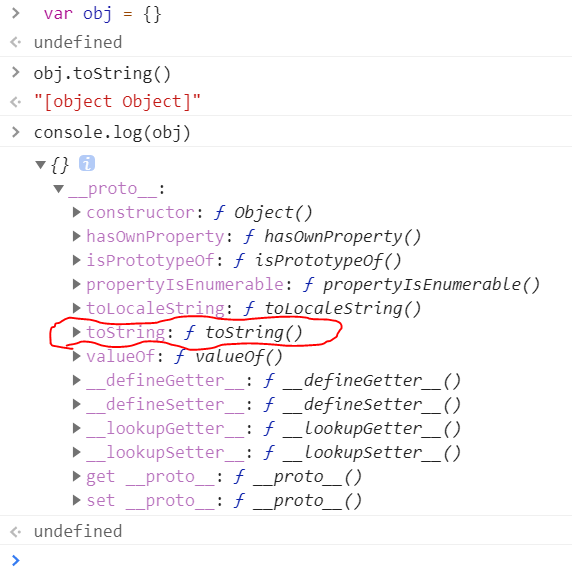

## 问题二

```javascript
var obj2 = {};
obj2.toSring();
```

- `obj` 和 `obj2` 有什么联系？

**相同点**

- 都可以调用 `.toString()`

**不同点**

- 地址不同 `obj !== obj2`
- 可以拥有不同的属性

## 原型

- `XXX.prototype` 存储了 `XXX` 对象的共同属性，这就是原型。
- 原型让你无需重复声明共有属性，省代码，省内存。
- 每个对象都有一个隐藏属性（`__proto__`），指向原型（对象）。

```javascript
var array = [];
console.log(array);
```

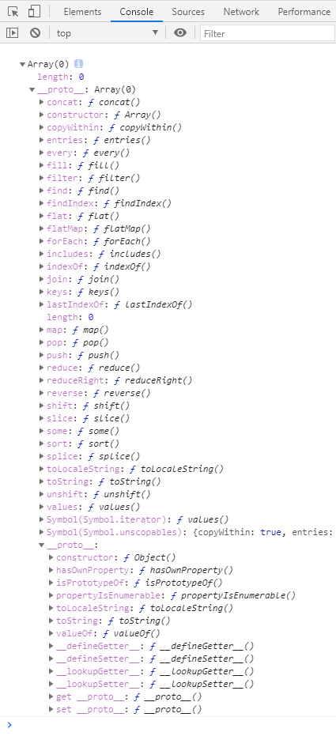

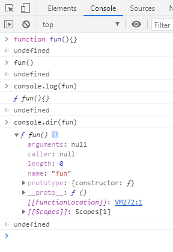

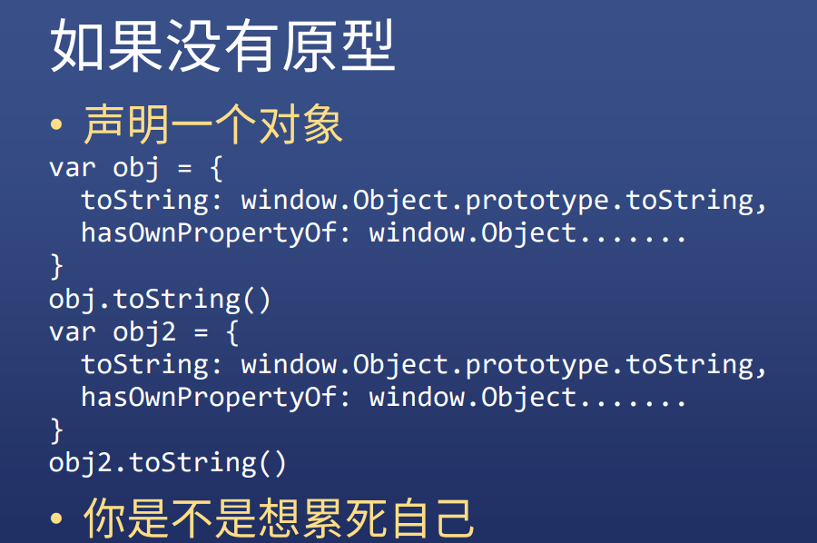

`prototype` 和` __proto__ `区别是什么？

- 都存着原型的地址，只不过 `prototype` 挂在函数上， `__proto__` 挂在每个新生成的对象上。

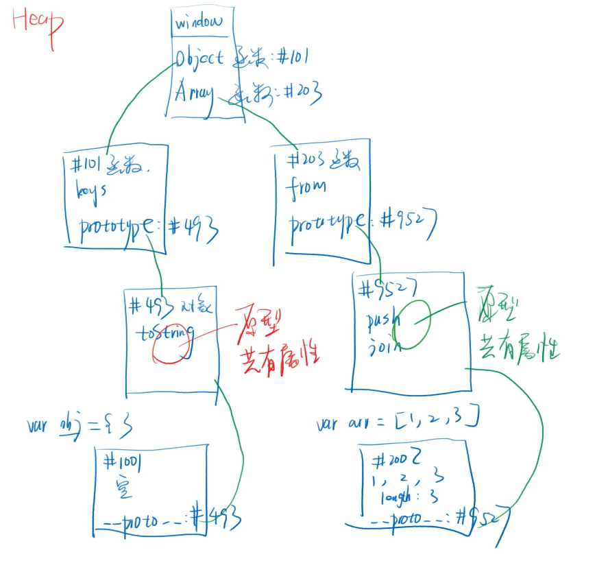

-----

```js
var obj = {}
obj.toString() === obj.toString.call(obj)
```

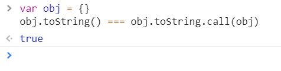

```js
var a = [1,2,3]
a.push(4) === a.push.call(a,4) === window.Array.prototype.push.call(a,4)
```

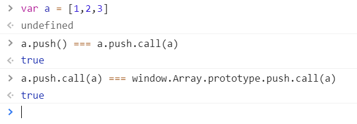

-------------------

```js
var 公用属性 = {
    hi(){
        console.log('hi')
    }
}
var obj = {}
obj.__proto__ === window.Object.prototype
obj.__proto__ = 公用属性
obj.hi()
```

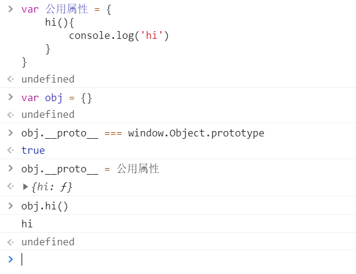

------------------

### Function.prototype.call()

* `call()` 方法使用一个指定的 `this` 值和单独给出的一个或多个参数来调用一个函数

* ```js
  function.call(thisArg, arg1, arg2, ...)
  ```

* `thisArg` 可选的，在 `function` 函数运行时使用的 `this` 值

* `arg1,arg2,...` 指定的参数列表

* 使用调用者提供的 `this` 值和参数调用该函数的返回值。

* 若该方法没有返回值，则返回 `undefined`

-----------------------

```js
var 公用属性 = {
    hi(a){
        console.log(a)
    }
}
var obj = {}
obj.__proto__ = 公用属性
obj.hi()
```

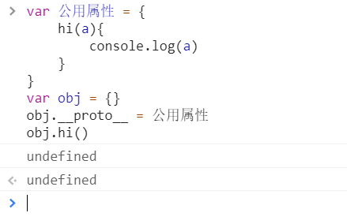

```js
var 公用属性 = {
    hi(a){
        console.log(this)
        console.log(a)
    }
}
var obj = {
    name:'余罪'
}
obj.__proto__ = 公用属性
obj.hi('留学生')
```

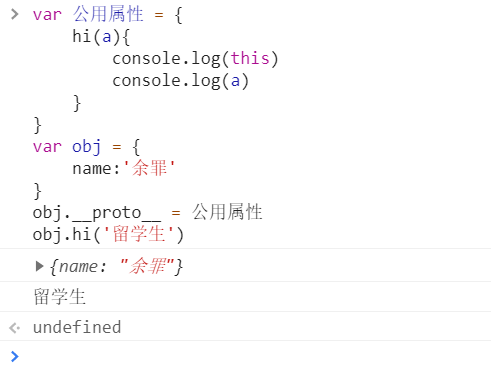

### 类

* 拥有相同属性的对象

### 构造函数

* 用来创建某个类的对象的函数


