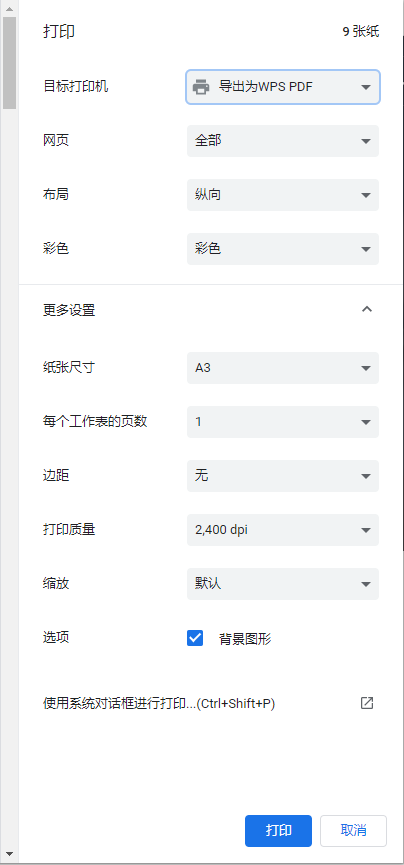

# windows

- win + D  
  展示桌面
- win + 方向键  
  移动窗口
- alt + tab / win + tap  
  切换窗口
- win + ctrl + 方向键  
  切换桌面
- ctrl + R / F5  
  刷新
- ctrl + P  
  打印

打印注意事项：边距无，勾选背景图形，取消勾选页眉页脚，导出为 PDF。

(2)

# Chrome

- 鼠标中键单击  
  打开或关闭
- ctrl + T  
  新开标签
- ctrl + shift + T  
  撤销关闭
- ctrl + 点击  
  在新标签打开
- ctrl + W  
  关闭当前标签
- ctrl + L  
  输入网址
- alt + 回车  
  在新标签页打开
- shift + 回车  
  在新窗口打开
- ctrl + shift + delete  
  删除历史浏览数据
