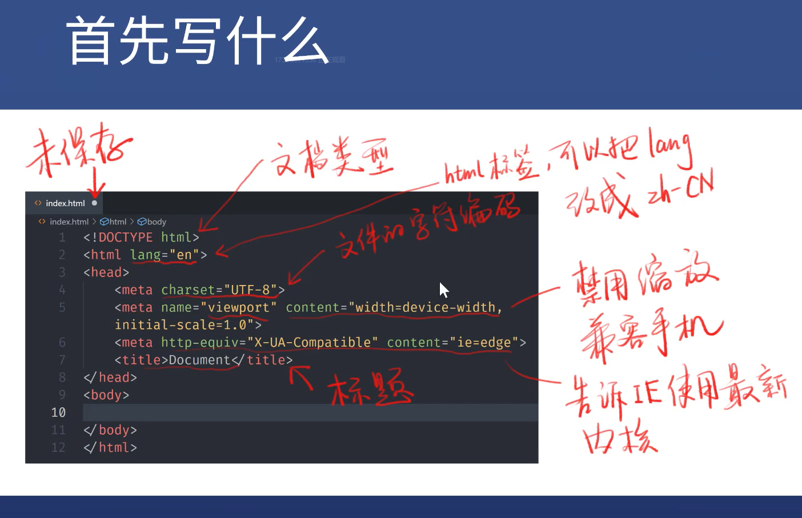

# HTML入门笔记1

## HTML是谁发明的？

李爵士（Tim Berners-Lee ）

## HTML起手应该写什么？

## 常用的表章节的标签

* 标题 h1~h6
* 章节 section
* 文章 article
* 段落 p
* 头部 header
* 脚部 footer
* 主要内容 main
* 旁支内容 aside
* 划分 div

## 全局属性

* 所有标签都有的属性
* class
* **contenteditable**
  - contenteditable** 是一个枚举属性，表示元素是否可被用户编辑。 如果可以，浏览器会修改元素的部件以允许编辑。
  - 该属性必须是下面的值之一：
    - `true` 或空字符串，表示元素是可编辑的；
    - `false` 表示元素不是可编辑的。
  - 如果没有设置该属性，其默认值继承自父元素。
  - 该属性是一个枚举属性，而非布尔属性。这意味着必须显式设置其值为 `true`、`false` 或空字符串中的一个，并且不允许简写为 `<label contenteditable>Example Label</label>`正确的用法是 `<label contenteditable="true">Example Label</label>`。
* **hidden**
  * 隐藏标签
* id 
* style
* **tabindex**
  - 正数，如tabindex=1 / 2/ 3/，表示按顺序访问
  - 0， 表示最后访问
  - -1， 表示不要用tab访问
* title

## 内容标签

* ol + li 有序列表
* ul + li 无序列表
* dl + dt + dd
  * dt 要描述的对象
  * dd 要描述的内容
* pre
  * 预定义格式文本，在该元素中的文本通常按照原文件中的编排，以等宽字体的形式展现出来，文本中的空白符（比如空格和换行符）都会显示出来。(紧跟在 `<pre> `开始标签后的换行符也会被省略)
* hr 水平分隔线
* br 换行
* em 表示语气上的强调
* strong 表示内容本身很重要
* code
  * 呈现一段计算机代码. 默认情况下, 它以浏览器的默认等宽字体显示。如果需要写换行的代码，可以嵌套一个pre标签。
* quote 行内引用
* blockquote 块级引用