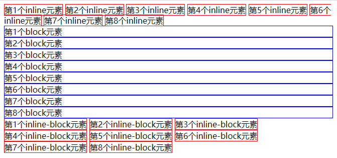

# CSS语法和文档流

## 层叠样式表

### 层叠指什么？

* **样式层叠**：可以多次对同一选择器进行样式声明
* **选择器层叠**：可以用不同选择器对同一个元素进行样式声明
* **文件层叠**：可以用多个文件进行层叠

## CSS的版本

* CSS 2.1 是使用最广泛的版本

## 如何查询浏览器对CSS特性的兼容性？

* 使用 [caniuse.com](https://caniuse.com/)

## CSS语法

### 语法一：样式语法

选择器 {

​	属性名: 属性值 ;

​	/* 注释 */

}

```css
        p {
            color: red;
            /*将字体设置为红色*/
        }
```


### 语法二：at 语法

```css
        @charset "UTF-8" ; /*必须写在第一行*/
        @import url(2.css) ;
        @media (min-width: 100px) and (max-width: 200px) {
            语法一
        } 
```


## 文档流

* 文档流是指HTML元素的流动方向

### 流动方向

* inline 元素从左到右，到达最右边才会换行，如果最右边长度不够一个 inline 元素，会自动切割为两半，一半在这一行，一半在下一行，即跨越两行
* block 元素从上到下，每一个都另起一行
* inline-block 也是从左到右，但不会跨越两行



### 宽度

* inline 宽度为内部 inline 元素的和，不能用 width 指定
* block 默认自动计算宽度（width:auto;），即能占多宽就占多宽，可用 width 指定
  * block 元素的默认宽度不是100%，也尽量不要对 block 元素写 width: 100%;
* inline-block 默认宽度是内部 inline 元素的和，可以用 widht 指定宽度
* inline 元素是尽可能窄，block 元素是尽可能宽

### 高度

* inline 高度由 line-height 间接确定，跟 height 无关
* block 高度由内部文档流元素决定，可以设 height
* inline-block 跟 block 类似，可以设置 height
* 一个空的 div 的高度是0，一个空的 span 元素的高度不是0，因为 span 元素的高度是 line-height 决定的

 ### overflow 溢出

* 内容的宽度或高度大于容器，会溢出
* 可用 overflow 来设置是否显示滚动条
* auto 是灵活设置，只有在需要的时候才出现滚动条
* scroll 是永远显示滚动条
* hidden 是直接隐藏溢出部分
* visible 是直接显示溢出部分
* overflow 可以分为 overflow-x 和 overflow-y

### 脱离文档流

* flotat
* position: absolute / fixed


