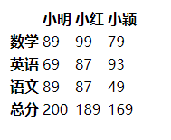
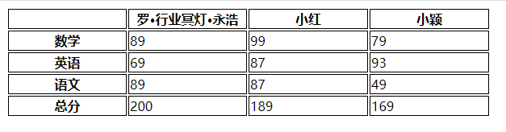
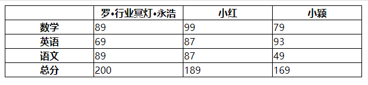
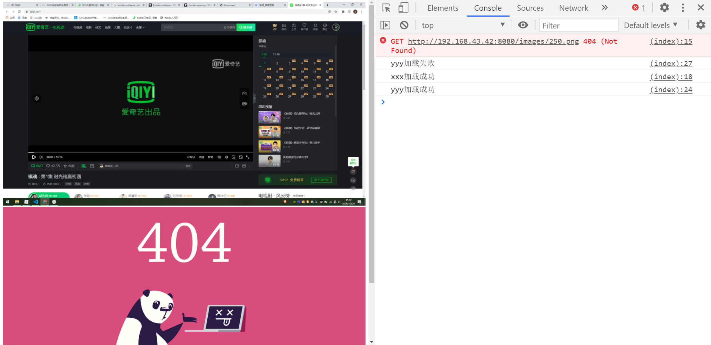

# HTML常用标签

## a标签

### 网址

* https://google.com
- http://google.com
* //google.com

### 伪协议

* javascript: 代码 ;
  * `<a href="javascript:;">啥都不干</a>`
* mailto: 邮箱
  * `<a href="mailto:1256926083@qq.com">举报</a>`
* tel: 手机号
  * `<a href="tel:17756658235">摇人</a>`

* id: href=#id名，可以跳转到id名为Id的标签

1. * `<p id="xxxx"></p>, <a href="#xxx"></a>`就可以定位到这个p标签

## table标签

### thread

### tbody

### tfoot

* tr 
  * table row 一行

* th
  * table head 表头

* td
  * table data 数据

```html
    <table>
        <thead>
            <tr>
                <th></th>
                <th>小明</th>
                <th>小红</th>
                <th>小颖</th>
            </tr>
        </thead>
        <tbody>
            <tr>
                <th>数学</th>
                <td>89</td>
                <td>99</td>
                <td>79</td>
            </tr>
            <tr>
                <th>英语</th>
                <td>69</td>
                <td>87</td>
                <td>93</td>
            </tr>
            <tr>
                <th>语文</th>
                <td>89</td>
                <td>87</td>
                <td>49</td>
            </tr>
        </tbody>
        <tfoot>
            <tr>
                <th>总分</th>
                <td>200</td>
                <td>189</td>
                <td>169</td>
            </tr>
        </tfoot>
    </table>
```



## table的样式

* table-layout：

  * `auto;` 表示根据内容来计算宽度
* `fixed;` 表示定宽，尽可能地让宽度平均

```css
      	/*auto*/
		table {
            width: 600px;
            table-layout: auto;
        } 
         th,td {
            border: 1px solid black;
        }
```


```css
        /*fixed*/
		table {
            width: 600px;
            table-layout: fixed;
        } 
         th,td {
            border: 1px solid black;
        }
```



* border-collapse 和 border-spacing用来调整表格Border的间隔

  * `border-collapse` 属性用来决定表格的边框是分开的还是合并的。在分隔模式下，相邻的单元格都拥有独立的边框。在合并模式下，相邻单元格共享边框。

  * `border-spacing` 属性指定相邻单元格边框之间的距离。

    ```css
            /*border-collapse*/
    		table {
                width: 600px;
                table-layout: fixed;
                border-collapse: collapse;
            } 
             th,td {
                border: 1px solid black;
            }
    ```

  

  ​		

   ```css
          /*border-spacing*/
          table {
              width: 600px;
              table-layout: fixed;
              border-spacing: 0;
          } 
           th,td {
              border: 1px solid black;
          }
   ```

  

## image标签

### 作用

* 发出 get 请求，展示一张图片

### 属性

* src  图片地址
* alt  如果图片加载失败，会显示 alt 属性的文字
* width / height  宽/高，如果只写其中一个，另一个会自适应。

## 事件

* onload  加载成功
* onerror  加载失败

### 示例

* 在图片加载失败时，加载备用图片

  ```html
      <style>
          img {
              max-width: 100%;
          }
      </style>
      
      
      <script>
          xxx.onload = function() {
              console.log('xxx加载成功');
          }
          xxx.onerror = function() {
              console.log('xxx加载失败');
          }
          yyy.onload = function() {
              console.log('yyy加载成功');
          }
          yyy.onerror = function() {
              console.log('yyy加载失败');
              yyy.src="/images/404.png"
          }
      </script>
  ```

  

 ## 响应式

* max-width: 100%  这样图片就可以自适应不同的屏幕大小。


## form 标签

### 作用

* 发 get 或 post 请求，然后刷新页面

## 属性

* action  往哪里发请求
* method  用哪种方式请求，GET或POST
* autocomplete  自动填充
  * `off`：在每一个用到的输入域里，用户必须显式的输入一个值，浏览器不会自动补全输入。
  * `on`：浏览器能够根据用户之前在表单里输入的值自动补全, 会给出填这个表单的提示。
* target: 在当前页面提交，还是新开一个页面提交

#### input 的 submit 和 button 的 submit 有什么区别？

* input 标签里不能再有其他的标签
* button 标签里可以有其他的标签，可以对提交按钮设置样式

