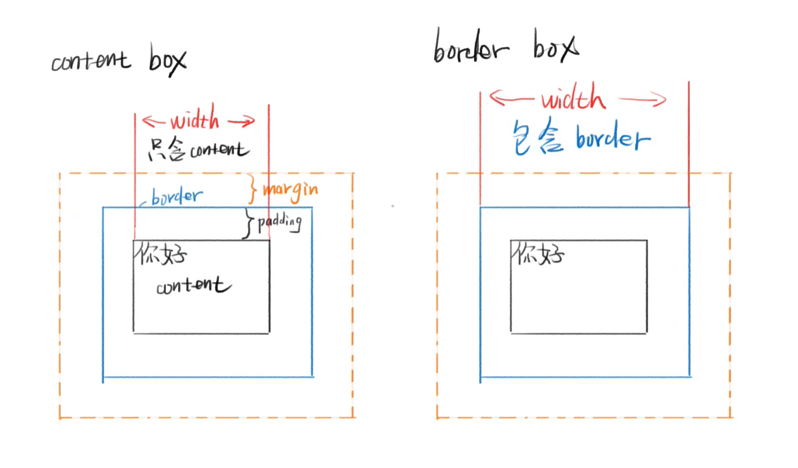
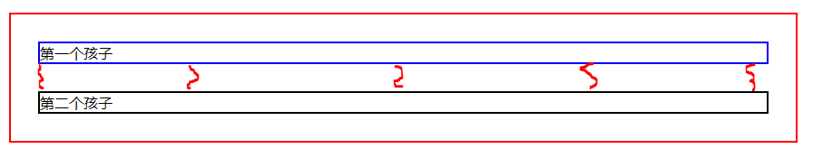
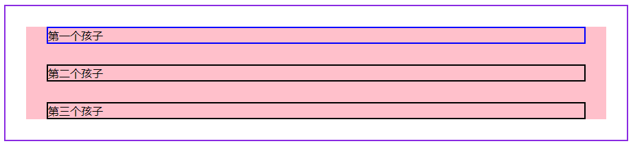

# CSS盒模型

## content-box 内容盒

* 内容就是盒子的边界
* width = 内容宽度

## border-box 边框盒

* 边框才是盒子的边界
* width = 内容宽度 + padding + border



## 简述CSS盒模型是什么？

CSS盒模型有两种，一种是 content-box ，一种是 border-box 。

content-box 的宽度 width 表示内容区的宽度，不包含 padding 和 border 。

border-box 的宽度 width 表示内容区 + padding + border 的总和。

一般优先使用后者。

## margin 合并

### 兄弟合并

```html
    <style>
        .parent {
            border: 2px solid red;
            margin: 20px;
        }
        .child1 {
            border: 2px solid blue;
            margin: 30px;
        }
        .child2 {
            border: 2px solid black;
            margin: 30px;
        }
    </style>
    <div class="parent">
        <div class="child1">第一个孩子</div>
        <div class="child2">第二个孩子</div>
    </div>
```



* 第一个 div 的 margin-bottom 和 第二个 div 的 margin-top 合并

### 父子合并

```html
    <style>
        body {
            border: 2px solid blueviolet;
        }
        .parent {
            margin: 30px;
            background-color: pink;
        }
        .child1 {
            border: 2px solid blue;
            margin: 30px;
        }
        .child2 {
            border: 2px solid black;
            margin: 30px;
        }
    </style>
    <div class="parent">
        <div class="child1">第一个孩子</div>
        <div class="child2">第二个孩子</div>
        <div class="child2">第三个孩子</div>
    </div>
```



* parent 的 margin-top 和 child1 的 margin-top 合并
* parent 的 margin-bottom 和 child3 的 margin-bottom 合并
* margin 合并只存在于上下外边距，左右外边距不会合并

## 取消 margin 合并

* 对于兄弟合并：用 display: inline-block;

* 对于父子合并：

  * 给 parent 加 border 
  * 给 parent 加 padding
  * 给 parent 加 overflow: hidden

  margin 能合并就是因为父子的 margin 之间没有其他东西，如果加了 border 或者 padding 就等于在父子margin 中间加了东西，因此也就无法合并 margin 了。

## 基本单位

### 长度单位

* px 像素
* em 相对于自身 font-size 的倍数
* 百分数
* 整数

颜色

* 十六进制 #FF6600 或者 #F60
* RGBA 颜色 rgb(0,0,0) 或者 rgba(0,0,0,1)
* hsl 颜色 hsl(360,100%,100%)