# flex布局

教程：[css tricks flex](https://css-tricks.com/snippets/css/a-guide-to-flexbox/)

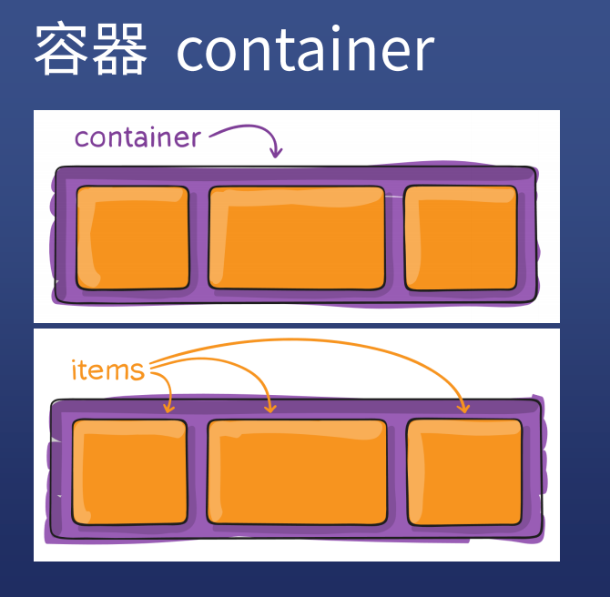

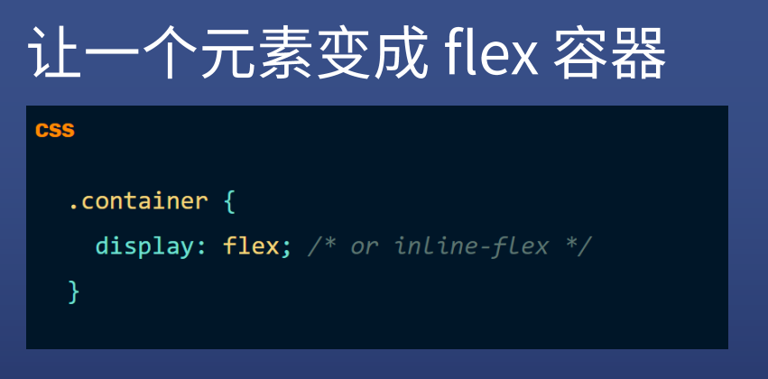

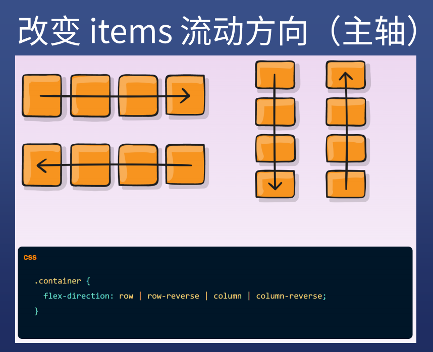

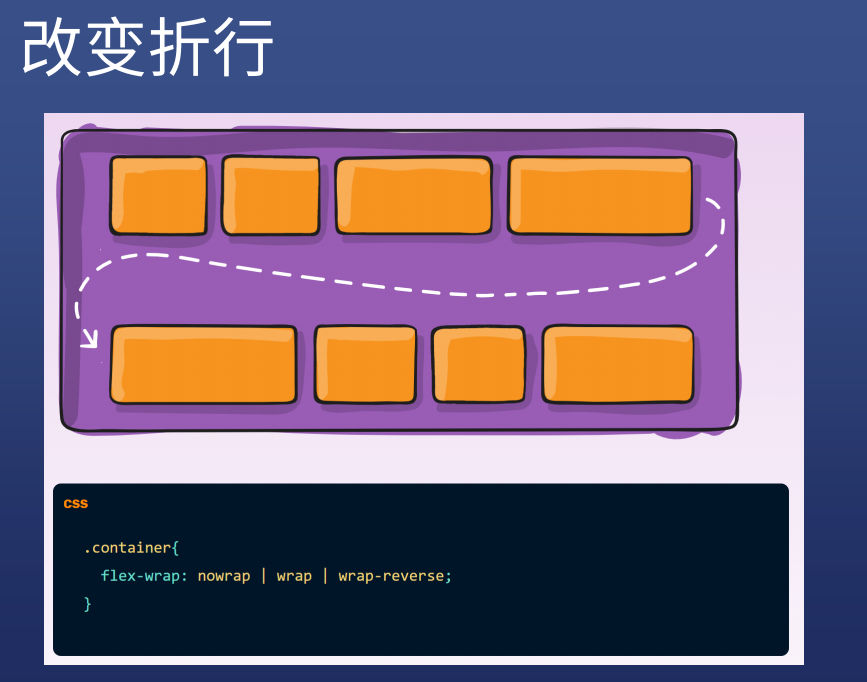

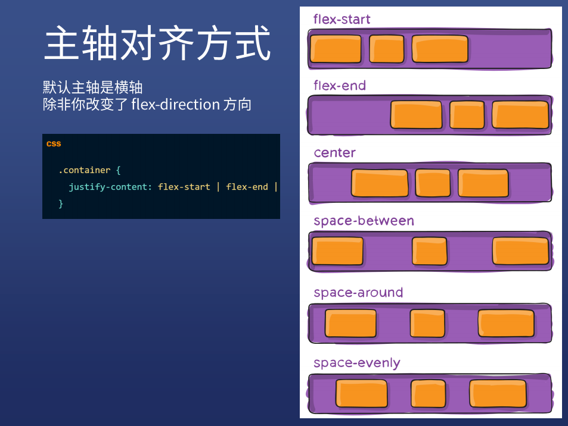

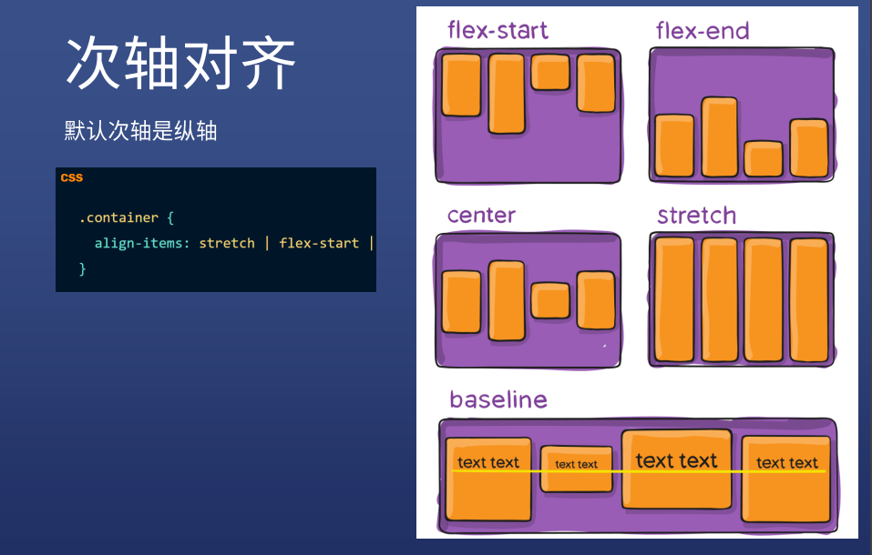

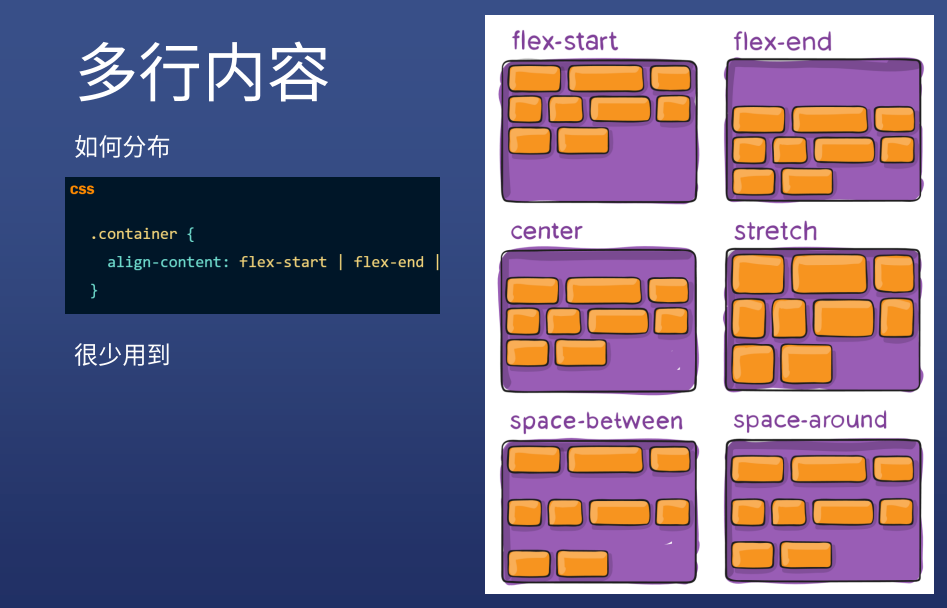

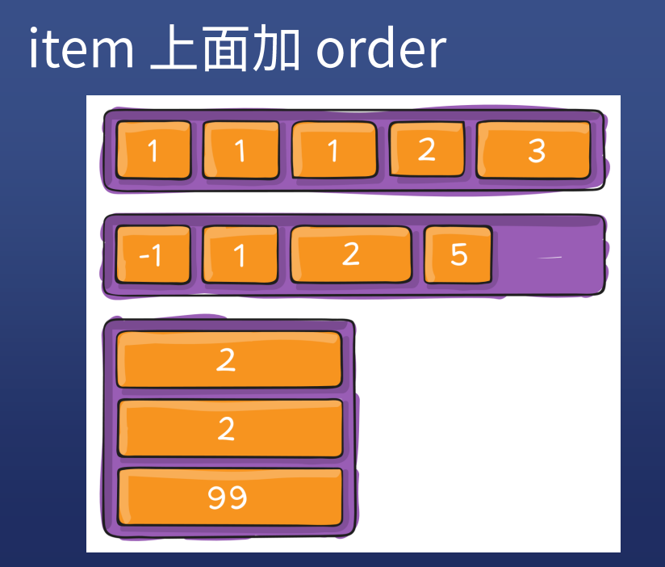

### item的属性：

* order: 默认是0
  * 按照 order 从小到大的顺序排
  * 负数、0、正数

* flex-grow
  * 使用技巧：三栏布局时，两边的不设置，中间的设置 flex-grow: 1;

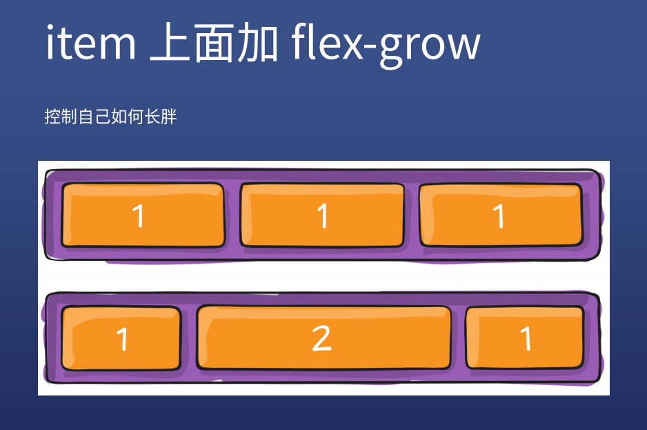

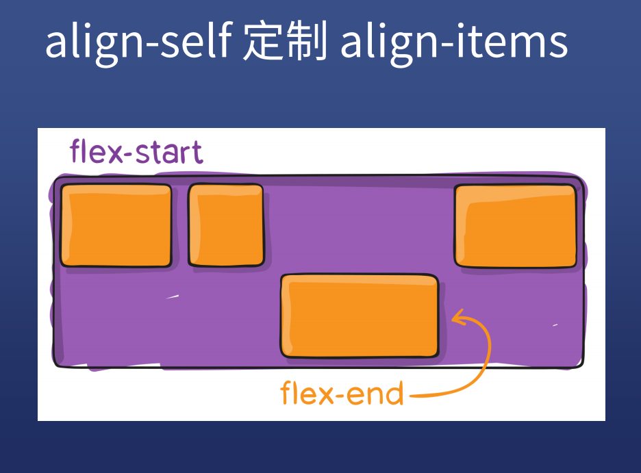

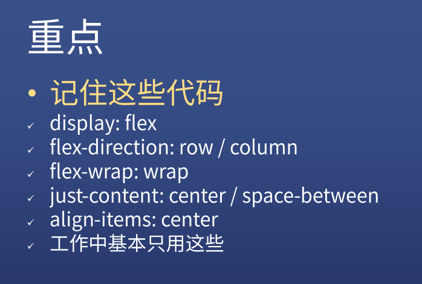

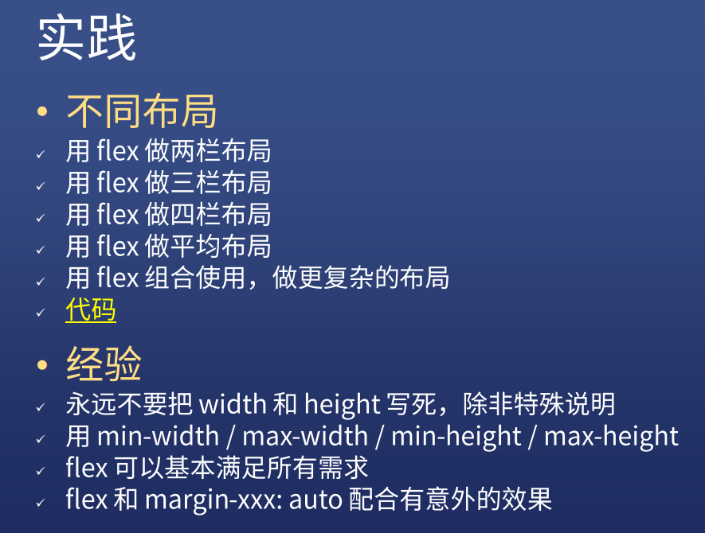

### 示例

https://clouddawn.github.io/flex/index.html