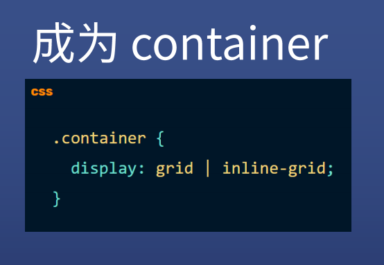
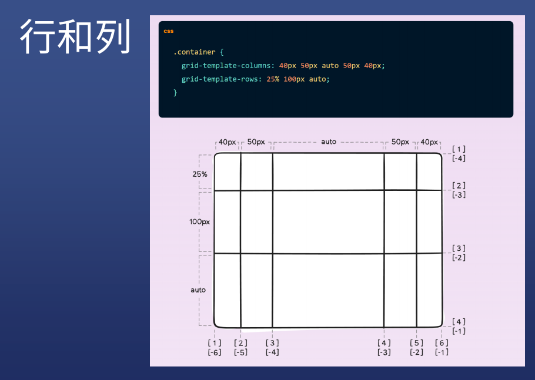
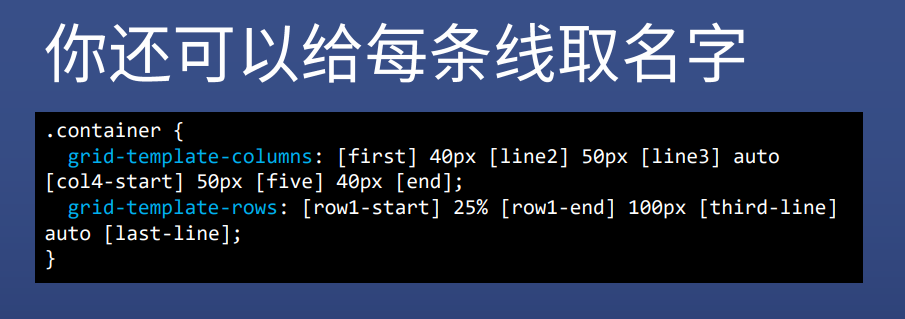
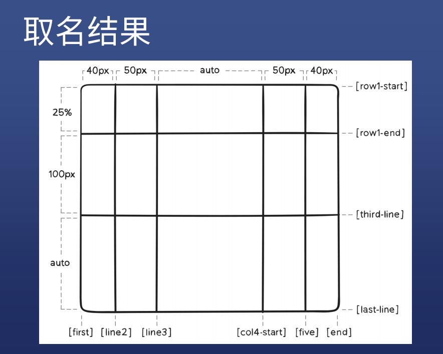
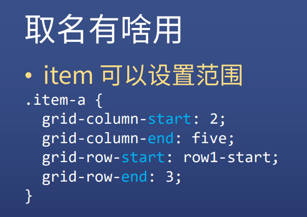
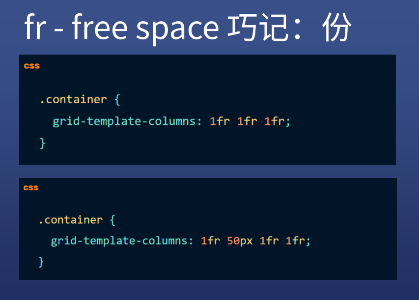
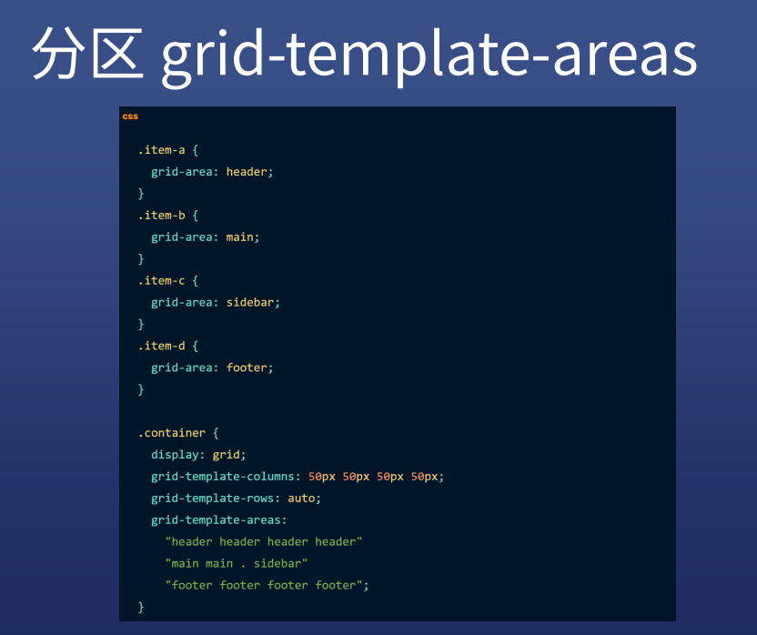
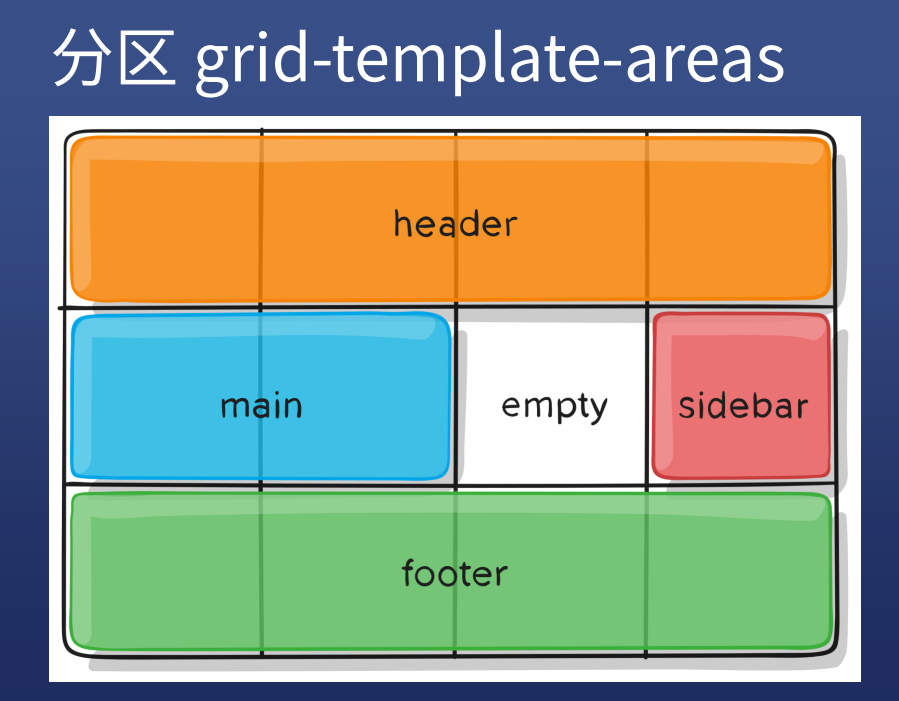
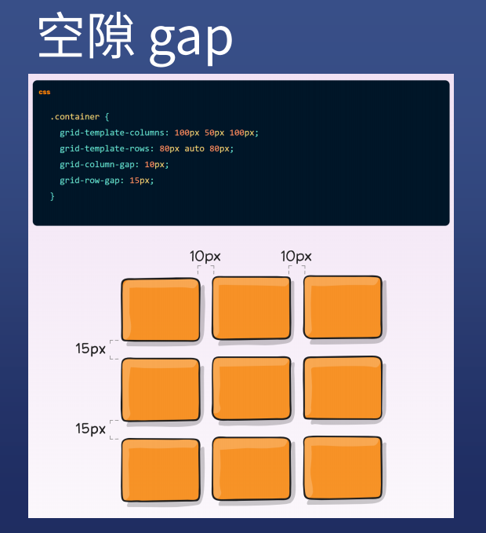

# grid布局

教程：https://css-tricks.com/snippets/css/complete-guide-grid/

* 二维布局用 grid ，一维布局用 flex

* grid尤其适合不规则布局

参考资料：

1. https://www.yuque.com/daughter-of-time/labuladongpanda123456/gxz6tp
2. http://js.jirengu.com/kabok/1/edit?html,css,output

