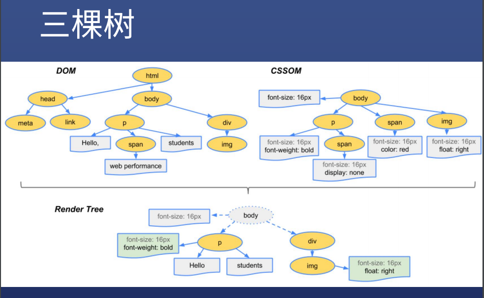
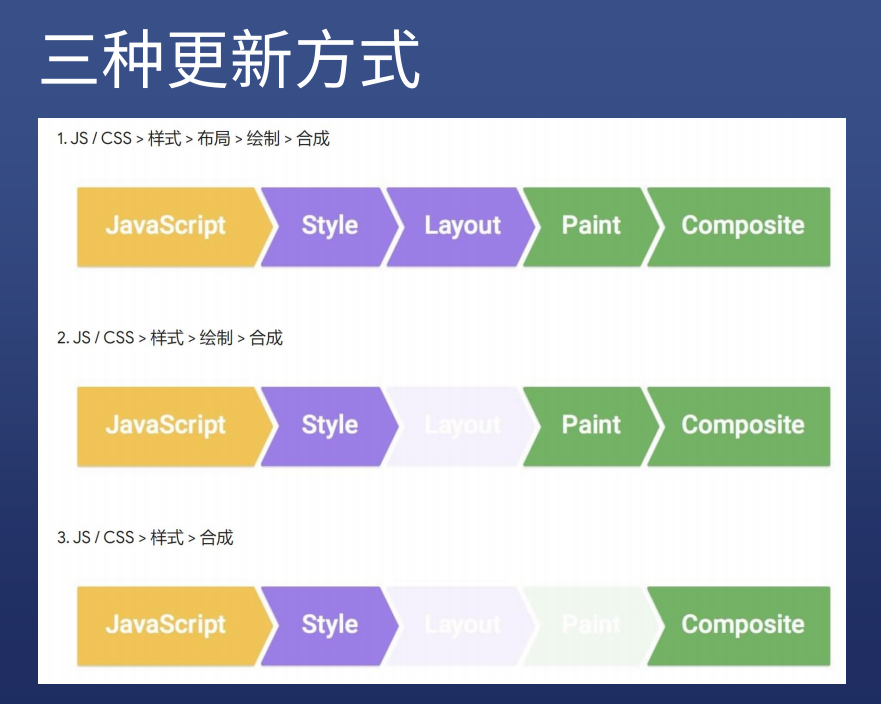

# css动画

## 原理

* 人脑的bug

## 定义

* 由许多静止的画面（帧），以一定的速度（如每秒30张）连续播放时，肉眼因视觉残象产生错觉，而误以为是活动的画面

## 概念

* 帧：每个静止的画面都叫做帧
* 播放速度：每秒24帧（影视）或者每秒30帧（游戏）

## 示例

* [将div从左往右移动](https://clouddawn.github.io/blog//md/demo/animation/demo-1/index.html)
* [疑问](https://app.yinxiang.com/fx/99bcb638-bd11-453d-bd6e-6086f3f4bbc3)
* 原理
  * 每过一段时间（用 setInterval 做到），将 div 移动一小段距离，直到移动到目标地点
* **setInterval()** 方法重复调用一个函数或执行一个代码段，在每次调用之间具有固定的时间延迟。在窗口和工作接口上提供的**setInterval()**方法重复调用函数或执行代码片段，每次调用之间有固定的时间延迟。它返回一个时间间隔ID，该ID唯一地标识时间间隔，因此您可以稍后通过调用**clearInterval()**来删除它。
* 在开发者工具中勾选 Paint flashing 
* 注意性能
  * 绿色表示重新绘制（repaint）了，CSS渲染过程依次包含布局（layout）、绘制（paint）、合成（composite），其中布局和绘制有可能被省略

## 前端高手不用 left 做动画

* 用 transform （变形）
* [demo-2](https://clouddawn.github.io/blog//md/demo/animation/demo-2/index.html)
* 原理
  * transform: translateX(0 => 300px) ，直接修改会被合成，需要等一会修改，transition 过渡属性可以自动脑补中间帧

* **setTimeout()**方法设置一个定时器，该定时器在定时器到期后执行一个函数或指定的一段代码。

* 注意性能
  * 并没有repaint（重新绘制），比改 left 性能好

## 浏览器渲染过程

* 根据 HTML 构建 HTML 树（DOM）

* 根据 CSS 构建 CSS 树（CSSOM）

* 将两棵树合并成一颗渲染树（render tree）

* Layout 布局（文档流、盒模型、计算大小和位置）

* Paint 绘制（把边框颜色、文字颜色、阴影等画出来）

* Composite 合成（根据层叠关系展示画面）

  

  

## 如何更新样式

### 一般我们用 JS 来更新样式

* 比如 div.style.background = 'red'
* 比如 div.style.display = 'none'
* 比如 div.classList.add('red')
* 比如 div.remove() 直接删掉节点

### 那么这些方法有什么不同吗？

* 第一种，全走
  * [div.remove()](http://js.jirengu.com/yegum/1/edit?html,css,js,output) 会触发当前消失，其他元素 relayout

* 第二种，跳过 layout
  * [改变背景颜色](http://js.jirengu.com/mafut/1)，直接 repaint + composite

* 第三种，跳过 layout 和 paint
  * [改变 transform](http://js.jirengu.com/wusew/1)，只需 composite 

* 以上链接必须全屏查看效果，在 iframe 里看有问题

* 查看每个属性触发什么流程：https://csstriggers.com/

## css 动画优化

* 参考资料：https://developers.google.com/web/fundamentals/performance/rendering
* JS 优化 
  * 使用 requestAnimationFrame 代替 setTimeout 或 setInterval

* CSS 优化
  * 使用 will-change 或 translate

## transform

* 四个常用功能
  * 位移  translate
  * 缩放  scale
  * 旋转  rotate
  * 倾斜  skew

* 经验
  * 一般都需要配合 transition 过渡
  * inline 元素不支持 transform ,需要先变成 block

## transform 之 translate

* 常用写法
  * translateX(< length-percentage >)
  * translateY(< length-percentage >)
  * translate(< length-percentage >,< length-percentage >?)
  * translateZ(< length >)且父容器 perspective
  * translate3d(x,y,z)
  
* 经验
  * translate(-50%,-50%)可做绝对定位元素的居中
  * 示例：http://js.jirengu.com/mipuf/1/edit?html,css,output

## transform 多重效果

* 组合使用

* transform: scale(0.5) translate(-100%, -100%);

  

跳动的心示例一：http://js.jirengu.com/luvom/1/edit?html,css,output

跳动的心示例二：http://js.jirengu.com/davip/1/edit?html,css,output

## transition 过渡

* 作用：补充中间帧

* transition: 属性名 时长 过渡方式 延迟
  * transition: left 200ms linear

* 可以用逗号分隔两个不同属性
  * transition: left 200ms, top 400ms

* 可以用 all 代表所有属性
  * transition: all 200ms

* 常用过渡方式有：linear | ease
* 注意，并不是所有属性都能过渡
  * display: none => block 没法过渡
  * 一般改成 visibility: hedden => visible
  * background颜色和opacity透明度可以过渡

### 过渡必须要有起始

* 一般只有一次动画，或者两次

## animation

* animation: 时长|过渡方式|延迟|次数|方向|填充模式|是否暂停|动画名
  * 时长： 1s 或者 1000ms
  * 过渡方式：跟 transition 取值一样，如 linear
  * 次数：3 或者 2.4 或者 infinite
  * 方向：reverse|alternate|alternate-reverse
  * 填充模式：none|forwards|backwards|both
  * 是否暂停：paused|running

示例：http://js.jirengu.com/wisup/1/edit?html,css,output

