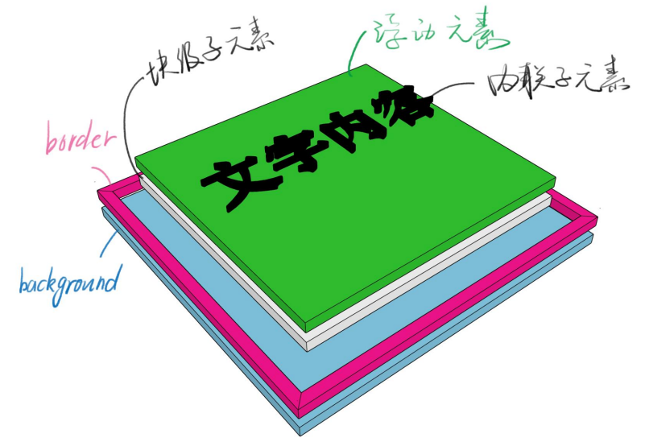
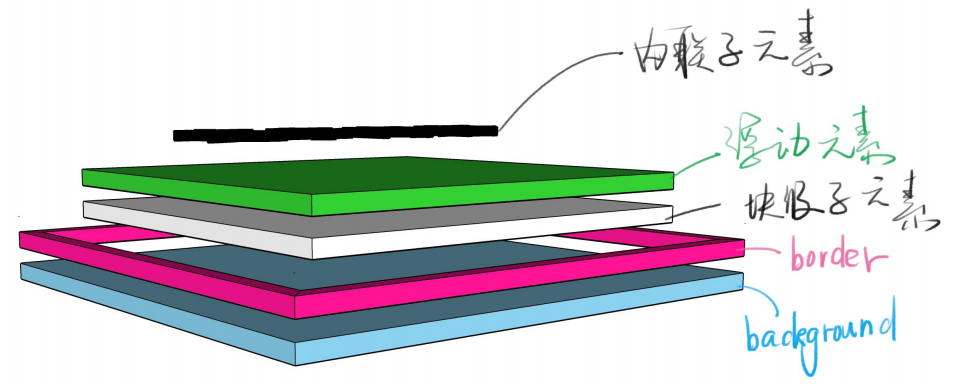
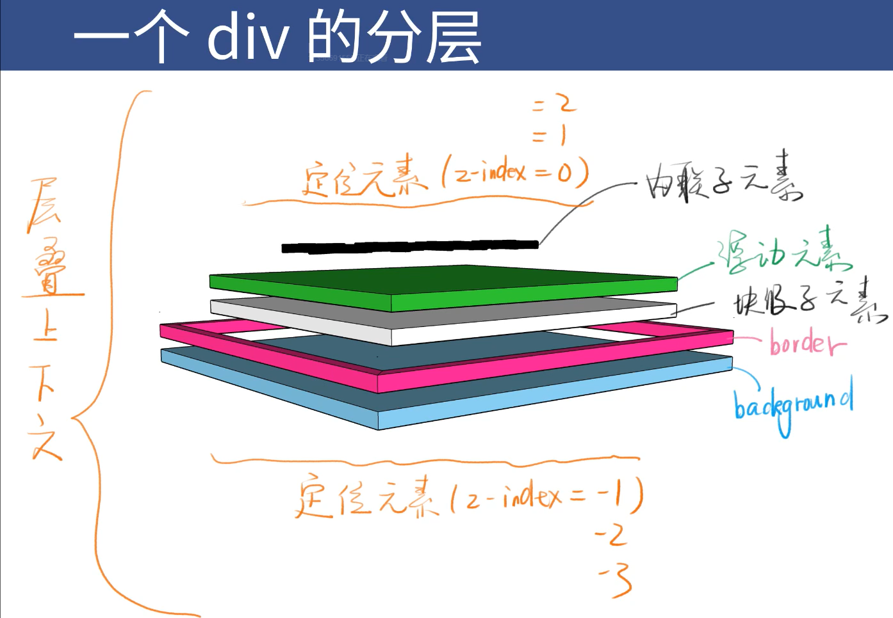

# css定位

## 布局和定位的区别

* 布局是屏幕平面上的，定位时垂直于屏幕的

## 一个div的分层

* 浮动元素脱离文档流其实就是浮起来了一点点

## position

* static    默认值，待在文档流里
* relative    相对定位，升起来，但不脱离文档流
* absolute    绝对定位，定位基准是祖先里的非 static 元素
* fixed    固定定位，定位基准是  viewport
* sticky    粘滞定位

### 经验

* 如果你写了 absolute，一般都得补一个 relative
* 如果你写了 absolute 或 fixed，一定要补 top 和 left
* sticky [兼容性](https://caniuse.com/?search=sticky)很差

## 层叠上下文

* 比喻
  * 每个层叠上下文就是一个新的小世界（作用域）
  * 这个小世界里面的 z-index 跟外界无关
  * 处在同一个小世界的z-index 才能比较

