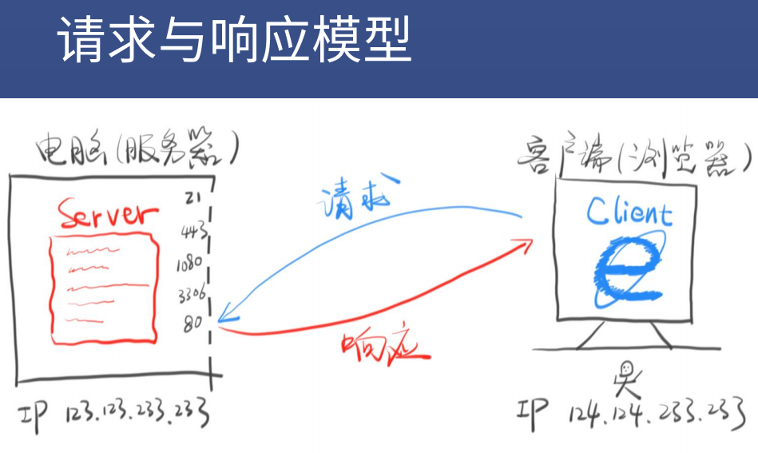
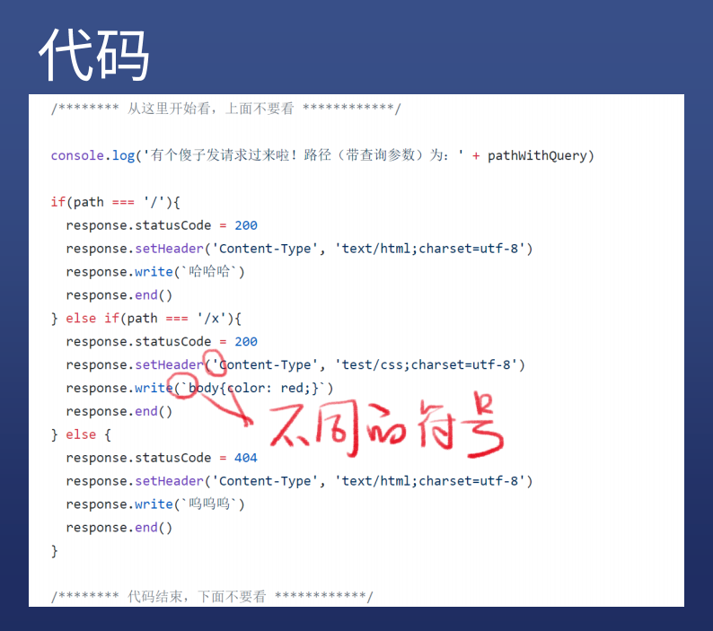

# HTTP请求与响应



## 如何发请求？

### 方法

* 用 chrome 地址栏
* 用 curl 命令

### 概念

* 帮你发请求的工具叫做**用户代理**
* 英文名 User Agent

## 如何做出一个响应？

### 需要编程

* Node.js 有一个 http 模块可以做到
* 代码示例

```js
var http = require('http')
var fs = require('fs')
var url = require('url')
var port = process.argv[2]

if(!port){
  console.log('请指定端口号好不啦？\nnode server.js 8888 这样不会吗？')
  process.exit(1)
}

var server = http.createServer(function(request, response){
  var parsedUrl = url.parse(request.url, true)
  var pathWithQuery = request.url 
  var queryString = ''
  if(pathWithQuery.indexOf('?') >= 0){ queryString = pathWithQuery.substring(pathWithQuery.indexOf('?')) }
  var path = parsedUrl.pathname
  var query = parsedUrl.query
  var method = request.method

  /******** 从这里开始看，上面不要看 ************/

  console.log('有个傻子发请求过来啦！路径（带查询参数）为：' + pathWithQuery)

  if(path === '/'){
    response.statusCode = 200
    response.setHeader('Content-Type', 'text/html;charset=utf-8')
    response.write(`二哈`)
    response.end()
  } else if(path === '/x'){
    response.statusCode = 200
    response.setHeader('Content-Type', 'text/css;charset=utf-8')
    response.write(`body{color: red;}`)
    response.end()
  } else {
    response.statusCode = 404
    response.setHeader('Content-Type', 'text/html;charset=utf-8')
    response.write(`你输入的路径不存在对应的内容`)
    response.end()
  }

  /******** 代码结束，下面不要看 ************/
})

server.listen(port)
console.log('监听 ' + port + ' 成功\n请用在空中转体720度然后用电饭煲打开 http://localhost:' + port)

```


### 注意事项

* 这些代码就是服务器代码，一般放在服务器上
* path 是不带查询参数的路径 /x
* query 是查询参数的对象形式 {a:'1'}
* queryString 是查询参数的路径，一般不用
* request 是请求对象
* response 是响应对象



## 代码逻辑

### 语法

* **``**这种字符串里面可以回车
* **''**这种字符串里面要回车只能用 \n 表示

### 逻辑

* 每次收到请求都会把中间的代码执行一遍
* 用 if else 判断路径，并返回响应
* 如果是已知路径，一律返回 200
* 如果是未知路径，一律返回 404
* Content-Type 表示内容的**类型/语法**
* response.write() 可以填写返回的内容

* response.end() 表示响应可以发给用户了

### 注意事项

* URL里的后缀卵用没有，/y.css 不一定是 CSS 内容
* Content-Type 才是决定文件类型的关键

## HTTP 基础概念

### 请求

* 请求动词    路径加查询参数	协议名/版本
* Host: 域名或 IP
* Accept: text/html
* Content-Type: 请求体的格式
* 回车
* 请求体（也就是上传内容）

#### 细节

* 三部分：请求行、请求头、请求体
* 请求动词有 GET / POST / PUT / PATCH / DELETE 等
* 请求体在 GET 请求中一般为空
* 大小写不敏感（随意）

### 响应

* 协议名/版本	状态码	状态字符串
* Content-Type: 响应体的格式
* 回车
* 响应体（也就是下载内容）

#### 细节

* 三部分：状态行、响应头、响应体

## 用 curl 构造请求

* curl -v http://124.0.0.1:8888

### 设置请求动词

* -X POST
* 注意大小写

### 设置路径和查询参数

* 直接在 url 后面加

### 设置请求头

* -H 'Name: Value' 或者 --header 'Name: Value'

### 设置请求体

* -d '内容' 或者 --data '内容'

## 用 Node.js 读取请求

### 读取请求动词

* request.method

### 读取路径

* requset.url    路径，带查询参数
* path 纯路径，不带查询参数
* query 只有查询参数

### 读取请求头

* request.headers['Accept']

## 用 Node.js 设置响应

### 设置响应状态码

* response.statusCode = 200

### 设置响应头

* response.setHeader('Content-Type','text/html');

### 设置响应体

* response.write('内容')
* 可追加内容


