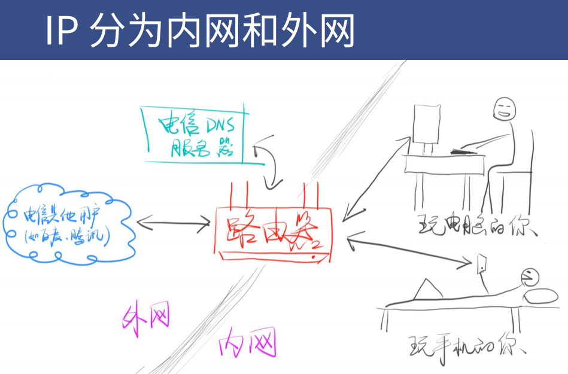
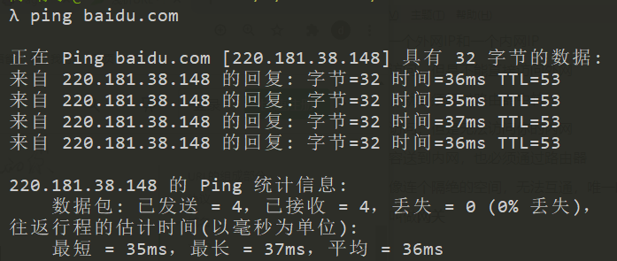
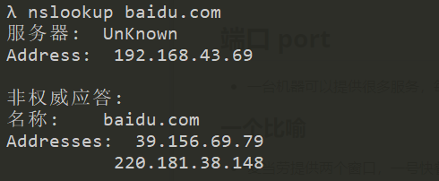
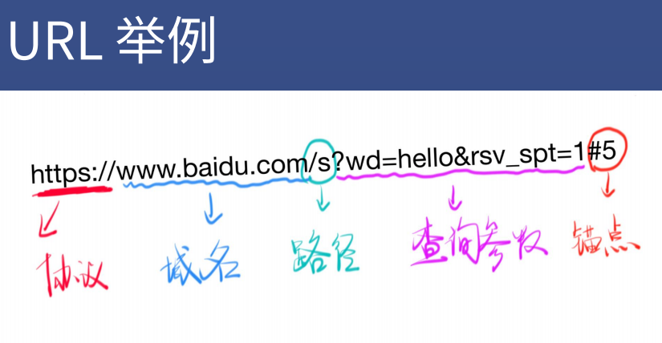

# 浅析URL

## 什么是IP?

**IP**（Internet Protocal）主要约定了两件事：

一、如何定位一台设备

二、如何封装数据报文，以跟其他设备交流

只要你在互联网中，你就有至少一个独特的IP

## 如何获取外网IP

* 从网络运营商租用带宽
* 电脑和手机分别连接路由器广播出来的无限WIFI
* 只要路由器连上了电信的服务器，那么路由器就会有一个**外网IP**，比如 14.17.32.211 就是一个外网IP。这就是你在互联网中的地址
* 但是如果你重启路由器，那么你很有可能被重新分配一个外网IP，也就是说你的路由器没有固定的外网IP
* 但是有个问题，你的路由器的外网IP如果是 14.17.32.211 ，那么你的手机和电脑的IP又是什么呢？
* 答案是**内网IP**

## 内网IP

* 路由器会在你家里创建一个内网，内网中的设备使用内网IP，一般来说这个IP的格式都是 192.168.xxx.xxx
* 一般路由器会给自己分配一个好记的内网IP，如 192.168.1.1
* 然后路由会给每一个内网中的设备分配一个不同的内网IP，如电脑是 192.168.1.2，手机是 192.168.1.3 ，以此类推。

## 路由器的功能

* 现在路由器有两个IP，一个外网IP和一个内网IP
* 内网中的设备可以互相访问，但是不能直接访问外网
* 内网设备想要访问外网，就必须经过路由器中转
* 外网中的设备可以互相访问，但是无法访问你的内网
* 外网中的设备想要把内容送到内网，也必须通过路由器
* 也就是说内网和外网就像连个隔绝的空间，无法互通，唯一的联通点就是路由器
* 所以路由器有时候也被叫做**网关**

## 几个特殊的IP

* 127.0.0.1 表示自己
* localhost  通过 hosts 指定为自己
  * C:\Windows\System32\drivers\etc

* 0.0.0.0 不表示任何设备

### ping

### nslookup

## 端口 port

* 一台机器可以提供很多服务，每个服务一个号码，这个号码就叫端口号 port

### 一个比喻

* 麦当劳提供两个窗口，一号快餐，二号咖啡
* 你去快餐窗口点咖啡会被拒绝，让你去另一个窗口
* 你去咖啡窗口点快餐结果一样

### 一台机器可以提供不同服务

* 要提供 HTTP 服务最好使用 80 端口
* 要提供 HTTPS 服务最好使用 443 端口
* 要提供 FTP 服务最好使用 21 端口
* 一共有 65535个端口（基本够用）
* 可以到[维基百科](https://zh.wikipedia.org/wiki/TCP/UDP%E7%AB%AF%E5%8F%A3%E5%88%97%E8%A1%A8#0.E5.88.B01023.E5.8F.B7.E7.AB.AF.E5.8F.A3)查询应该用什么端口

### 使用规则

* 0 到 1023 （2的10次方减1）号端口是留给系统使用的
* 你只有拥有了管理员权限后，才能使用这 1024 个端口
* 其他端口可以给普通用户使用
* 比如 http-server 默认使用 8080 端口
* 一个端口如果被占用，你就只能换一个端口
* **IP和端口缺一不可**

## 域名

* 域名就是对IP的别称
* baidu.com 对应什么 IP
  * ping baidu.com

* 一个域名可以对应不同的 IP
* 这个叫做均衡负载，防止一台机器扛不住
* 一个 IP 可以对应不同的域名
* 这个叫做共享主机，穷开发者会这么做

### 域名和IP是怎么对应起来的？

* 通过DNS
* 当你输入 baidu.com
* 你的浏览器会向网络运营商提供的 DNS 服务器询问 baidu.com 对应什么 IP
* 网络运营商会回答一个 IP
* 然后浏览器才会向对应 IP 的 80/443 端口 发送请求
* 请求内容是查看 baidu.com 的首页

### 为什么是 80 或 443 端口？

* 服务器默认用 80 提供 http 服务
* 服务器默认用 443 提供 https 服务
* 可以在开发者工具里看到具体的端口

### WWW

* www.baidu.com 和 baidu.com 是同一个域名吗？
* 不是

### 他们是什么关系？

* com 是顶级域名
* xxx.com 是二级域名（俗称一级域名）
* www.xxx.com 是三级域名（俗称二级域名）
* 他们是父子关系
* github.io 把子域名 xxx.github.io 免费给用户使用
* 所以，www.xxx.com 和 xxx.com 可以不是同一家公司，也可以是
* www 其实是多余的

### 如何请求不同的页面

* 使用路径
* https://developer.mozilla.org/zh-CN/docs/Web/HTML

### 如何做到同一个页面，不同内容

* 使用查询参数
* https://www.baidu.com/s?wd=game

### 如何做到同一个内容，不同位置

* 使用锚点
* https://developer.mozilla.org/zh-CN/docs/Web/CSS#参考书
* **注意**，锚点看起来有中文，实际不支持中文
* #参考书会变成 #%E5%8F%82%E8%80%83%E4%B9%A6
* 锚点是无法在 Network 面板看到的，因为锚点不会传给服务器

### URL

* 协议 + 域名或IP + 端口号 + 路径 + 查询字符串 + 锚点

  

### curl 命令

* 用 curl 可以发 HTTP 请求
* curl -v http://baidu.com
* curl -s -v -- https://www.baidu.com
* url 会被 curl 工具重写，先请求 DNS 获得 IP
* 先进行 TCP 连接，TCP 连接成功后，开始发送 HTTP 请求
* 响应结束后，关闭 TCP 连接
* **HTTP**规定请求的格式是什么，响应的格式是什么

