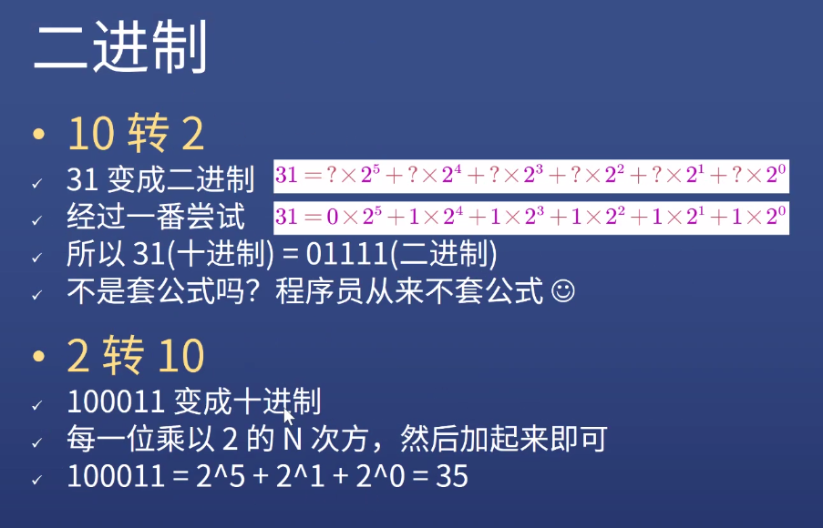
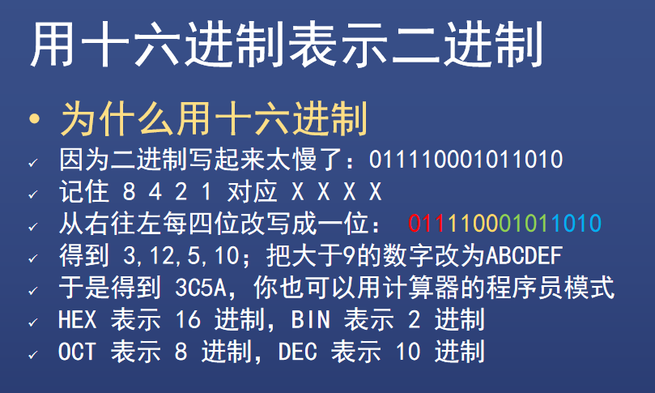
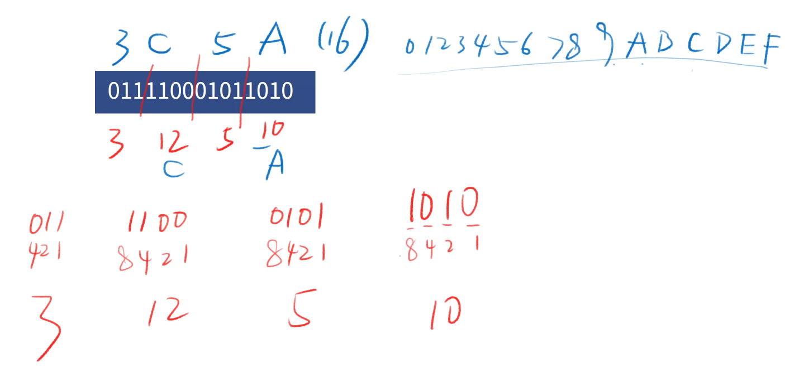
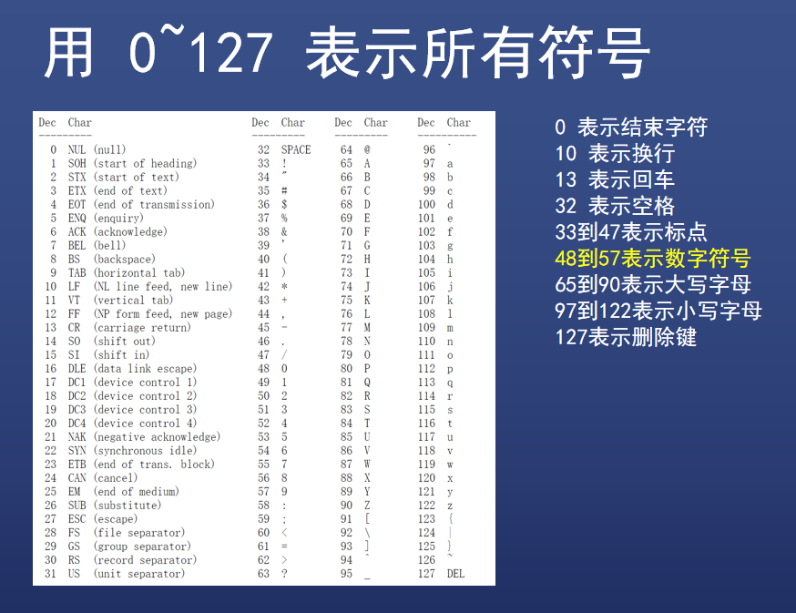
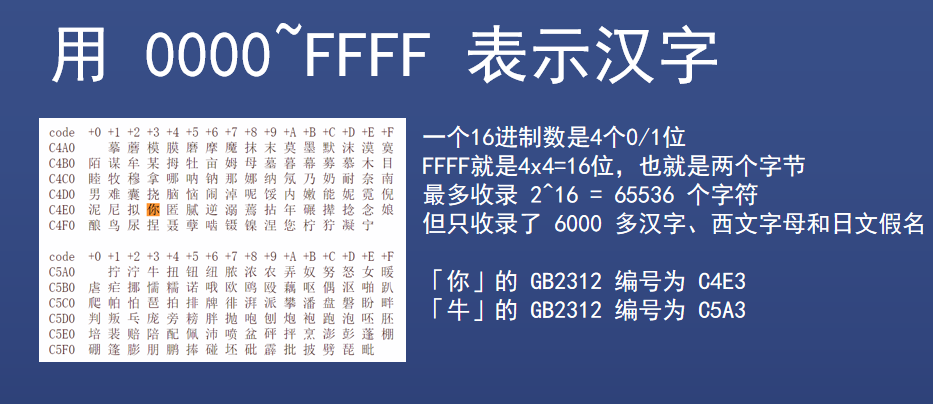
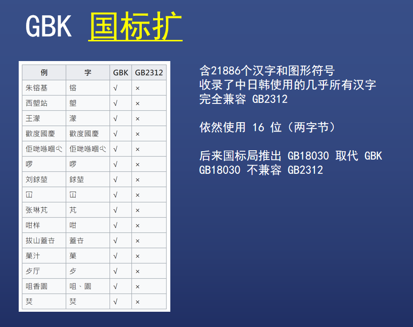
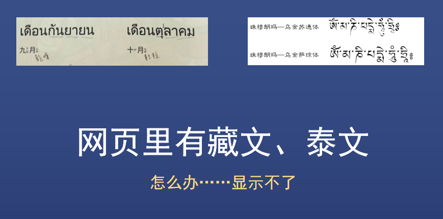
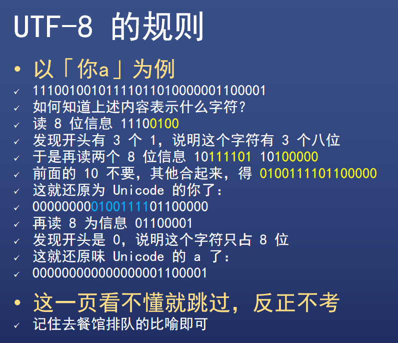

# JS数据类型（一）

## 数字与字符串

### 都是一，为什么要分 1 和 '1' ？

#### 功能不同

* 数字是数字，字符串是字符串，要严谨
* 数字能加减乘除，字符串不行
* 字符串能表示电话号码，数字不行
  * 因为数字开头的 0 会被省略，比如 010 就变成了 10

#### 存储形式不同

* JS 中，数字是用 64 位浮点数的形式存储的
* JS 中，字符串是用类似 UTF8 形式存储的

## 如何存数字

* 十进制转二进制即可

## 如何存字符

* 转成数字不就得了
* 但是注意，'1' 不能用 1 来表示

### 如何存储 a b c 1 2 3 

* 简单，编号表示

### 中国人开始用电脑了，怎么表示中文呢?

* 简单，还是编号
* 中国国家标准局来编，名称为**国标2312**

### 微软出手了，微软退出了一个国标扩展，简称 GBK

### 简单，继续编号，这回，一次解决全世界的需求

### Unicode 万国码

#### 优点

* 已收录 13 万字符 （大于 16 位），全世界通用
* 以后还会继续扩充，不会停止

#### 缺点

* 两个字节不够用，每个字符要用三个及以上字节
* 这样所有文件都扩大 50%，不划算
* 那怎么办？用 UTF-8

### UTF-8

### 如何存字符

* 编号，然后存编号

### 数字 1 和字符 1 的区别

* 功能不同、存储形式不同

