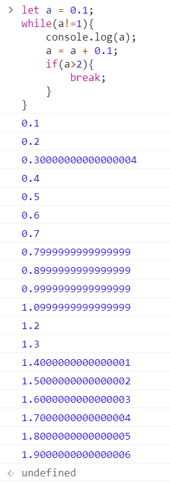

# JS语法


## 表达式与语句

* 1+2 表达式的**值**为 3
* add(1,2) 表达式的值为函数的**返回值**
* console.log 表达式的值为函数本身
* console.log(3) 表达式的值为多少？
  * undefined

### 语句

* var a=1 是一个语句

### 二者的区别

* 表达式一般都有值，语句可能有也可能没有
* 语句一般会改变环境（声明、赋值）
* 上面两句话并不是绝对的


## 大小写敏感

* var a 和 var A 是不同的
* object 和 Object 是不同的
* function 和 Function 是不同的


## 空格

### 大部分空格没有实际意义

* var a = 1 和 var a=1 没有区别
* 加回车大部分时候也不影响
* 只有一个地方不能加回车，那就是 return 后面


## 标识符

### 规则

* 第一个字符，可以是 Unicode 字母或 $ 或 _ 或中文
* 后面的字符，除了上面所说，还可以有数字

### 变量名是标识符

* var _ = 1;
* var $ = 2;
* var 你好 = 'hi';


## 注释

* 踩坑注解
* 为什么代码会写得这么奇怪，遇到什么 bug


## if 语句

### 语法

* ```js
  if(表达式){
      语句1;
  }else{
      语句2;
  }
  ```

### 变态情况

* 表达式里可以非常变态，如 a=1
  * 应该写成 a===1

* 语句1里可以非常变态，如嵌套的 if else

* 语句2里可以非常变态，如嵌套的 if else

* 缩进也可以很变态，如面试题常常下套

* ```js
  let a = 1;
  if(a === 2)
      console.log('a');
  	console.log('a等于2');
  ```

  输出的结果为 a等于2 ,因为如果不写花括号，if 只能管到后面的一个语句


## 程序员戒律 

* 使用最没有歧义的写法

### 最推荐使用的写法

```js
if (表达式) {
    语句
} else if (表达式) {
    语句
} else {
    语句
}
```

### 次推荐使用的写法

```js
function fn(){
    if (表达式) {
        return 表达式;
    }
    if (表达式) {
        return 表达式;
    }
    return 表达式;
}
```


## switch 语句

### 语法

```js
switch (fruit) {
    case "banana":
        // ...
        break;
    case "apple":
        // ...
        break;
    default:
        // ...
}
```


## 问号冒号表达式

* `表达式1 ? 表达式2 : 表达式3`

  ```js
  function abs(n){
      return n>0 ? n : -n;
  }
  ```


## && 短路逻辑

* A && B && C && D 取第一个假值或D
* 并不会取 true / false


## || 短路逻辑

* A || B || C || D 取第一个真值或 D
* 并不会取 true / false


## while 循环

### 语法

* `while (表达式) {语句}`
* 判断表达式的真假
* 当表达式为真，执行语句，执行完在判断表达式的真假
* 当表达式为假，执行后面的语句

### 面试题

下面这个循环为什么是死循环？

```js
let a = 0.1;
while(a!=1){
    console.log(a);
    a = a + 0.1;
}
```




* 因为 JS 的浮点数不精确


## for 循环

### 语法

```js
for(语句1;表达式2;语句3){
    循环体
}
```

* 先执行语句1
* 然后判断表达式2
* 如果为真，执行循环体，然后执行语句3
* 如果为假，直接退出循环，执行后面的语句

### 问题

```js
for (var i=0; i<5; i++){
    console.log(i);
}
console.log(i); //请问这个 i 的值为多少？
```

* setTimeout 就是过一段时间执行

```js
for (var i=0; i<5; i++){
    setTimeout(()=>{
        console.log(i);
    },0)
}
```

* 会打印出5次5

* `for (var i = 0; i < 5; i++) {}`执行完毕，i的值是5

* 而`setTimeout`就是过一段时间执行， 而for循环是当前任务，所以这段代码意思就是说**等到for循环执行完毕**了，再打印5次i，所以就会打印5个5

```js
for (let i=0; i<5; i++){
    setTimeout(()=>{
        console.log(i);
    },0)
}
```

* 把 var 换成 let ,就会打印出 0,1,2,3,4


## break

* 退出所有循环


## continue

* 退出当前一次循环


## label 语句

```js
{
    foo:1
}
```

上面的东西是什么？

* 以上的代码是：有一个代码块，代码块里有一个label, a: 1 表示这个标签是a, a的值是1
* 以上代码不是一个对象！


