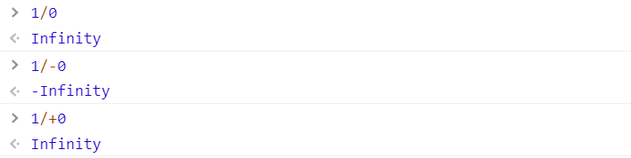
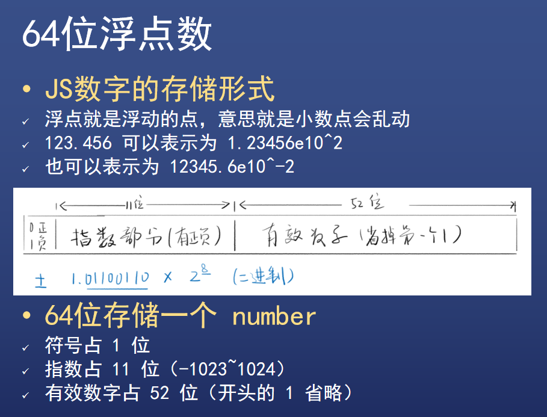
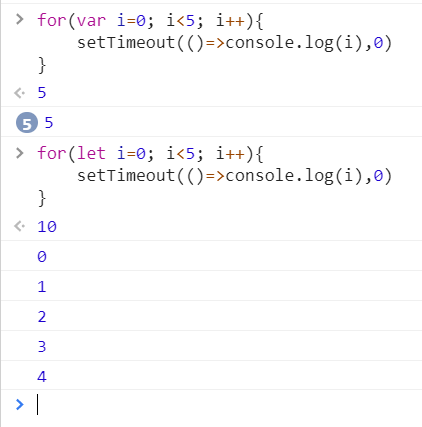
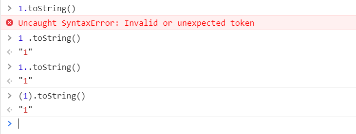

# JS数据类型（二）

### 7种（大小写无所谓）

* 数字 number
* 字符串 string
* 布尔 bool
* 符号 symbol
* 空 undefined
* 空 null
* 对象 object
* 总结：四基两空一对象

### 以下不是数据类型

* 数组、函数、日期
* 它们都属于 object


## 数字 number

* 64位浮点数

### 写法

* 整数写法
  * 1

* 小数写法
  * 0.1
* 科学计数法
  * 1.23e4
* 八进制写法
  * 0123 
  * 00123
  * 0o123
* 十六进制写法
  * 0x3F
  * 0X3F
* 二进制写法
  * 0b11
  * 0B11

### 特殊值

#### 正0 和 负0

* 都等于 0，要严谨

#### 无穷大

* Infinity
* +Infinity
* -Infinity




#### 无法表示的数字

* NaN (Not a Number)
* 它是一个数字




## 字符串 string

* 每个字符两个字节（阉割版 UTF-8)

### 写法

* 单引号
  * '你好'
* 双引号
  * "你好"
* 反引号
  * \`你好\`

* 注意
  * 引号不属于字符串的一部分，就像书名号不属于书名的一部分一样
  * 如果要在单引号里面包含单引号怎么办？

### 转义

* 错误写法
  * 'it's ok'
  * JS 引擎会认为 'it' 就结束了，后面的看不懂

* 正确写法
  * 'it\\'s ok'  // 这就是转义
  * "it's ok"
  * \`it's ok\`
* 用另一种写法表示你想要的东西
  * \\' 表示 '
  * \\" 表示 "
  * \n 表示换行
  * \r 表示回车
  * \t 表示 tab 制表符
  * \\ \   表示 \
  * \uFFFF 表示对应的 Unicode 字符
  * \xFF 表示前 256 个 Unicode 字符

### 多行字符串

* 如果你想要在字符串里回车

* ```js
  let s = `这样是
  可以的
  用反引号很容易做到`
  ```

### 字符串的属性

#### 字符串的长度

* `string.length`
  * `'123'.length`  // 3
  * `'\n\r\t'.length`  // 3
  * `''.length`  // 0
  * `' '.length` // 1

#### 通过下标读取字符

* `string[index]`
  * `let s = 'hello';`
  * `s[0]`  //  "h"

* 注意 index 从 0 开始
  * s[0] 是第一个字符

* 注意 index 到 length
  * `let s = 'hell0';`
  * `s[5]`  //  undefined , 居然不报错
  * `s[4]`  //  'o'

### base64 转码

* `window.btoa`
  * 正常字符串转为 Base64 编码的字符串

* `window.atop`
  * Base64  编码的字符串转为原来的字符串

* 一般用来隐藏招聘启事里的简历
  * 邮箱：MTIzNDU2N0BxcS5jb20=
* 有时候也用来自欺欺人
  * 所谓的**加密**，也就能骗过一部分外行


## 布尔 boolean

* 真或假

* 只有两个值 true 和 false

### 下列运算符会得到 bool 值

#### 否定运算

* !value

#### 相等运算

* 1 === 2
* 1 != 2
* 3 === 4
* 3 !== 4

#### 比较运算

* 1 > 2
* 1 >= 2
* 3 < 4
* 3 <= 4

### if 配 bool

* if 语句常常需要判断真假

* ```js
  if(value){
     ......
  }esle {
     ...... 
  }
  ```

### 五个 falsy 值

* falsy 就是相当于 false 但又不是 false 的值
* 分别是 `undefined  null  o  NaN  ''` 
* 注意，`''`和`' '`不是一个玩意


## undefined 和 null 两种空类型

### 区别

#### 没有本质区别

#### 细节一

* 如果一个变量声明了，但没有赋值，那么默认值就是 undefined ,而不是 null

#### 细节二

* 如果一个函数，没有写 return ,那么默认 return undefined ,而不是 null

#### 细节三

* 前端程序员习惯上，把非对象的空值写为 undefined , 把对象的空值写为 null
* 但仅仅是习惯上而已


## symbol 符号

* 不常用
* [参考资料](https://zhuanlan.zhihu.com/p/22652486)


## 变量声明

### 三种声明方式

* `var a = 1;`
* `let a = 1;`
* `const a = 1;`
* `a = 1;`

### 区别

* var 是过时的、不好用的方式
* let 是新的，更合理的方式
* const 是声明时必须赋值，且不能再改的方式
* 最后这种方式是错误的，不准这样声明

### let 声明

#### 规则

* 遵循块作用域，即使用范围不能超出 {}
* 不能重复声明
* 可以赋值，也可以不赋值
* 必须先声明再使用，否则报错
* 全局声明的 let 变量，不会变成 window 的属性
* for 循环配合 let 有奇效




### const 声明

#### 规则

* 跟 let 几乎一样
* 只有一条不一样：声明时就要赋值，赋值后不能改


### 变量声明

#### 指定值

* `var a = 1;`

#### 同时也指定了类型

* `var a = 1;`

#### 但是值和类型都可以随意变化

* `a = 2;`
* `a = '字符串';`


### name 和 'name' 的区别

#### name 是变量

* 值可变，可能是 'name' , 也可能是 'hello'

#### 'name' 是字符串常量

* 常量就是不变量
* 'name' 只能是 'name' , 不能是其他值


## 总结 

### 六种类型（大小写无所谓）

* undefined
* null 
* number
* string
* bool
* symbol

#### 这些都是简单类型，只有 object 叫做复杂类型

 

## 类型转换

#### number => string

* `String(n)`
* `n + ""`

#### string => number

* `Number(s)`
* `parseInt(s)`
* `parseFloat(s)`
* `s - 0`
* `+s`

#### x => bool

* `Boolean(x)`
* !!x

#### x => string

* `String(x)`
* `x.toString()`




### 更多JS奇葩之处尽在：[JS秘密花园](https://bonsaiden.github.io/JavaScript-Garden/zh/)


