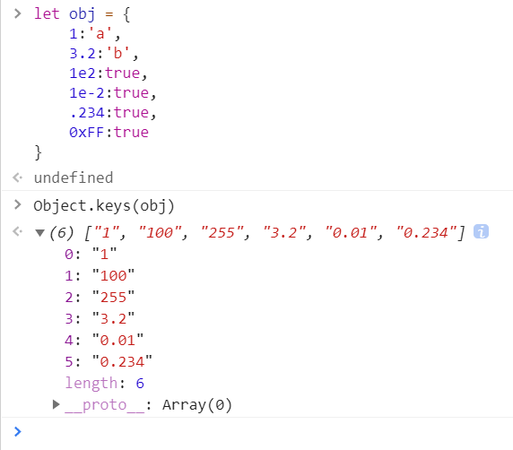
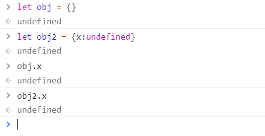
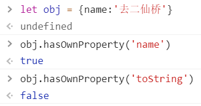

# 对象 object

* 第七种数据类型，唯一一种复杂类型

### 定义

* 无序的数据集合
* 键值对的集合

### 写法

```js
let obj = {
    'name':'frank',
    'age':18
}

let obj = new Object({'name':'frank'});

console.log({
    'name':'frank',
    'age':18
});
```

### 细节

* 键名是字符串，不是标识符，可以包含任意字符
* 引号可省略，省略之后就只能写标识符
* 就算引号省略了，键名也还是字符串


### 属性名

* 每个 key 都是对象的属性名（property）

### 属性值

* 每个 value 都是对象的属性值

### 奇怪的属性名

#### 所有属性名会自动变成字符串

```js
let obj = {
    1:'a',
    3.2:'b',
    1e2:true,
    1e-2:true,
    .234:true,
    0xFF:true
}
```



#### 细节

* Object.keys(obj) 可以得到 obj 的所有 key


### 变量作属性名

* 之前都是用**常量**做属性名
* 如何用变量做属性名

* `let p1 = 'name';`
* `let obj = {p1:'frank'}`   这样写，属性名为 'p1'
* `let obj = {[p1]:'frank'}`    这样写，属性名为 ‘name'

#### 对比

* 不加 [ ] 的属性名会自动变成字符串
* 加了 [ ] 则会当做变量求值
* 值如果不是字符串，则会自动变成字符串


### 对象的隐藏属性

#### 隐藏属性

* JS中每一个对象都有一个隐藏属性（__ proto __）
* 这个隐藏属性（__ proto __）储存这其共有属性组成的对象的地址
* 这个共有属性组成的对象叫做原型
* 也就是说，隐藏属性储存这原型的地址

#### 代码示例

* var obj = {};
* obj.toString()    // 居然不报错
* 因为 obj 的隐藏属性对应的对象上有 toString()

#### 除了字符串，symbol 也能做属性名

```js
let a = Symbol();
let obj = {
    [a]:'Hello'
}
```


### 删除属性

#### delete obj.xxx 或 delete obj['xxx']

* 即可删除 obj 的 xxx 属性
* 请区分**属性值为 undefined**和**不含属性名**

#### 不含属性名

* `'xxx' in obj === false`

#### 含有属性名，但是值为 undefined

* `'xxx' in obj && obj.xxx === undefined`

#### 注意 obj.xxx === undefined

* 不能断定 'xxx' 是否为 obj 的属性



#### 类比

* 你有没有卫生纸？
* A：没有  //  不含属性名
* B：有，但是没带  //  含有属性名，但是值为 undefined


### 查看所有属性（读属性）

#### 查看自身所有属性

* Object.keys(obj)

#### 查看自身所有值

* Object.values(obj)

#### 查看自身+共有属性

* console.dir(obj)
* 或者自己依次用 Object.keys(obj) 
* obj. __ proto __打印出 
* 还可以用 obj.entries(obj)

#### 判断一个属性时自身的还是共有的

* obj.hasOwnProperty('toString')



### 原型

#### 每个对象都有原型

* 原型里面存着对象的共有属性
* 比如 obj 的原型就是一个对象
* obj.__ proto __ 存着这个对象的地址
* 这个对象里有 toString / constructor / valueOf 等属性

#### 对象的原型也是对象

* 所以对象的原型也有原型
* obj = { } 的原型即为所有对象的原型
* 这个原型包含所有对象的共有属性，是对象的根
* 这个原型也有原型，是 null


### 查看属性

#### 两种方法查看属性

* 中括号语法：`obj['key']`
* 点语法：`obj.key`
* 坑新人语法：`obj[key] // 变量 key 值一般不为 'key'`

#### 请优先使用中括号语法

* 点语法会误导你，让你以为 key 不是字符串
* 等你确定不会弄混两种语法，再改用点语法

#### obj.name 等价于 obj['name']

```js
let name = 'frank';
obj[name] 等价于 obj['frank']
```


### 小试牛刀

#### 代码

```js
let list = ['name', 'age', 'gender']
let person = {
name:'frank', age:18, gender:'man'}
for(let i = 0; i < list.length; i++){
let name = list[i]
console.log(person__???__)
}
```

使得 person 的所有属性被打印出来

 #### 选项

A. `console.log(person.name)`

B. `console.log(person[name])`

答案在文章末尾


### 修改或增加共有属性

#### 无法通过自身修改或增加共有属性

* `let obj = {},obj2 = {}`  共有 toString
* `obj.toString = 'xxx'`   只会改 obj 自身的属性
* `obj2.toString` 还是在原型上

#### 修改或增加原型上的属性

* `obj.__ proto __.toString = 'xxx'`	不推荐用 `__ proto __`
* `Object.prototype.toString = 'xxx'`
* 一般来说，不要修改原型，会引起很多问题


### 修改隐藏属性

#### 不推荐使用 __ proto __

```js
let obj = {name:'frank'}
let obj2 = {name:'jack'}
let common = {kind:'human'}
obj.__ proto __ = common
obj2.__ proto __ = common
```

#### 推荐使用 Object.create

```js
let ab = Object.create(common)
ab.name = 'frank'
let ab2 = Object.create(common)
ab2.name = 'jack'
```


### 所有 __ proto __ 代码都是不建议写的


#### 小试牛刀的答案为 B


