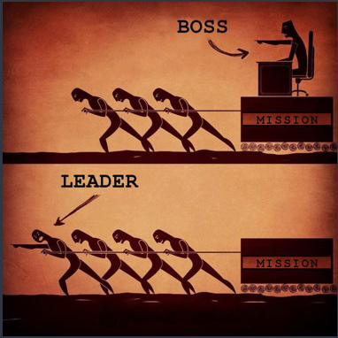

# 程序员如何得到上司的赏识

## 上司分两种

* boss
* leader

### boss

* 给你发工资，但不一起干活
* 关心投入产出比，不关心细节

### leader

* 与你一起做事，他要关注大局
* 希望减小风险，需要建立威信

## 原则

### 一、反馈是第一要务

1. 打算怎么做
2. 不打算做什么
3. 做成什么样了
4. 有什么风险

### 二、确认目标

1. 理解上司的目标
2. 表明自己的目标
3. 时常沟通目标

**为了定风向，推目标一致者**

### 三、强化人设

1. 在团队中的人设
2. 在会议中的人设
3. 在开发时的人设

**红脸与白脸**

**拆屋顶与开天窗**

## 反原则

### 一、毫无反馈

1. 做了一半返工
2. 还剩一天才求助
3. 遇到难题就搜索

### 二、你做你的，我做我的

* 目标与团队不一致

### 三、猪都会了你不会

1. 讲一次，不改
2. 讲两次，不改
3. 讲三次，还不改

### 四、无法从一而终

1. 昨天活跃，今天消沉
2. 上周加班，这周怠工

**事出反常必有妖，你应该提前预警**

## 疑问

### 技术好就一定受赏识吗？

No

除非你不可取代，公司要避免这种人

### 闷头做事一定不受赏识吗？

No 

如果经过多次合作，上司已经了解你，那么你们之间，会有默契

### 不出错与有优有劣

后者好

## 总结

#### 勤于反馈，有个人特点，目标与上司一致，容易受赏识

