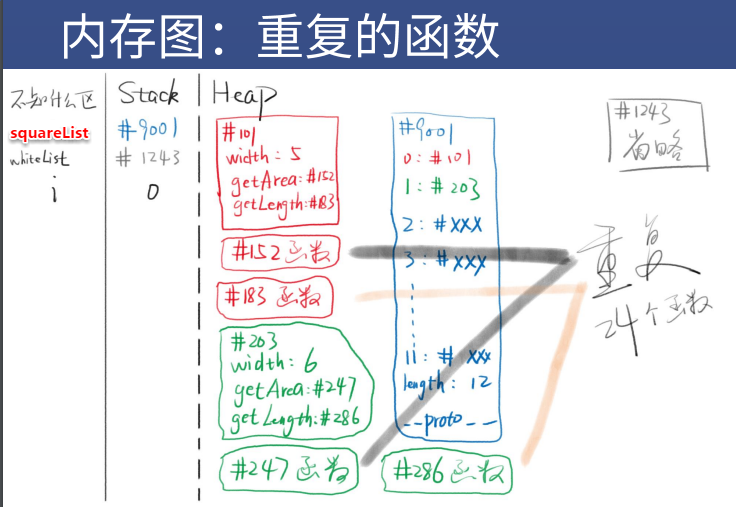
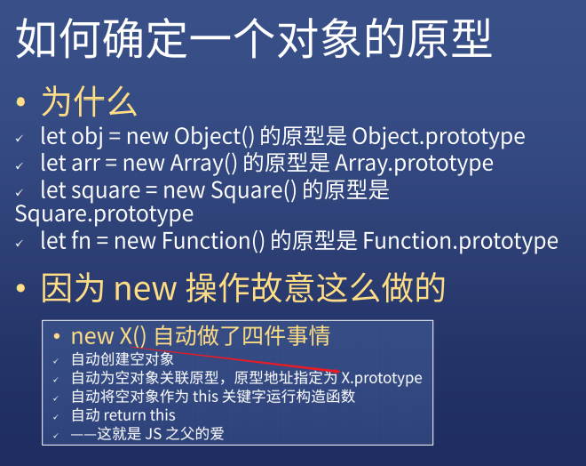
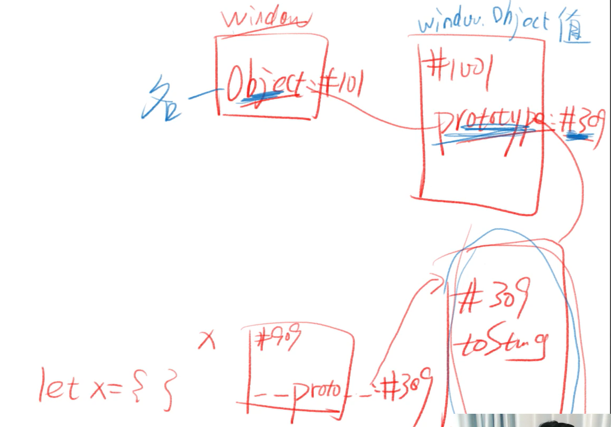

# JS对象分类（一）

## 对象需要分类吗？

* 这是一个值得思考的问题

## 我们来做一个小程序

### 要求

* 输出各种形状的面积和周长

## 正方形

```js
let square = {
    width:5,
    getArea(){
        return this.width*this.width;
    },
    getLength(){
        return this.width*4;
    }
}
```

### 那如果要一打不同边长的正方形呢！

### 一个一个写吗！太麻烦了

### 应该用for循环

```js
let squareList = [];
let widthList = [5,6,5,6,5,6,5,6,5,6,5,6];
for(let i=0; i<12; i++){
    squareList[i] = {
        width:widthList[i],
        getArea(){
            return this.width*this.width;
        },
        getLength(){
            return this.width*4;
        }
    }
}
```

### 这样就搞定了

### 但是又暴露出一个问题，那就是这样太占内存




## 借助原型

* 将12个对象的共用属性放到原型里

```js
let squareList = [];
let widthList = [5,6,5,6,5,6,5,6,5,6,5,6];
let squarePrototype = {
    getArea(){
        return this.width*this.width;
    },
    getLength(){
        return this.width*4;
    }
}
for(let i=0; i<12; i++){
    squareList[i] = Object.create(squarePrototype);
    squareList[i] = widthList[i];
}
```


### 又搞定了，但是现在创建 square 的代码太分散了

* 那就把代码抽离到一个函数里，然后调用函数

```js
let squareList = [];
let widthList = [5,6,5,6,5,6,5,6,5,6,5,6];
function createSquare(width){	// 此函数叫做构造函数，就是可以构造出一个对象的函数
    let obj = Object.create(squarePrototype);	// 以 squareProtype 为原型创建对象
    obj.width = width;
    return obj;
}
let squarePrototype = {
    getArea(){
        return this.width*this.width;
    },
    getLength(){
        return this.width*4;
    }
}
for(let i=0; i<12; i++){
    squareList[i] = createSquare(widthList[i]);
}
```


### squarePrototype 原型和 createSquare 函数还是分散的

### 能不能组合在一起


### 函数和原型结合

```js
let squareList = [];
let widthList = [5,6,5,6,5,6,5,6,5,6,5,6,];
function createSquare(width){
    let obj = Object.create(createSquare.squarePrototype);
    obj.width = width;
    return obj;
}
createSquare.squarePrototype = {	// 把原型放到函数上，结合够紧密了吧！
    getArea(){
        return this.width*this.width;
    },
    getLength(){
        return this.width*4;
    }
    constructor:createSquare;	// 方便通过原型找到构造函数
}
for(let i=0; i<12; i++){
    squareList[i] = createSquare(widthList[i]);
    console.log(squareList[i].constructor);	// constructor 可以知道谁构造了这个对象：你妈是谁？
}
```


### 这段代码几乎完美，因此被固定下来了


## new 操作符

### 函数和原型结合（重写）

```js
let squareList = [];
let widthList = [5,6,5,6,5,6,5,6,5,6,5,6];
function Square(width){
    this.width = width;
}
Square.prototype.getArea = function(){
    return this.width*this.width;
}
Square.prototype.getLength = function(){
    return this.width*4;
}
for(let i=0; i<12; i++){
    squareList[i] = new Square(widthList[i]);
    console.log(squareList[i].constructor);
}
// 每个函数都有 prototype 属性，每个 prototype 都有 constructor 属性
```


## 总结

### new X() 自动做了四件事

* 自动创建空对象
* 自动为空对象关联原型，原型地址指定为 X.prototype
* 自动将空对象作为 this 关键字运行构造函数
* 自动 return this

### 构造函数X

* X 函数本身负责给对象本身添加属性
* X.prototype 对象负责保存对象的共用属性


## 题外话：代码规范

### 大小写

* 所有构造函数（专门用于创建对象的函数）首字母大写
* 所有被构造出来的对象，首字母小写

### 词性

* new 后面的函数，使用名词形式
* 如 new Person()、new Object()
* 其他函数，一般使用动词开头
* 如 createSquare(5)、createElement('div')




### 结论

#### 你是谁构造的

#### 你的原型就是谁的 prototype 属性

#### 对应的对象


### 原型公式

#### 对象.__ proto __ === 其构造函数.prototype


#### 小试牛刀1

`let x = {};`

请问：

1. x 的原型是什么？
2. x.__ proto __ 的值是什么？
3. 上面两个问题是等价的吗？
4. 请用内存图划出 x 的所有属性

答案：

1. Object.prototype
2. Object.prototype
3. 是
4. 


#### 小试牛刀2

`let square = new Square(5)`

请问：

1. square 的原型是什么？
2. square.__ proto __的值是什么？

答案：Square.prototype


#### 小试牛刀3

请问：

1. Object.prototype 是哪个函数构造出来的？
2. Object.prototype 的原型是什么？
3. Object.prototype.__ proto __ ?

答案：

1. 不知道
2. 没有
3. null


## Square 最终版

```js
function Square(width){
	this.width = width;
}
	Square.prototype.getArea = function(){
	return this.width * this.width
}
	Square.prototype.getLength = function(){
	return this.width * 4
}
let square = new Square(5)
square.width
square.getArea()
square.getLength()
```


## 圆 Circle

```js
function Circle(radius){
    this.radius = radius;
}
Circle.prototype.getArea = function(){
    return Math.pow(this.radius,2)*Math.PI;
}
Circle.prototype.getLength = function(){
    return this.radius*2*Math.PI;
}
let circle = new Circle(5);
circle.radius;
circle.getArea();
circle.getLength();
```


## 正方形 Rectangle

```js
function Rect(width,height){
    this.width = width;
    this.height = height;
}
Rect.prototype.getArea = function(){
    return this.width*this.height;
}
Rect.prototype.getLength = function(){
    return (this.width + this.height)*2;
}
let rect = new Rect(4,5);
rect.width;
rect.height;
rect.getArea();
rect.getLength();
```


## 回到开头的问题，对象需要分类吗

### 需要分类

#### 理由一

* 有很多对象拥有一样的属性和行为
* 需要把它们分为同一类
* 如 square1 和 square2
* 这样创建类似对象的时候就很方便

#### 理由二

* 但是还有很多对象拥有其他的属性和行为
* 所有就需要不同的分类
* 比如 Square / Circle / Rect 就是不同的分类
* Array / Function 也是不同的分类
* 而 Object 创建出来的对象，是最没有特点的对象

### 类型 VS 类

#### 类型

* 类型是 JS 数据的分类，有 7 种
* 四基两空一对象

#### 类

* 类是针对于对象的分类，有无数种
* 常见的有 Array、Function、Date、RegExp等


