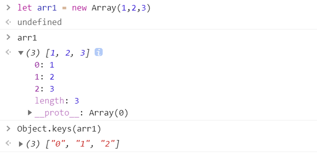
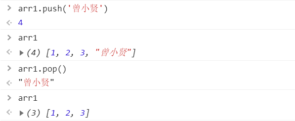
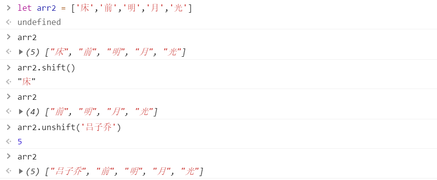
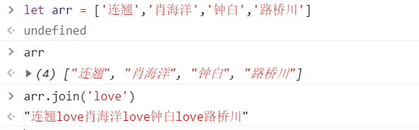
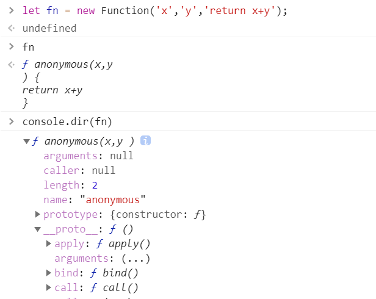
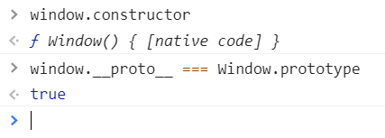
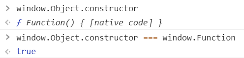
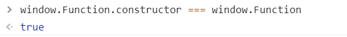
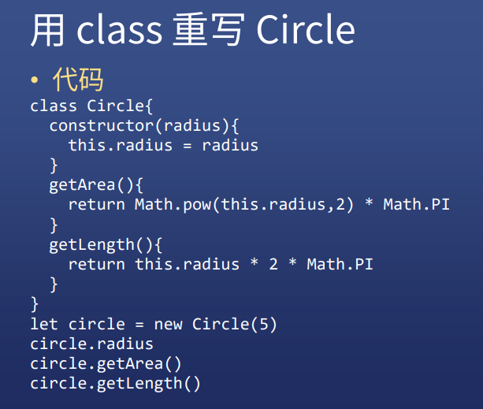
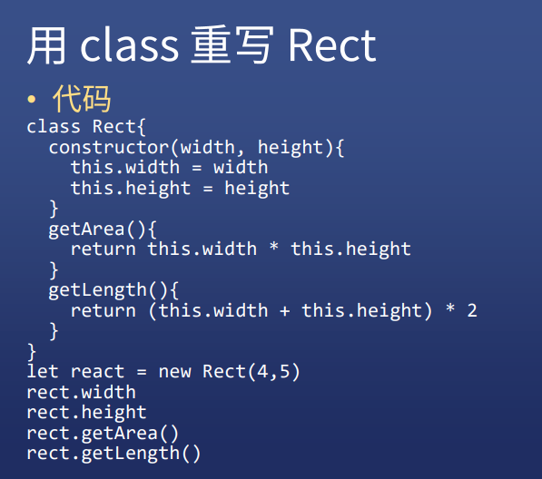

# JS对象分类（二）

## 数组对象

### 定义一个数组

* `let arr = [1,2,3]`
* `let arr = new Array(1,2,3)`    // 元素为 1,2,3
* `let arr = new Array(3)`    // 长度为 3

### 数组对象的自身属性

* '0'    '1'    '2'    'length'
* 注意，属性名没有数字，只有字符串



### 数组对象的共用属性

* 'push'
  * 将一个或多个元素添加到数组的末尾，并返回该数组的新长度
* 'pop'
  * 从数组中删除最后一个元素，并返回该元素的值



* 'shift'
  * 提档，从数组中删除**第一个**元素，并返回该元素的值
* 'unshift'
  * 将一个或多个元素添加到数组的**开头**，并返回该数组的**新长度**



* 'join'
  * 将一个数组的所有元素连接成一个字符串并返回这个字符串。如果数组只有一个项目，那么将返回该项目而不使用分隔符



* 'concat'
  * 用于合并两个或多个数组。此方法不会更改现有数组，而是返回一个新数组


## 函数对象

### 定义一个函数

```js
function fn(x,y){
    return x+y;
}

let fn2 = function fn(x,y){
    return x+y;
}

let fn = (x,y) => x+y;

let fn = new Function('x','y','return x+y');
```

### 函数对象自身属性

* 'name'
* 'length'

### 函数对象共用属性

* 'call'
* 'apply'
* 'bind'




## JS 终极一问

### window 是谁构造的？

* Window
* 可以通过 constructor 属性看出构造者




### window.Object 是谁构造的？

* window.Function
* 因为所有函数都是 window.Function 构造的




### window.Function 是谁构造的？

* window.Function
* 因为所有函数都是 window.Function 构造的
* 自己构造的自己？并不是这样，这是“上帝”的安排
* 浏览器构造了 Function ,然后指定它的构造者是自己




## class

```js
class Square{
    static x = 1;
	width = 0;
	constructor(width){
        this.width = width;
    }
}
getArea(){
    return this.width*this.width;
}
getLength(){
    return this.width*4;
}
get area2(){	// 只读属性
    return this.width*this.width;
}
```






