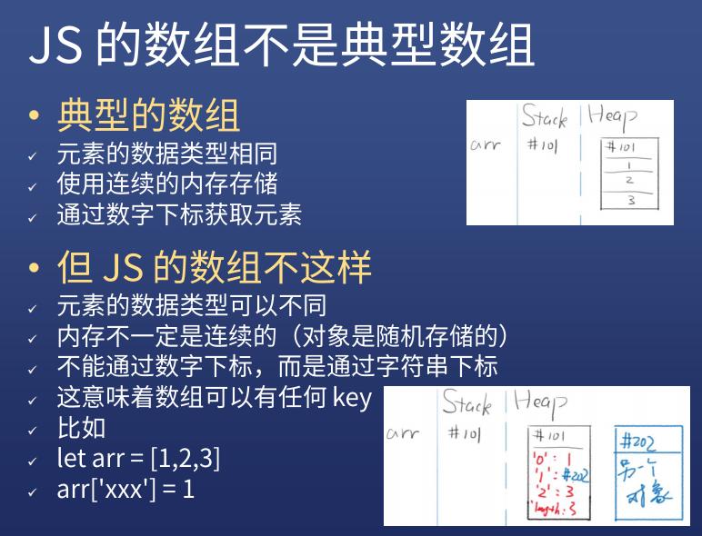
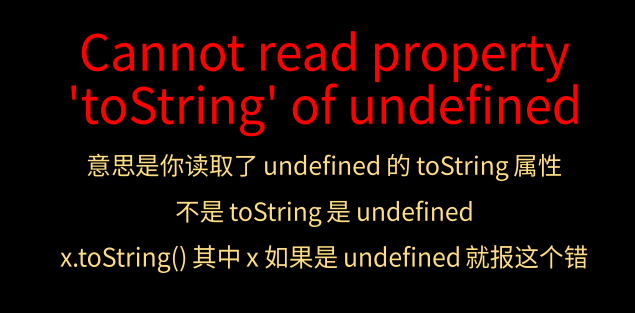

# 数组对象

* 一种特殊的对象

## JS其实没有真正的数组

* 只是用对象模拟数组




## 创建一个数组

### 新建

- `let arr = [1,2,3]`
- `let arr = new Array(1,2,3)` // 元素为 1,2,3
- `let arr = new Array(3)` // 长度为 3

### 转化

* `let arr = '1,2,3'.split(',')`
* `let arr = '123'.split('')`
* `Array.from('123')`


### 伪数组

* `let divList = document.querySelectorAll('div')`

* 伪数组的原型链中并没有数组的原型

* 可以通过 `Array.fron(divList)` 转换成数组

  

### 没有数组共用属性的“数组”就是伪数组


### 合并两个数组，得到新数组

* `arr1.concat(arr2)`


### 截取一个数组的一部分

* `arr1.slice(1)`	// 从第二个元素开始
* `arr1.slice(0)`    // 全部截取，相当于复制
* 注意，JS 只提供浅拷贝


## 删元素

### 跟对象一样


* 注意，神奇的现象出现了，数组的长度并没有变

### 如果直接改 length 可以删元素吗？

* 可以


### 以上两种方法不推荐使用，推荐使用下面的方法

### 删除头部的元素

* `arr.shift()`    // `shift` 方法移除索引为 0 的元素(即第一个元素)，并返回被移除的元素，其他元素的索引值随之减 1。如果 length 属性的值为 0 (长度为 0)，则返回 undefined 。

### 删除尾部的元素

* arr.pop()	// arr 被修改，并返回被删元素


### 删除中间的元素

* `arr.splice(index,1)`	// 删除从 index 开始的一个元素
* `arr.splice(index,1,'x')`    // 并在删除位置添加 'x'
* `arr.splice(index,1,'x','y')`    // 并在删除位置添加 'x' , 'y'


## 查看所有元素

### 查看所有属性名


* Object.values(arr)    是查看属性值


### 查看数字（字符串）属性名和值

#### for 循环

```js
for(let i=0; i<arr.length; i++){
    console.log(`${i}:${arr[i]}`)
}
```

* 你要自己让 i 从 0 增长到 length-1

#### forEach

```js
arr.forEach(function(item,index){
    console.log(`${index}:${item}`)
})
```

#### 两者区别

* for 循环可以使用 break 和 continue , forEach 不行
* for 循环里面是块级作用域，forEach 里面是函数作用域

### forEach 是一个槛

* 自己写 forEach 才能理解 forEach

```js
function forEach(array,fn){
    for(let i=0; i<array.length; i++){
        fn(array[i],i,array);
    }
}
forEach(['a','b','c'],function(x,y,z){
    console.log(x,y,z);
})
```

* 为什么要传入 array 呢？
* 不为什么，规定如此


### 查看单个属性

#### 跟对象一样

* `let arr = [111,222,333]`
* `arr[0]`

#### 索引越界

* `arr[arr.length] === undefined`
* `arr[-1] === undefined`

#### 举例

```js
let arr = ['l','o','v','e']
for(let i=0; i<=arr.length; i++){
    console.log(arr[i].toString())
}
```




#### 查找某个元素是否在数组里

* `arr.indexOf(item)`    // 返回在数组中可以找到一个给定元素的第一个索引，如果不存在，则返回-1


#### 使用条件查找元素

* `arr.find(item => item%2 === 0)`    // 找第一个偶数
* `arr.find(function(x){return x%2 === 0})`    

#### 使用条件查找元素的索引

* `arr.findIndex(item => item%2 === 0)`    // 找第一个偶数的索引

* `arr2.findIdex(function(x){return x%2 === 0})`


### 增加数组中的元素

#### 在尾部加元素

* `arr.push(newItem)`    // 修改 arr, 返回新长度
* `arr.push(item1,item2)`    // 修改 arr, 返回新长度

#### 在头部加元素

- `arr.unshift(newItem)`    // 修改 arr, 返回新长度
- `arr.unshift(item1,item2)`    // 修改 arr, 返回新长度

#### 在中间添加元素

* `arr.splice(index,0,'x')`	// 在 index 处插入 'x'
* `arr.splice(index,0,'x','y')`	// 在 index 处插入 'x' , 'y'


### 修改数组中的元素

#### 反转顺序

* `arr.reverse`    // 修改原数组

  


