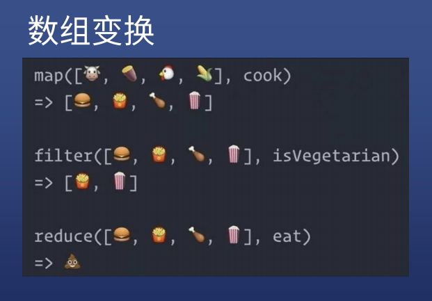
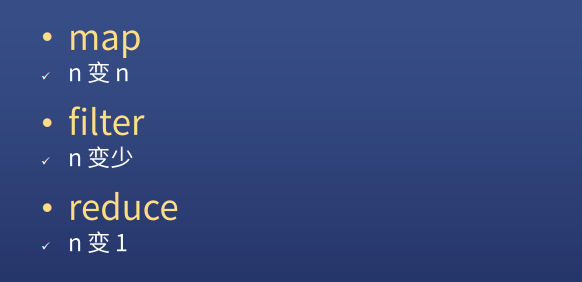

# 数组变换





## map

* 创建一个新数组，其结果是该数组中的每个元素是调用一次提供的函数后的返回值

### 将数组 [1,2,3,4,5,6] 转换为 [1,4,9,16,25,36]

```js
let arr = [1,2,3,4,5,6]
arr.map(item => item*item)
```


## filter

* 创建一个新数组, 其包含通过所提供函数实现的测试的所有元素

### 将数组 [1,2,3,4,5,6] 中的偶数筛选出来

```js
let arr = [1,2,3,4,5,6]
arr.filter(item => item%2 === 0 ? true : false)
//简写
arr.filter(item => item%2 === 0)
```


## reduce

* 对数组中的每个元素执行一个由您提供的**reducer**函数(升序执行)，将其结果汇总为单个返回值。

### 将数组 [1,2,3,4,5,6] 中的所有元素相加

```js
let arr = [1,2,3,4,5,6]
let sum = 0
arr.reduce((sum,item) => {return sum+item},0)
```

### 将数组 [1,2,3,4,5,6] 转换为 [1,4,9,16,25,36]

```js
let arr = [1,2,3,4,5,6]
arr.reduce((result,item) => {return result.concat(item*item)},[])
```

### 将数组 [1,2,3,4,5,6] 中的偶数筛选出来

```js
let arr = [1,2,3,4,5,6]
arr.reduce((result,item) => {
    if(item%2 === 1){
        return result
    }else {
        return result.concat(item)
    }
},[])

// 简化版本
let arr = [1,2,3,4,5,6]
arr.reduce((result,item) => item % 2 === 1 ? result : result.concat(item),[])

// 简化版本2.0
let arr = [1,2,3,4,5,6]
arr.reduce((result,item) => result.concat(item % 2 === 1 ? []:item),[])
```


## 面试题 

* https://xiedaimala.com/tasks/1008eacb-b4d1-452c-a07b-0817733af75e/video_tutorials/69558ace-e2ac-4002-8300-53fdba9bd713
* 太难了，暂时跳过，以后再补


