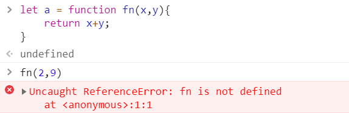
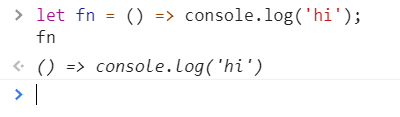
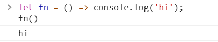
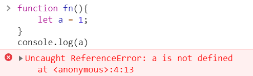
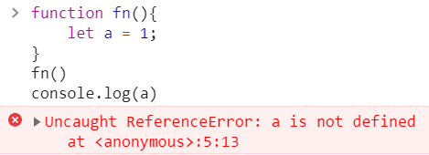
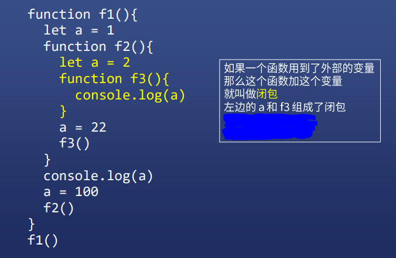
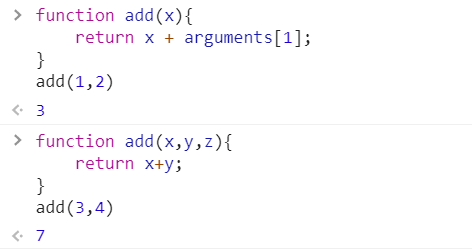
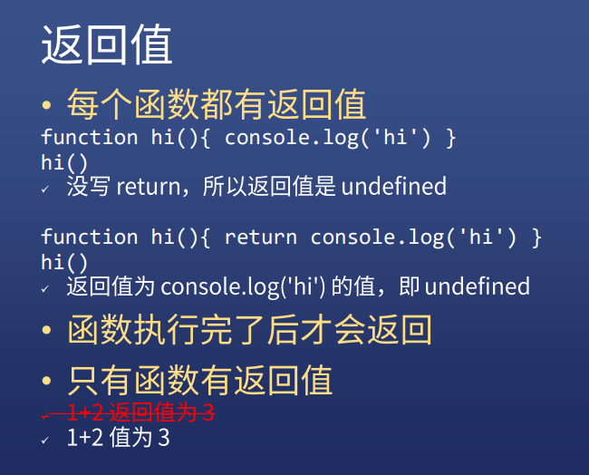

# JS 函数（一）


## 函数是对象


## 定义一个函数

### 具名函数

```js
function 函数名(形式参数1,形式参数2){
    语句
    return 返回值
}
```

### 匿名函数

* 上面的具名函数，去掉函数名就是匿名函数

* ```js
  let a = function(x,y){return x+y}
  ```

* 也叫函数表达式


```js
let a = function fn(x,y){	// 使用这种方式，fn的作用域只在 = 的右边
    return x+y;
}
```



### 箭头函数

```js
let f1 = x => x*x

let f2 = (x,y) => x+y  // 圆括号不能省

let f3 = (x,y) => {
    console.log('来了，老弟');
    return x+y;
}	// 花括号不能省

let f4 = (x,y) => ({name:x,age:y})
// 直接返回对象会出错，需要加个圆括号
```

### 构造函数

```js
let fn = new Function('x','y','return x+y')
```

* 基本没人用，但是能让你知道函数是谁构造的
* 所有函数都是 Function 构造出来的
* 包括 Object、Array、Function 也是


## 函数自身 VS 函数调用

### fn VS fn()


### 函数自身

```js
let fn = () => console.log('hi');
fn
```

* 不会有任何结果，因为 fn 没有执行



### 函数调用

```JS
let fn = () => console.log('hi');
fn()
```

* 打印出 hi , 有圆括号才是调用



### 再进一步

```js
let fn = () => console.log('hi')
let fn2 = fn
fn2()
```

* fn 保存了匿名函数的地址
* 这个地址被复制给了 fn2
* fn2() 调用了匿名函数
* fn 和 fn2 都是匿名函数的引用而已
* 真正的函数既不是 fn 也不是 fn2


## 函数的要素

### 每个函数都有这些东西

* 调用时机
* 作用域
* 闭包
* 形式参数
* 返回值
* 调用栈
* 函数提升
* arguments （除了箭头函数）
* this（除了箭头函数）


### 调用时机

* 时机不同，结果不同

#### 例一

```js
let a = 1
function fn(){
    console.log(a)
}
```

#### 问：打印出多少

#### 答：不知，因为没有调用代码


#### 例二

```js
let a = 1
function fn(){
    console.log(a)
}
fn()
```

#### 问：打印出多少

#### 答：1


#### 例三

```js
let a = 1
function fn(){
    console.log(a)
}
a = 2
fn()
```

#### 问：打印出多少

#### 答：2


#### 例四

```js
let a = 1
function fn(){
    console.log(a)
}
fn()
a = 2
```

#### 问：打印出多少

#### 答：1


#### 例五

```js
let a = 1
function fn(){
    setTimeout(()=>{
        console.log(a)
    },0)
}
fn()
a = 2
```

#### 问：打印出多少

#### 答：2


#### 例六

```js
let i=0
for(; i<6; i++){
    setTimeout(()=>{
        console.log(i)
    },0)
}
```

#### 问：打印出多少

#### 答：六个 6


#### 例七

```js
for(let i=0; i<6; i++){
    setTimeout(()=>{
        console.log(i)
    },0)
}
```

#### 问：打印出多少

#### 答：是 0、1、2、3、4、5，

#### 因为 JS 在 for 和 let 一起用的时候会加东西，

#### 每次循环会多创建一个 i 。


### 作用域

* 每个函数都会默认创建一个作用域

#### 例一



* a 不存在
* 是不是因为 fn 没执行导致
* 就算 fn 执行了，也访问不到作用域里面的 a



* let 的作用域只在最近的 { } 中


### 全局变量 VS 局部变量

* 在顶级作用域声明的变量是全局变量
* window 的属性时全局变量
* 其他都是局部变量


### 函数可嵌套

* 作用域也可嵌套

```js
function f1(){
    let a = 1;
    function f2(){
        let a = 2;
        console.log(a);
    }
    console.log(a);
    a = 3;
    f2();
}
f1();
// 1
// 2
```

#### 作用域规则

* 如果多个作用域有同名变量 a
* 那么查找 a 的声明时，就向上取最近的作用域
* 简称**就近原则**
* 查找 a 的过程与函数执行无关
* 但 a 的值与函数执行有关

```js
function f1(){
    let a = 1;
    function f2(){
        let a = 2;
        function f3(){
            console.log(a);
        }
        a = 22;
        f3();
    }
    console.log(a);
    a = 100;
    f2();
}
f1();
// 1
// 22
```


### 闭包




### 形式参数

#### 形式参数的意思就是非实际参数

```js
function add(x,y){
    return x+y;
}
add(1,2);
```

* 其中 x 和 y 就是形参，因为并不是实际的参数
* 调用 add 时，1 和 2 是实际参数，会被赋值给 x  y

#### 形参可认为是变量声明

* 上面的代码近似于下面的

```js
function add(){
    var x = arguments[0];
    var y = arguments[1];
    return x+y;
}
```

#### 形参可过可少

#### 形参只是给参数取名字







