# JS运算符

## 算术运算符

### number 运算

#### 加减乘除	+	-	*	/

* 注意 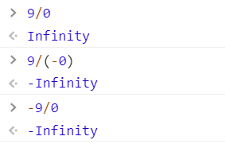

#### 余数

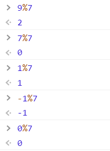

#### 指数

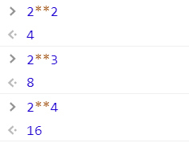

#### 自增自减

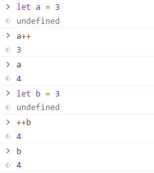

* a 在前，值为前
* a 在后，值为后

#### 求值运算符 +x

#### 负数运算符 -y


### string 运算

* 连接运算 

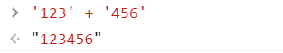


### 不同类型不要加起来

#### 把 1 和 '2' 加起来是几个意思


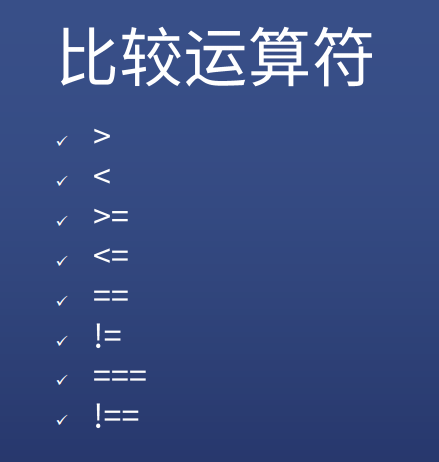

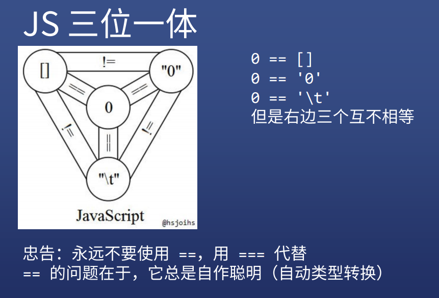

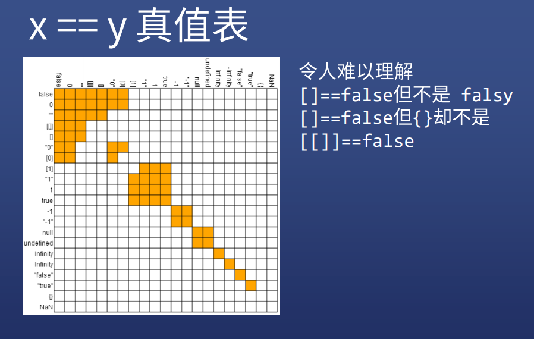


 

```js
function add(a){
  // if(!a){ a = 100 }else{ a = a }  
  // 与下面的代码等价
    a = a || 100;
    return a + 1;
}
```

* 不过这样写是有 bug 的，如果 a = 0 ，!a === ture

```js
// 因此可以再优化一下
function add(a = 100){
    return a + 1;
}
```

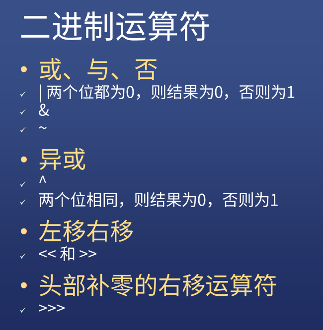


### 参考资料：[位运算符在JS中的妙用](https://juejin.cn/post/6844903568906911752)


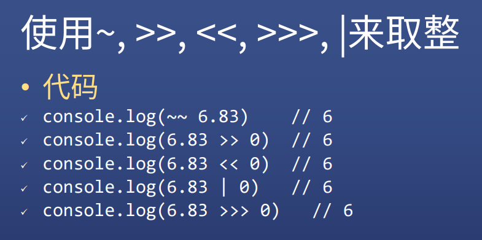

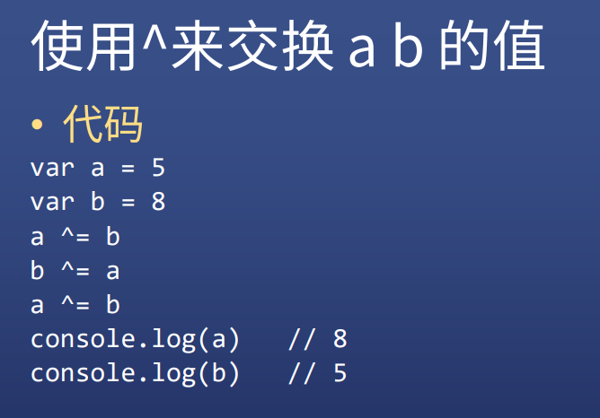

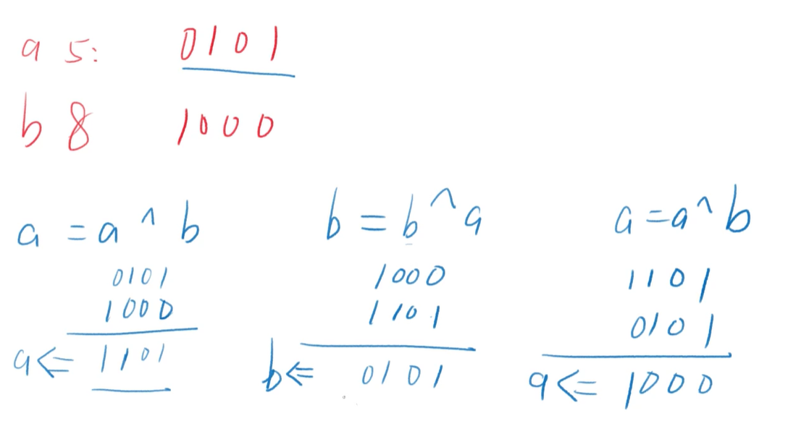


### 交换 a b 的值，JS 中有更简便的做法

```js
var a = 3, b = 4;
[a,b] = [b,a]
```


## 点运算符

### 语法

* `对象.属性名 = 属性值`

### 作用

* 读取对象的属性值

### 有个疑问

* 不是对象，为什么也可以有属性？`'a-b-c'.split('-')`
* JS 有特殊逻辑，点前面不是对象，就把它封装成对象
* number 会变成 Number 对象
* string 会变成 String 对象
* bool 会变成 Boolean 对象

## void 运算符

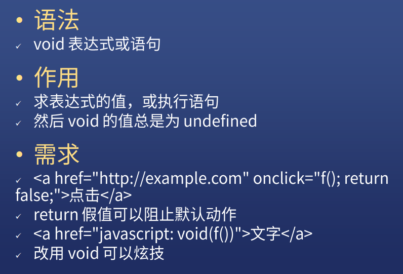


## 逗号运算符


