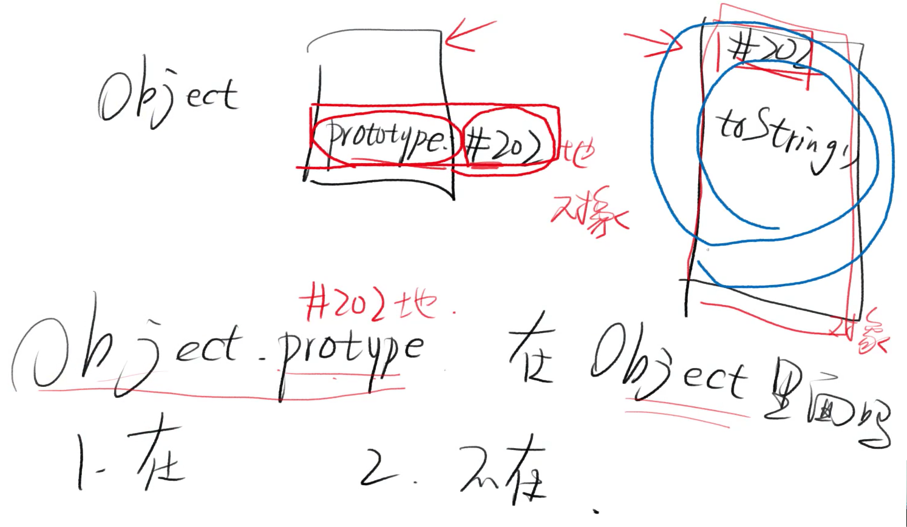
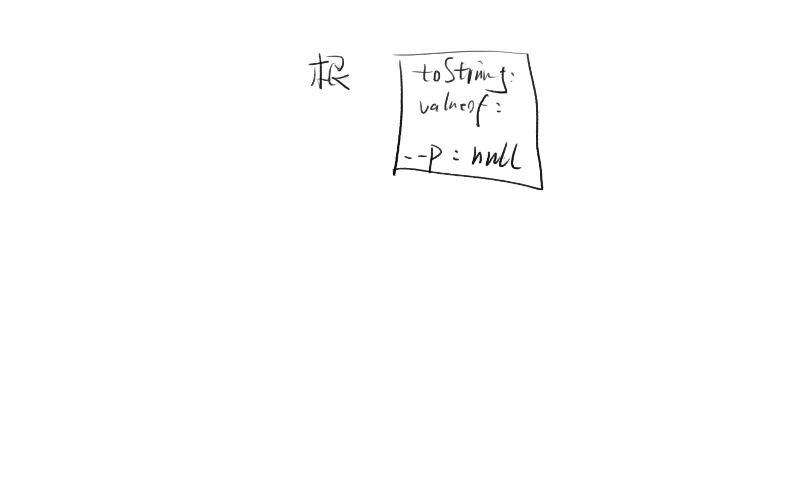
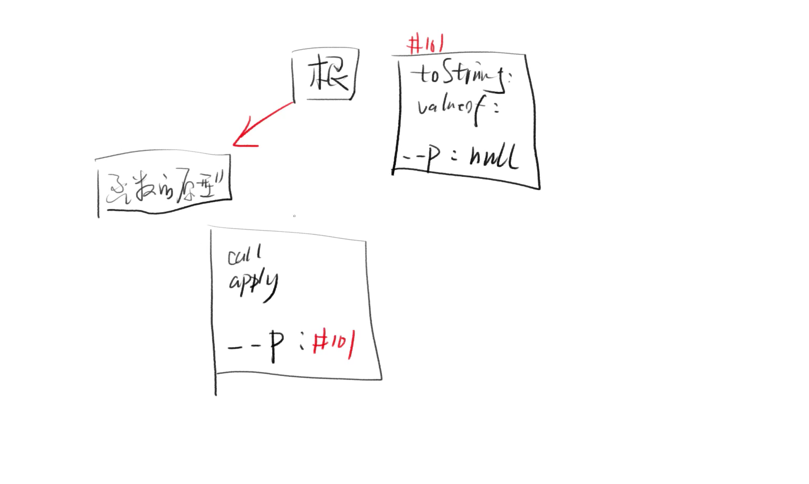
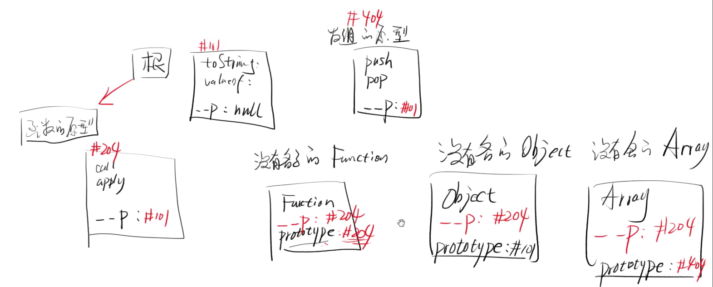
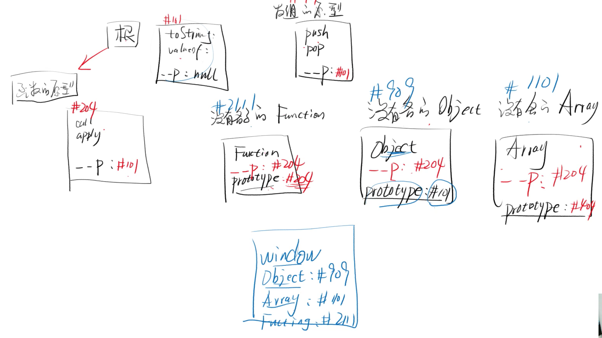
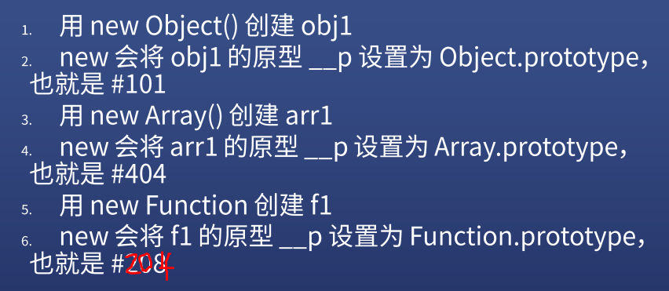
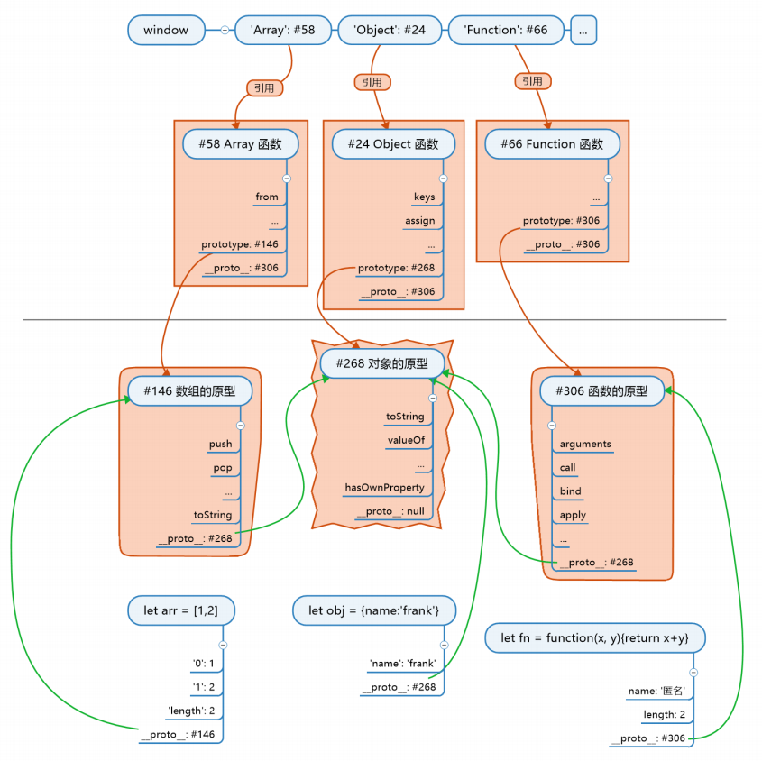

# JS 总结

## 最重要的知识

### JS 公式

```js
对象.__proto__ === 其构造函数.prototype
```

### 根公理

```js
Object.prototype 是所有对象的（直接或间接）原型
```

* 所谓公理就是规定好的

### 函数公理

```js 
所有函数都是由 Function 构造的

任何函数.__proto__ === Function.prototype

任意函数有 Object / Array / Function
```


### 基于这三个知识和基础知识，可以推出 JS 世界


## 拨乱反正

### 乱一

#### XXX 的原型

* `{name:'frank'}`  的原型
* [1,2,3] 的原型
* Object 的原型

#### 解读

* Object 的原型是 `Object.__proto__` : 对
* Object 的原型是 `Object.prototype` : 错

#### 错在哪

* 「的原型」等价于「`.__proto__`」
* 中文的「原型」无法区分 `__proto__` 和 `prototype`
* 所以我们只能约定，原型默认表示 `__proto__`
* 只不过 `__proto__` 正好等于某个函数的 `prototype`

### 乱二

#### 矛盾

* `[1,2,3]` 的原型是 `Array.prototype`
* `Object.prototype` 是所有对象的原型
* 那为什么 `Object.prototype` 不是 `[1,2,3]` 的原型

#### 错在哪

* 原型分两种：直接原型和间接原型
* 对于普通对象来说，`Object.prototype` 是直接原型
* 对于数组、函数来说，`Object.prototype` 是间接原型

### 乱三

* `Object.prototype` 不是根对象

#### 理由

* `Object.prototype` 是所有对象的原型
* `Object` 是 `Fuction` 构造出来的
* 所以，`Function` 构造了 `Object.prototype`
* 推论，`Function` 才是万物之源啊！

#### 错在哪

* `Object.prototype` 和 `Object.prototype 对象` 的区别
* 对象里面从来都不会包含另一个对象，只会包含另一个对象的地址



## 构建 JS 世界



* 创建根对象 #101(toString)，根对象没有名字



* 创建函数的原型 #204(call / apply)，原型 `__proto__` 为 #101



* 创建数组的原型 #404(push / pop)，原型 `__proto__` 为 #101

* 创建 Function #342，原型 `__proto__` 为 #204

* 用 `Function.prototype` 存储函数的原型，等于 #204

* 此时发现 `Function` 的 `__proto__` 和 `prototype` 都是 #204

* 用 Function 创建 Object

* 用 Object.prototype 存储对象的原型，等于 #101

* 用 Function 创建 Array

* 用 Array.prototype 存储数组的原型，等于 #404

  

* 创建 window 对象
* 用 window 的 'Object' 'Array' 属性将「没有名字的 Object」和「没有名字的 Array」中的函数命名
* 注意：JS 创建一个对象时，不会给这个对象名字







## 小试牛刀

### `Object.prototype` 的原型是什么

* `Object.prototype.__proto__ === null`
* 因为 `Object.prototype` 是根对象

### `Function.prototype` 的原型是什么？

* `Function.prototype.__proto__ === Object.prototype`

### `let f = () => {}` f 的原型是什么？

* `f.__proto__ === Function.prototype`

### `Function` 的原型是什么？

* `Function.__proto__ === Function.prototype`

### `Array.prototype.toString` 的原型是什么？

* `Array.prototype.toString.__proto__ === Function.prototype`


## 总结

### 构造函数

* 是用来构造对象的
* 会预先存好对象的原型，原型的原型是根
* new 的时候将对象的 `__proto__` 指向原型

### 对象

* 所以对象都直接或间接指向根对象
* 如果对象想要分类，就在原型链上加一环
* 用构造对象可以加这一环


