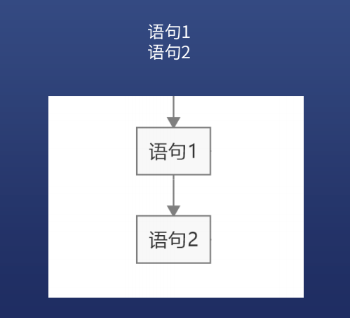
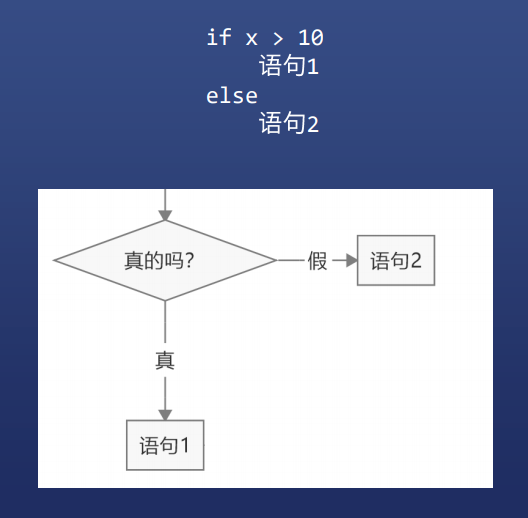
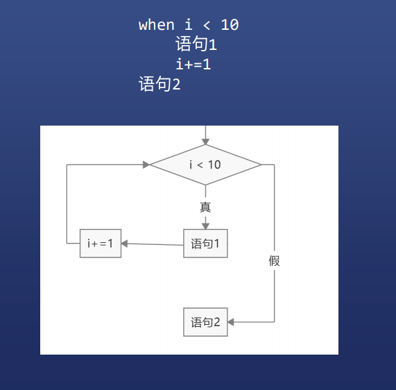
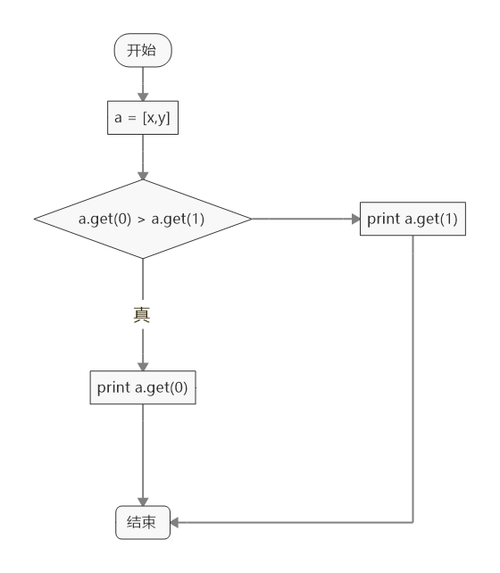

# 伪代码、流程图与数据结构


## 流程图、伪代码的好处

### 锻炼你的大脑

* 你必须自己画出来
* 不能运行在计算机里

### 整理你的思路

* 思路乱，则图乱
* 伪代码都写不好，则代码更写不好


## 所有的复杂算法都能用这三种语句描述

### 顺序执行语句



### 条件判断语句



###  循环语句



### 推荐使用 Mindjet 画流程图，也可以用 XMind、百度脑图等工具代替


## 用流程图找到最大数

### 两个数



### N 个数


## 数据结构

* 就是数据与数据之间的关系和结构

### 如何表示两个数据

#### 如果顺序有意义

* [x,y] 表示第一个是 x，第二个是 y
* [y,x] 表示第一个是 y，第二个是 x
* 比如坐标就是这样的数据
* 要提供 first 和 last 操作

#### 如果顺序无意义

* (x,y) 和 (y,x) 一样
* 比如血压值(120,80) 和 (80,120) 没区别
* 不需要提供 first 和 last 操作

### 如何表示 N 个数据

#### 如果顺序有意义

* 数组表示 [a1,a2,a3,...aN]
* 要提供索引操作 get(i)
* 要提供 add / indexOf / delete 操作

#### 如果顺序没有意义

* 集合表示 {a1,a2,a3,...aN}
* 要提供 add / indexOf / delete 操作

### 如何表示 N 对 N 数据

#### 比如学号

* 用「哈希表」表示
* hash = {1001 => '小明', 1002 => '小红'}


### 数据结构 = 数据形式 + 操作

* 不同形式的数据暴露不同的操作


### 小试牛刀

有一段英文对白，里面只会出现 a-z、A-Z、标点符号和空格，请告诉我每个字符出现的次数

* 例如 Hi, I'm Frank

* 输出 a 出现 1 次，F 出现 1 次，H 出现 1 次 ……

```
// 以下为伪代码

str = `Hi, I'm Frank`
hash = {}

for i from 0 to str.length-1
    key = str.get(i)
    value = hash.get(key,0) + 1
    hash.set(key,value)

for key,value from hash
	print `${key} 出现了 ${value} 次`
```


### 数据结构的作用

#### 提前记住一些结构

* 这些结构很常见，能让你很快理清思路

#### 锻炼你的抽象能力

* 一种数据结构往往能解决很多类似的问题
* 如果你选错了数据结构，你根本就想不出思路
* 牛逼的程序员更重视数据结构，而不是算法


