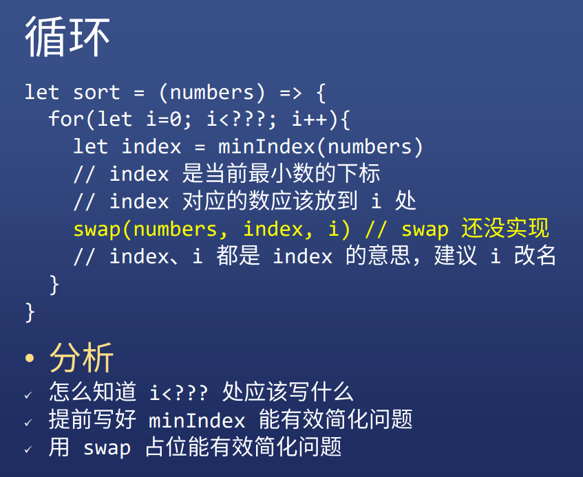
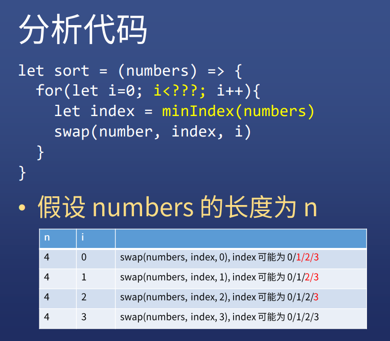
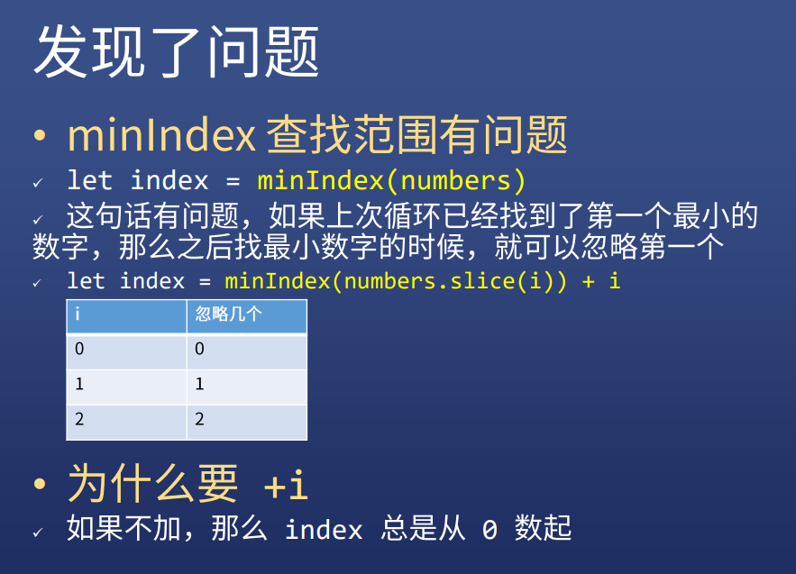
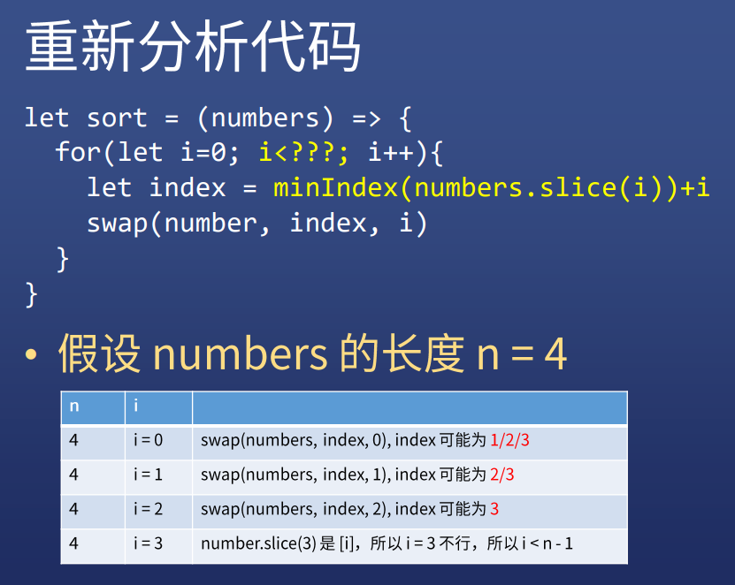
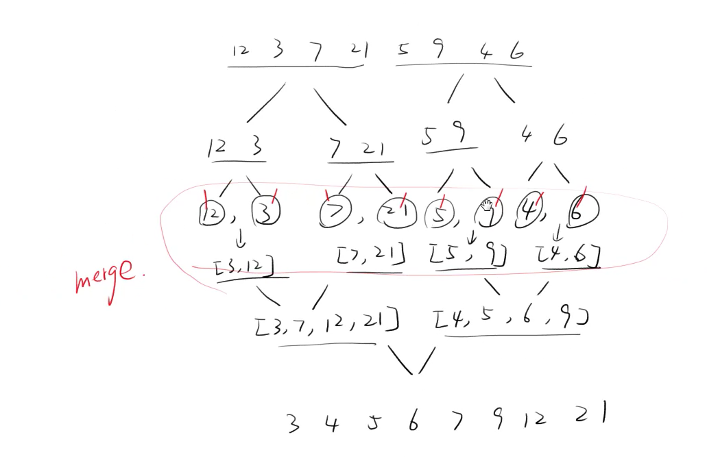
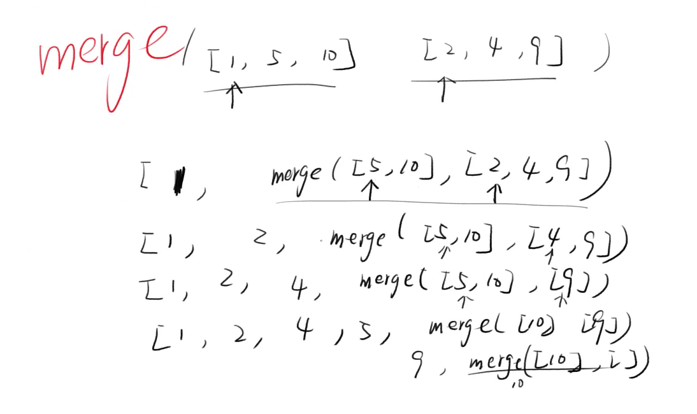

# 算法入门（二）

```
let min = (numbers) => {
    if(numbers.length > 2){
        return min(
            [numbers[0],min(numbers.slice(1))]
        );      
    }else{
        return Math.min.apply(null,numbers);
    }
}
let minIndex = (numbers) => numbers.indexOf(min(numbers));
let sort = (numbers) => {
	let min = minIndex(numbers);
}
```

```js
let numbers = ['a','b','c'];
[numbers[1],numbers[2]]=[numbers[2],numbers[1]]
```

## minIndex

### 永远都有两种写法

#### 递归

```js
let minIndex = (numbers) => numbers.indexOf(min(numbers))
let min = (numbers) => {
    if(numbers.length > 2){
        return min(
            [numbers[0],min(numbers.slice(1))]
        );      
    }else{
        return Math.min.apply(null,numbers);
    }
}
```

#### 循环

```js
let minIndex = (numbers) => {
    let index = 0;
    for(let i=1; i<numbers.length; i++){
        if(numbers[i] < numbers[index]){
            index = i;
        }
    }
    return index;
}
```

### 所有递归都可以改写成循环


## sort 改写，递归变循环



### 实现 swap

```js
let swap = (array, i, j) => {
    let temp = array[i];
    array[i] = array[j];
    array[j] = temp;
}
swap(numbers,1,2);
```

### 错误地实现 swap

```js
let swap = (a,b) => {
    let temp = a;
    a = b;
    b = temp;
}
swap(numbers[1],numbers[2]);
```

### 传值 VS 传址

* 上面代码执行后，numbers[1] 和 numbers[2] 的值原封不动
* 因为 a b 是简单类型，传参的时候会复制值
* 而 array[i] array[j] 是对象，传参复制地址







## 最终代码

```js
let sort = (numbers) => {
	for(let i=0; i< numbers.length -1; i++){
		console.log(`----`) 
        console.log(`i: ${i}`)
        let index = minIndex(numbers.slice(i))+ i
        console.log(`index: ${index}`)
        console.log(`min: ${numbers[index]}`)
        if(index!==i){
            swap(numbers, index, i)
            console.log(`swap ${index}: ${i}`)
            console.log(numbers)
        }
	}
    return numbers
}
let swap = (array, i, j) => {
    let temp = array[i]
    array[i] = array[j]
    array[j] = temp
}
let minIndex = (numbers) => {
    let index = 0
    for(let i=1; i<numbers.length; i++){
        if(numbers[i] < numbers[index]){
			index = i
	}
}
	return index
}
```

## 最终代码

```js
let sort = (numbers) => {
	for(let i=0; i< numbers.length -1; i++){
        let index = minIndex(numbers.slice(i))+ i
        if(index!==i){
            swap(numbers, index, i)
        }
	}
    return numbers
}
let swap = (array, i, j) => {
    let temp = array[i]
    array[i] = array[j]
    array[j] = temp
}
let minIndex = (numbers) => {
    let index = 0
    for(let i=1; i<numbers.length; i++){
        if(numbers[i] < numbers[index]){
			index = i
	}
}
	return index
}
```

## 总结

### 所有递归都能改成循环

### 循环的时候有很多细节

* 这些细节很难想清楚
* 要动手列出表格找规律
* 尤其是边界条件很难确定

### 如果 debug

* 看控制台
* 打 log
* 打 log 的时候注意加标记


## 快速排序

### 递归思路

#### 以某某为基准

* 想象你是一个体育委员
* 你面对的同学为 [12, 3, 7, 21, 5, 9, 4, 6]
* 以某某为基准，小的去前面，大的去后面
* 你只需要重复说这句话，就能排序

```js
let quickSort = arr => {
    if(arr.length <= 1){
        return arr;
    }
    let pivotIndex = Math.floor(arr.length/2);
    let pivot = arr.splice(pivotIndex,1)[0];
    let left = [];
    let right = [];
    for(let i=0; i<arr.length; i++){
        if(arr[i] < pivot){
            left.push(arr[i]);
        }else{
            right.push(arr[i])
        }
    }
    return quickSort(left).concat([pivot],quickSort(right))
}
```

## 归并排序

#### 不以某某为基准

* 想象你是一个体育委员
* 你面对的同学为 [12, 3, 7, 21, 5, 9, 4, 6]
* 左边一半排好序，右边一半排好序
* 然后把左右两边合并（merge）起来






```js
let mergeSort = arr => {
    let k = arr.length;
    if(k === 1){
        return arr;
    }
    let left = arr.slice(0,Math.floor(k/2));
    let right = arr.slice(Math.floor(k/2));
    return merge(mergeSort(left),mergeSort(right));
}
let merge = (a,b) => {
    if(a.length === 0) return b;
    if(b.length === 0) return a;
    return a[0] > b[0] ? [b[0]].concat(merge(a,b.slice(1))):			  [a[0]].concat(merge(a.slice(1),b));
}
```

## 计数排序

* 用一个哈希表做记录
* 发现数字 N 就记 N:1，如果再次发现 N 就加 1
* 最后把哈希表的 key 全部打出来，假设 N:m，那么 N 需要打印 m 次

```js
let countSort = arr => {
    let hashTable = {},max = 0,result = [];
    for(let i=0; i<arr.length; i++){
        if(!(arr[i] in hashTable)){
            hashTable[arr[i]] = 1;
        }else{
            hashTable[arr[i]] += 1;
        }
        if(arr[i] > max){max = arr[i]}
    }
    for(let j=0; j <= max; j++){
        if(j in hashTable){
            for(let i=0; i<hashTable[j]; i++){
                result.push(j);
            }
        }
    }
    return result
}
```

### 特点

#### 数据结构不同

* 使用了额外的 hashTable
* 只遍历数组一遍（不过还要遍历一次 hashTable）
* 这叫做**用空间换时间**

#### 时间复杂度对比


## 算法学习总结

### 心法

* 战略上藐视敌人，战术上重视敌人

### 特点

* 思路都很简单
* 细节都很多
* 多画表，多画图，多 log
* 如果实在不想陷入 JS 的细节，可以伪代码


## 还有哪些排序算法

* [冒泡排序](https://visualgo.net/zh/sorting)  点击BUB
* [插入排序](https://visualgo.net/zh/sorting)  点击INS
* [希尔排序](http://sorting.at/)  Shell Sort
* [基数排序](https://visualgo.net/zh/sorting) 点击 RAD


### 生成一个 [1,2,3……,1000] 的数组，并在控制台打印出来

```js
let array = [];
for(let i=0; i<1000; i++){
    array.push(i+1);
}
console.log(array);
```


