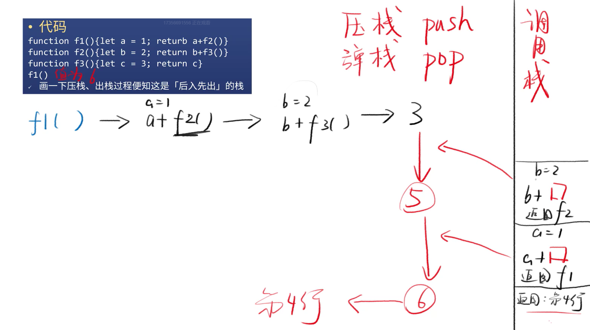
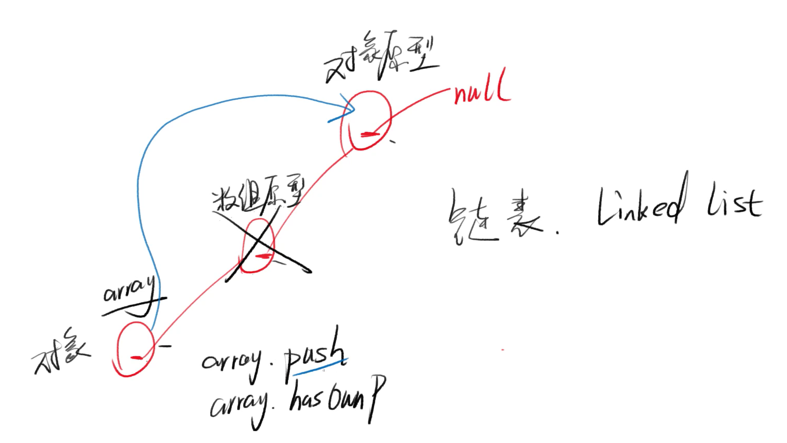
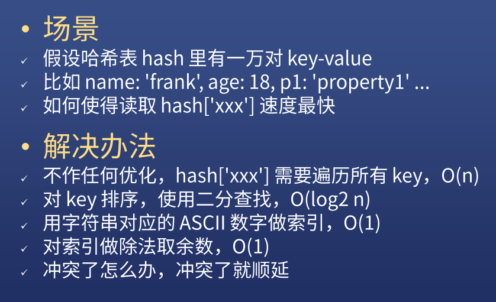
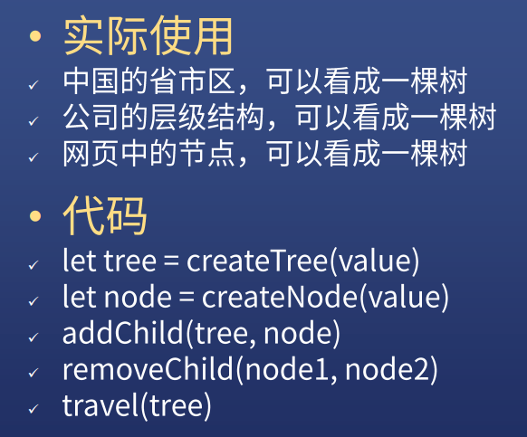

# 数据结构（一）

## 队列 Queue

* **先进先出 FIFO** 的数组

### 题目

* 请实现一个餐厅叫号网页
* 点击**取号**按钮生成一个号码
* 点击**叫号**按钮显示**请X号就餐**

### 代码

* 首先选择队列 queue 作为数据结构
* queue.push 为入队
* queue.shift 为出队

```js
<!DOCTYPE html>
<html lang="en">
<head>
    <meta charset="UTF-8">
    <meta name="viewport" content="width=device-width, initial-scale=1.0">
    <title>队列示例</title>
</head>
<body>
    <style>
        #screen {
            border: 1px solid black;
            width: 200px;
            height: 200px;
        }
    </style>
    <div id="screen"></div>
    <div class="actions">
        <button id="createNumber">取号</button>
        <button id="callNumber">叫号</button>
    </div>
    <div>
        当前号码<span id="newNumber"></span>
    </div>
    <div>
        当前队列<span id="queue"></span>
    </div>
    <script>
        const divScreen = document.querySelector('#screen');
        const btnCreateNumber = document.querySelector('#createNumber');
        const btnCallNumber = document.querySelector('#callNumber');
        const spanNewNumber = document.querySelector('#newNumber');
        const spanQueue = document.querySelector('#queue');

        let n = 0;
        let queue = [];
        btnCreateNumber.onclick = () => {
            n += 1;
            // queue.push(n);
            queue.push.call(queue,n);
            spanNewNumber.innerText = n;
            spanQueue.innerText = JSON.stringify(queue);
        }

        btnCallNumber.onclick = () => {
            if(queue.length === 0){
                return;
            }
            // const m = queue.shift();
            const m = queue.shift.call(queue);
            divScreen.innerText = ` 请 ${m} 号就餐`;
            spanQueue.innerText = JSON.stringify(queue);
        }
    </script>
</body>
</html>
```

## 栈 Stack

* **后进先出 LIFO** 的数组

### 举例

* JS 函数的调用栈 call stack 就是一个栈
* 假设 f1 调用了 f2，f2 又调用了 f3
* 那么 f3 结束后应该回到 f2，f2 结束后应该回到 f1

### 代码

```js
function f1(){
    let a = 1;
    return a+f2();
}
function f2(){
    let b = 2;
    return b+f3();
}
function f3(){
    let c = 3;
    return c;
}
f1();
```



## 链表 Linked List

* 一个链一个

```js
let array = [1,2,3];
array.__proto__ === Array.prototype;
Array.prototype.__proto__ === Object.prototype
```

* 从这个角度看对象，就是链表



```js
list = create(value)
node = get(index)
append(node,value)
remove(node)
travel(list,fn)
```

## 链表的变形

### 双向链表

* 每个节点有一个 previous 指向上一个节点

### 循环链表

* 最后一个节点的 next 指向头节点


## 哈希表  key-value pairs

[「哈希表」是什么？有哪些常用的解决冲突的方法？](https://www.zhihu.com/question/330112288/answer/744362539)

## 哈希表的难点



## 树




* 