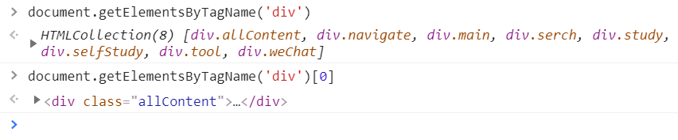

# DOM 编程（一）

### JS 中的七种数据类型

* number 
* string
* bool
* stymbol
* null
* undefined
* object

### JS 中的五个 falsy 值

* 0
* NaN
* ''
* null
* undefined

## 网页其实是一棵树


## JS 如何操作这棵树

* 浏览器往 window 上加一个 document 即可
* JS 用 document 操作网页
* 这就是 Document Object Model 文档对象模型


## 获取元素，也叫标签

### 有很多 API

```js
window.idxxx  或者直接  idxxx
```


```js
document.getElementById('idxxx')
```


* 如果 id 名字与全局属性冲突，比如 id 为 parent , 只能用 `document.getElementById('idxxx')`


```js
document.getElementsByTagName('div')[0]
```



```js
document.getElementsByClassName('red')[0]
```

* 获取类

* 以上三种 `getElement(s)ByXXX` 要兼容 IE 是才会使用

* 平常用下面两种

```js
document.querySelector('#idxxx')

document.querySelectorAll('.red')[0]
```


## 获取特定元素

### 获取 html 元素

```js
document.documentElement
```


### 获取 head 元素

```js
document.head
```

### 获取 body 元素

```js
document.body
```

### 获取窗口（窗口不是元素）

```js
window
```

---


### 获取所有元素

```js
document.all
```

* 这个 `document.all` 是个奇葩，第 6 个 falsy 值


